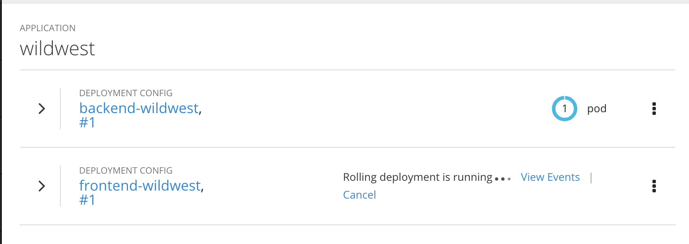

With the `backend` component running and connected to persistent storage, we are ready to bring up the `frontend` component and connect it to the `backend`. Once again, source code for the component is already available in the command line environment.

Change directories to the `frontend` directory:

`cd ~/frontend`{{execute interrupt}}

Listing the contents of this directory shows that `frontend` is a Node.js application.

`ls`{{execute}}

Since `frontend` is written in an interpreted language, there is no build step analogous to the Maven build we performed for the `backend` component. We can proceed directly to specifying the `nodejs` environment from the cluster's software catalog.

We give this Node.js component the name `frontend`:

`odo create nodejs frontend`{{execute}}

`odo` will create a `config.yaml` just like with the `backend` component, and you should see the following output:

```
✓  Checking component
✓  Checking component version
Please use `odo push` command to create the component with source deployed
```

With the component named and the config file created, we can push the Node.js source code from the current directory:

`odo push`{{execute}}

`odo push` should produce the following output:

```
✓  Checking component
✓  Checking component version
✓  Creating nodejs component with name frontend
✓  Initializing 'frontend' component
✓  Creating component frontend
✓  Successfully created component frontend
✓  Applying component settings to component: frontend
✓  Successfully updated component with name: frontend
✓  Pushing changes to component: frontend of type local
✓  Waiting for component to start
✓  Copying files to component
✓  Building component
✓  Changes successfully pushed to component: frontend
```

When we created the `backend` component, we viewed the logs via the terminal. You can also follow the status of your container creation in the web console. Click the Dashboard tab and make sure you're in the project named `myproject`. Click **Overview** in the left navigation to go to the Overview section, where you should see the following:



Once the deployment finishes, you'll see the pod become available. When the pod becomes available, the `frontend` component has now been deployed and is running on a container on OpenShift.
