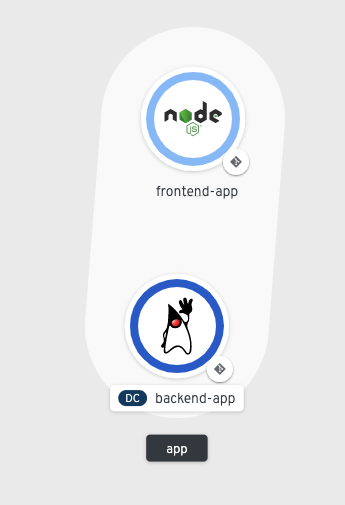
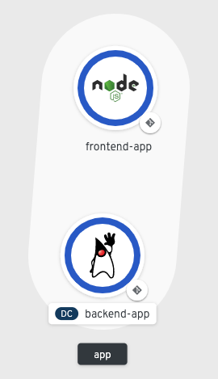
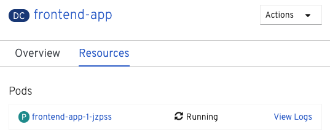

With the `backend` component running and connected to persistent storage, we are ready to bring up the `frontend` component and connect it to the `backend`. Once again, source code for the component is already available in the command line environment.

Change directories to the `frontend` directory:

`cd ~/frontend`{{execute interrupt}}

Listing the contents of this directory shows that `frontend` is a Node.js application.

`ls`{{execute}}

Since `frontend` is written in an interpreted language, there is no build step analogous to the Maven build we performed for the `backend` component. We can proceed directly to specifying the `nodejs` environment from the cluster's catalog.

We give this Node.js component the name `frontend`:

`odo create nodejs frontend`{{execute}}

`odo` will create a `config.yaml` just like with the `backend` component, and you should see the following output:

```
✓  Validating component [6ms]
Please use `odo push` command to create the component with source deployed
```

With the component named and the config file created, we can push the Node.js source code from the current directory:

`odo push`{{execute}}

`odo push` should produce the following output:

```
Validation
 ✓  Checking component [23ms]

Configuration changes
 ✓  Initializing component
 ✓  Creating component [86ms]

Pushing to component frontend of type local
 ✓  Checking files for pushing [710993ns]
 ✓  Waiting for component to start [52s]
 ✓  Syncing files to the component [26s]
 ✓  Building component [8s]
 ✓  Changes successfully pushed to component
```

When we created the `backend` component, we viewed the logs via the terminal. You can also follow the status of your container creation in the web console. Click the **Console** tab and make sure you're in the project named `myproject`.

Depending on how far along your `odo push` is, you may see the pod for the `frontend` component starting up with a light blue ring as shown below. This light blue ring means the pod is in a pending state and hasn't started yet:



Once the pod becomes available, you'll see the `frontend` component become available with a dark blue ring around it like the `backend` component has. This is shown below:



To see the logs of the `frontend` component, wait for the dark blue ring to appear around the component and then click on the `frontend` component circle. This should bring up the deployment config for `frontend` and present the option to **View Logs** under the **Pods** section. This is shown below:



Click on **View Logs** where you should eventually see the following logs confirming `frontend` is running:

```
CONFIG ERROR: Can't find backend webservices component!
Use `odo link` to link your front-end component to a backend component.
Listening on 0.0.0.0, port 8080
Frontend available at URL_PREFIX: /
{ Error: 'Backend Component Not Configured' }
```

Don't worry about the error message for now! You'll correct this in the next section.

When you are done viewing the logs, click on the **Topology** tab on the left side of the web console to head back to `myproject`.
