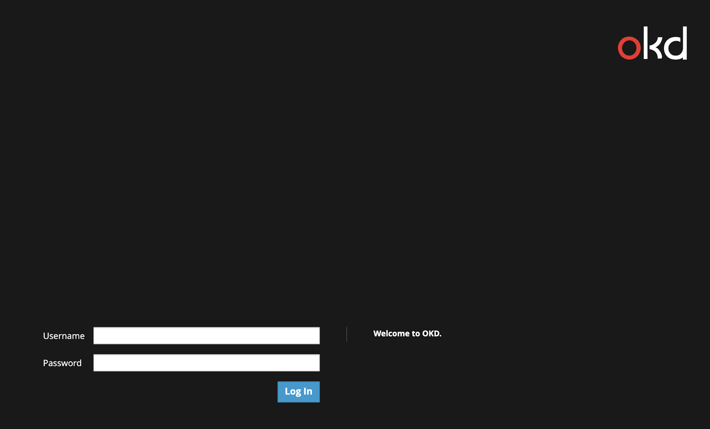
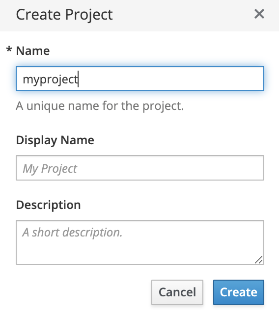

While the command line tool is awesome, for this course we are going to focus on the web console, which is equally awesome.

## Task 1
To begin, click on the **Dashboard** tab on your screen. This will open the web console on your browser.

You should see an **OKD** window with **Username** and **Password** forms as shown below:

For this scenario, log in by entering the following:

**Username:** `developer`{{copy}}

**Password:** `developer`{{copy}}

After logging in to the web console, you'll see a blue button labeled *Create Project* in the top right corner of your screen that is shown below. Click this button to get started.

You should now see a page for creating your first project in the web console. Fill in the _Name_ field as `myproject`{{copy}}.

The rest of the form is optional and up to you to fill in or ignore. Click *Create* to continue.

After your project is created, your project will appear under **My Projects**, and you can click on `myproject` to access your newly created project.

## Task 2

Notice the menu on the left. You're now currently on the **Overview** screen. The tools that you'll need for building and deploying your application can also be found here on the left.

Take a quick look around these, clicking on **Applications**, **Builds**, and **Resources** to see more options. There won't be much there for now as we have nothing in our project.

We'll get into those in future sections, but go ahead and explore to see what's possible! Don't spend too much time on these now as you will get to use a lot of these features in the upcoming sections.
