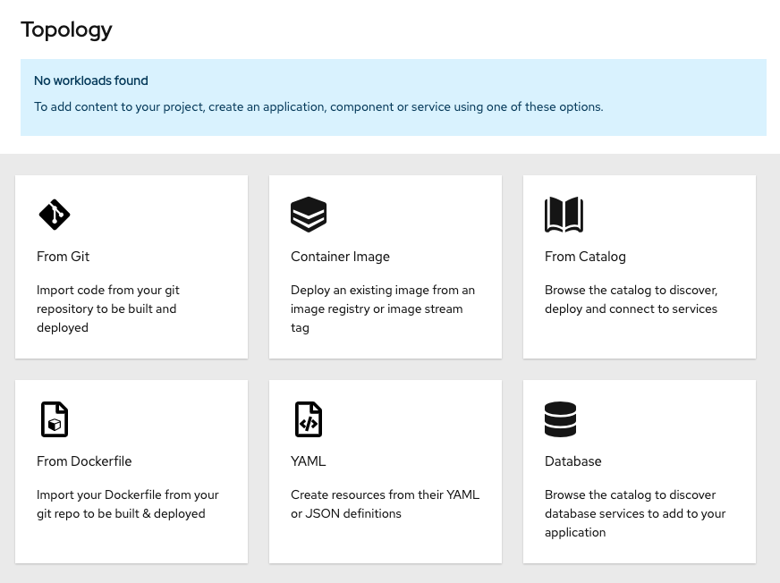
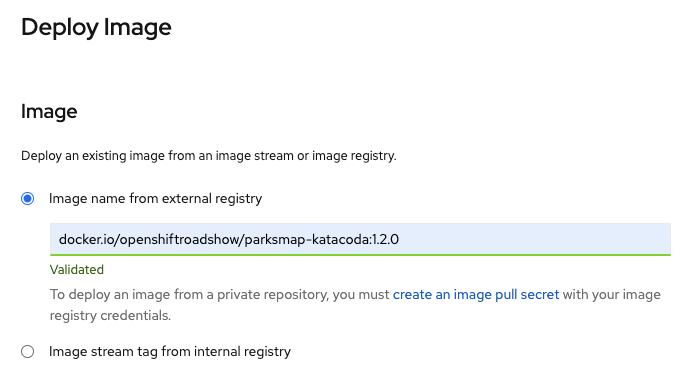
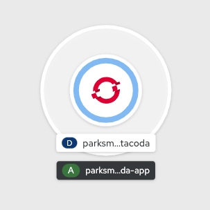

In this section, you are going to deploy the front end component of an application called **parksmap**. The web application will display an interactive map, which will be used to display the location of major national parks from all over the world.

# Exercise: Deploying Your First Image

The simplest way to deploy an application in OpenShift is to take an existing container image and run it. We are going to use the OpenShift web console to do this, so ensure you have the OpenShift web console open with the *Developer Perspective* active and that you are in the project called `myproject`.

The OpenShift web console provides various options to deploy an application to a project. For this section, we are going to use the *Container Image* method. As the project is empty at this point, the *Topology* view should display the following options: *From Git*, *Container Image*, *From Catalog*, *From Dockerfile*, *YAML*, and *Database*. 

Choose the **Container Image** option.

In the future, to get back to this menu of ways to add content to your project, you can click *+Add* in the left navigation.

Within the *Deploy Image* page, enter the following for *Image name from external registry*: 

`docker.io/openshiftroadshow/parksmap-katacoda:1.2.0`{{copy}}

Press tab or click outside of the text box to validate the image:

The *Application Name* field will be populated with `parksmap-katacoda-app` and the *Name* field with `parksmap-katacoda`. This name will be what is used for your application and the various components created that relate to it. Leave this as the generated value as steps given in the upcoming sections will use this name.

By default, creating a deployment using the *Container Image* method will also create a Route for your application. A Route makes your application available at a publicly accessible URL. 

Normally, you would keep this box checked, since it's very convenient to have the Route created for you. For the purposes of learning, **un-check the box**. We'll learn more about Routes later in the tutorial, and we'll create the Route ourselves then.

You are ready to deploy the existing container image. Click the blue *Create* button at the bottom of the screen. This should bring you back to the *Topology* view, where you'll see a visual representation of the application you just deployed. As the image deployment progresses, you'll see the ring around the `parksmap-katacoda` deployment progress from white to light blue to blue.

These are the only steps you need to run to get a "vanilla" container image deployed on OpenShift. This should work with any container image that follows best practices, such as defining the port any service is exposed on, not needing to run specifically as the *root user* or other dedicated user, and which embeds a default command for running the application.
