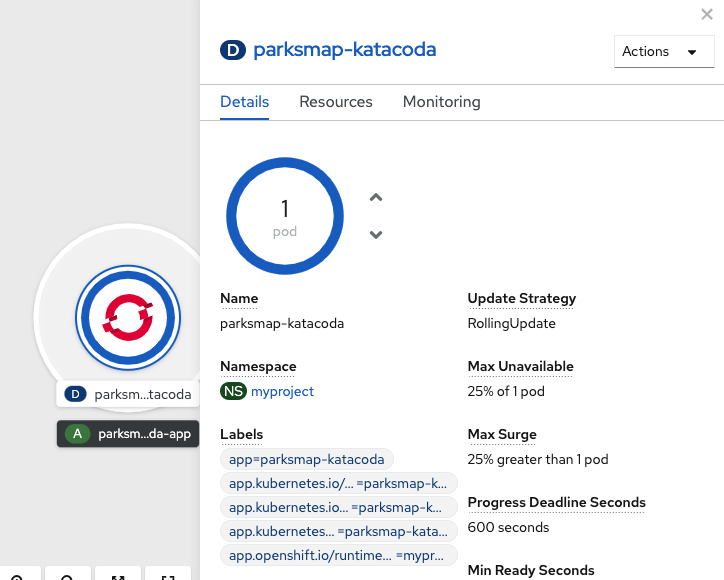
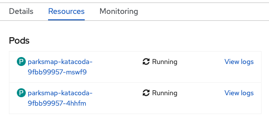
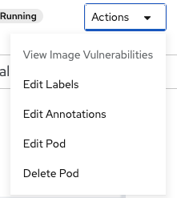
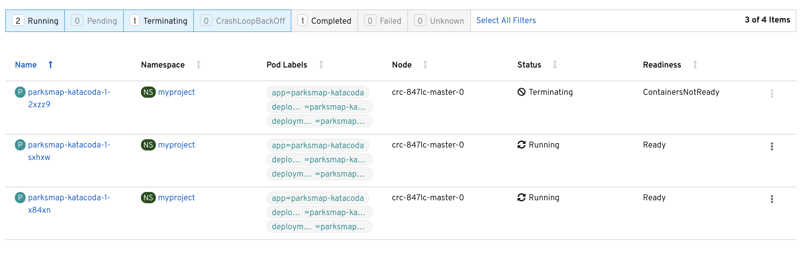

Let's scale our application up to 2 instances of the pods. You can do this by clicking inside the circle for the `parksmap-katacoda` application from *Topology* view to open the side panel. In the side panel, click the *Details* tab, and then click the "up" arrow next to
the *Pod* in side panel.

To verify that we changed the number of replicas, click the *Resources* tab in the side panel. You should see a list with your pods similar to the image below:

You can see that we now have 2 replicas.

Overall, that's how simple it is to scale an application (*Pods* in a
*Service*). Application scaling can happen extremely quickly because OpenShift
is just launching new instances of an existing image, especially if that image
is already cached on the node.

### Application "Self Healing"

OpenShift's *Deployments* are constantly monitoring to see that the desired number
of *Pods* is actually running. Therefore, if the actual state ever deviates from the desired state (i.e., 2 pods running), OpenShift will work to fix the situation.

Since we have two *Pods* running right now, let's see what happens if we
"accidentally" kill one.

On the *Resources* tab where you viewed the list of pods after scaling to 2 replicas, open one of the pods by clicking its name in the list.

In the top right corner of the page, there is an _Actions_ drop down menu. Click it and select *Delete Pod*.

After you click *Delete Pod*, click *Delete* in the confirmation dialog. You will be taken to a page listing pods, however, this time, there are three pods. Note that on smaller screens you may not see all of these columns.

The pod that we deleted is terminating (i.e., it is being cleaned up). A new pod was created because
OpenShift will always make sure that, if one pod dies, there is going to be new pod created to
fill its place.

### Exercise: Scale Down

Before we continue, go ahead and scale your application down to a single
instance. Click *Topology* to return to the *Topology* view, then click `parksmap-katacoda` and on the *Overview* tab, click the down arrow to scale back down to one instance.
