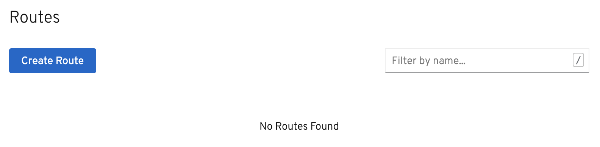
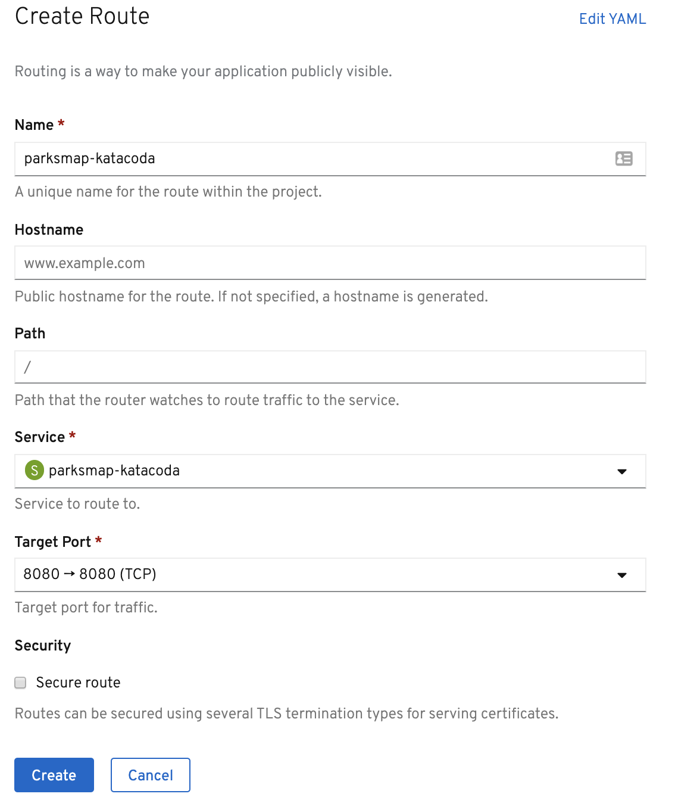
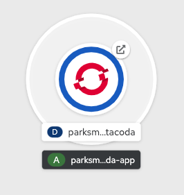

_Services_ provide internal abstraction and load balancing within an OpenShift
environment, but sometimes clients (users, systems, devices, etc.) **outside**
of OpenShift need to access an application. The way that external clients are able
to access applications running in OpenShift is through the OpenShift routing layer.
The resource object which controls this is a _Route_.

The default OpenShift router (HAProxy) uses the HTTP header of the incoming
request to determine where to proxy the connection. You can optionally define
security, such as TLS, for the _Route_. If you want your _Services_, and, by
extension, your _Pods_,  to be accessible to the outside world, you need to
create a _Route_.

As we mentioned earlier in the tutorial, the *Container Image* method of deploying an application will create a _Route_ for you by default. Since we un-checked that option, we will manually create a _Route_ now.

## Exercise: Creating a Route

Fortunately, creating a _Route_ is a pretty straight-forward process.  First, go to the *Administrator Perspective* by switching to *Administrator* in the *Developer* drop down menu. Ensure that your `myproject` project is selected from the projects list. Next, click *Networking* and then *Routes* in the left navigation menu.

Click the blue *Create Route* button.

Enter `parksmap-katacoda` for the _Route_ Name, select `parksmap-katacoda` for the _Service_, and `8080` for the Target Port. Leave all the other settings as-is.

Once you click _Create_, the _Route_ will be created and displayed in the _Route Details_ page.

You can also view your _Route_ in the *Developer Perspective*. Toggle back to the *Developer Perspective* now, and go to *Topology* view. On the `parksmap-katacoda` visualization you should now see an icon in the top right corner of the circle. This represents the _Route_, and if you click it, it will open the URL in your browser.

Once you've clicked the _Route_ icon, you should see this in your browser:

