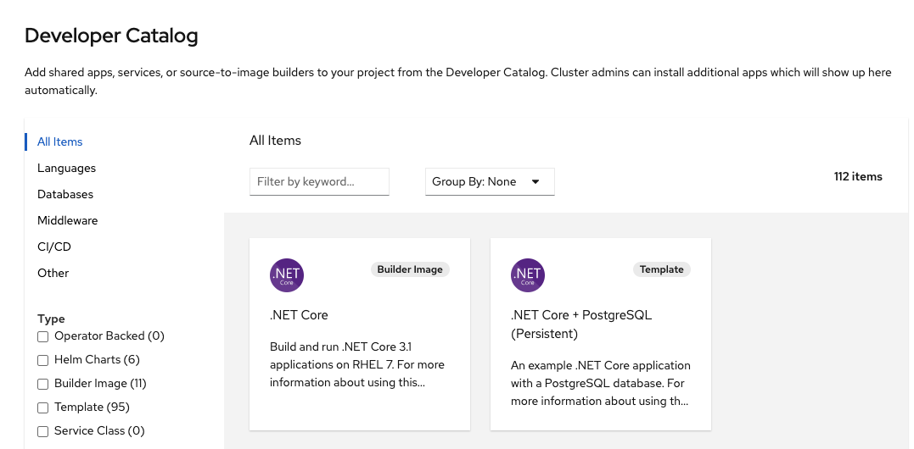
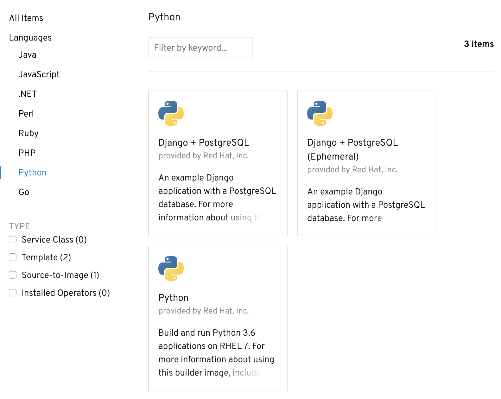
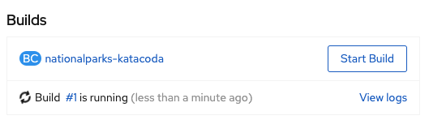
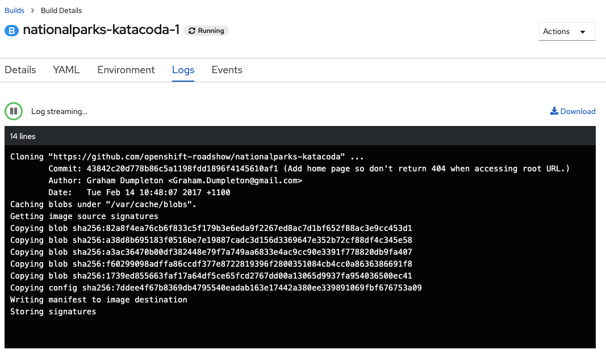

In this section, you are going to deploy a backend service for the ParksMap application. This backend service will provide data, via a REST service API, on major national parks from all over the world. The ParksMap front end web application will query this data and display it on an interactive map in your web browser.

# Background: Source-to-Image (S2I)

In a previous section, you learned how to deploy an application (the ParksMap front end) from a pre-existing container image. Here you will learn how to deploy an application direct from source code hosted in a remote Git repository. This will be done using the [Source-to-Image (S2I)](https://github.com/openshift/source-to-image) tool.

The documentation for S2I describes itself in the following way:

> Source-to-image (S2I) is a tool for building reproducible container images. S2I
produces ready-to-run images by injecting source code into a container image and
assembling a new container image which incorporates the builder image and built
source. The result is then ready to use with docker run. S2I supports
incremental builds which re-use previously downloaded dependencies, previously
built artifacts, etc.

OpenShift is S2I-enabled and can use S2I as one of its build mechanisms (in addition to building container images from Dockerfiles and "custom" builds).

A full discussion of S2I is beyond the scope of this tutorial. More information about S2I can be found in the [OpenShift S2I documentation](https://docs.openshift.com/container-platform/latest/builds/understanding-image-builds.html#build-strategy-s2i_understanding-image-builds) and the [GitHub project respository for S2I](https://github.com/openshift/source-to-image).

The only key concept you need to remember about S2I is that it handles the process of building your application container image for you from your source code.

# Exercise: Deploying the application code

The backend service that you will be deploying in this section is called `nationalparks-katacoda`. This is a Python application that will return map coordinates of major national parks from all over the world as JSON via a REST service API. The source code repository for the application can be found on GitHub at:

* https://github.com/openshift-roadshow/nationalparks-katacoda

To deploy the application you are going to use the **+Add** option in the left navigation menu of the *Developer Perspective*, so ensure you have the OpenShift web console open and that you are in the project called `myproject`. Click **+Add**. This time, rather than using *Container Image*, choose *From Catalog*, which will take you to the following page:

If you don't see any items, then uncheck the **Operator Backed** checkbox. Under the **Languages** section, select Python in the list of supported languages. When presented with the options of *Django + Postgres SQL*, *Django + Postgres SQL (Ephemeral)*, and *Python*, select the *Python* option and click on _Create Application_.

For the *Git Repo URL* use:

``https://github.com/openshift-roadshow/nationalparks-katacoda``{{copy}}

Once you've entered that, click outside of the text entry field, and then you should see the *Name* of the application show up as `nationalparks-katacoda`. The *Name* needs to be ``nationalparks-katacoda`` as the front end for the ParksMap application is expecting the backend service to use that name.

Leave all other options as-is.

Click on *Create* at the bottom right corner of the screen and you will return to the *Topology* view. Click on the circle for the `nationalparks-katacoda` application and then the *Resources* tab in the side panel. In the *Builds* section, you should see your build running.

This is the step where S2I is run on the application source code from the Git repository to create the image which will then be run. Click on the *View Logs* link for the build and you can follow along as the S2I builder for Python downloads all the Python packages required to run the application, prepares the application, and creates the image.

Head back to *Topology view* when the build completes to see the image being deployed and the application being started up. The build is complete when you see the following in the build logs: `Push successful`.

The green check mark in the bottom left of the `nationalparks-katacoda` component visualization indicates that the build has completed. Once the ring turns from light blue to blue, the backend `nationalparks-katacoda` service is deployed.

Now, return to the ParksMap front end application in your browser, and you should now be able to see the locations of the national parks displayed. If you don't still have the application open in your browser, go to *Topology* view and click the icon at the top right of the circle for the `parksmap-katacoda` application to open the URL in your browser.

Congratulations! You just finished learning the basics of how to get started with the OpenShift Container Platform.

Now that you've completed this tutorial, click *Continue* for more resources and tools to help you learn more about OpenShift.
