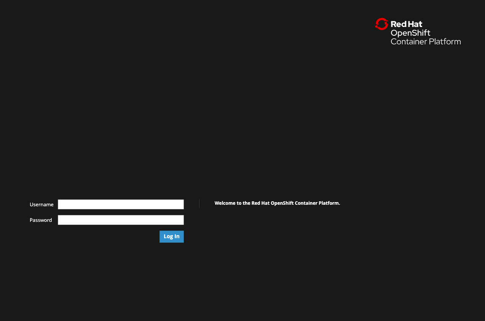
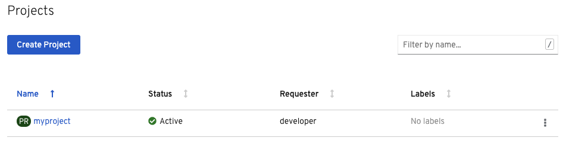
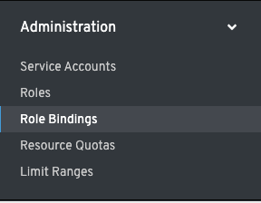
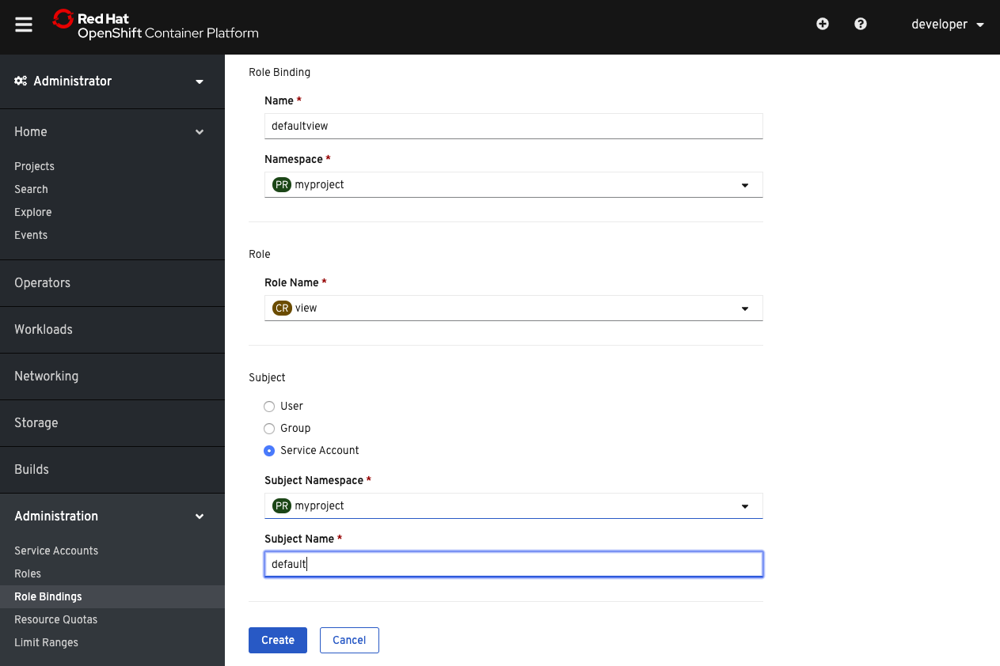

## Logging in to OpenShift

Before we get started, you need to log in to OpenShift. To log in to the OpenShift cluster used for this scenario from the _Terminal_,
run:

`odo login -u developer -p developer`{{execute}}

This will log you in using the credentials:

* **Username:** ``developer``
* **Password:** ``developer``

You should see the output below:

```
Connecting to the OpenShift cluster

Login successful.

You don't have any projects. You can try to create a new project, by running
    odo project create <project-name>
```

We will start by creating a new project by running `odo project create`:

`odo project create myproject`{{execute}}

You should see the following output confirming the creation of a new OpenShift project called `myproject` and that `odo` is now using `myproject`:

```
 ✓  New project created and now using project : myproject
```

## Creating a Service Account
The backend of our application uses the OpenShift REST API. In order for the backend to access the API, we need to grant access to the service account that the backend is using. We will do this in the web console.

Click the **Console** tab next to the **Terminal** tab near the center top of your browser. This opens the OpenShift web console.

You should see an OpenShift window with **Username** and **Password** fields, which is similar to this one:



For this scenario, start by entering the following:

**Username:** ``developer``{{copy}}

**Password:** ``developer``{{copy}}

After logging in to the web console, you'll be in the **Administrator** perspective of the web console, which is a view of the console for handling operations and administrative tasks associated with your OpenShift cluster.

To start, select the project you just created using `odo` (i.e. `myproject`) by clicking on `myproject` on the **Projects** page as shown below:



By clicking on the project name, you will be taken to the **Project Details** page that shows information about what is happening in your project. By clicking on the project name, you are also now using this project and all actions via the web console will now happen in this project.

On the left side of the console, click the **Administration** tab and select the **RoleBindings** option as shown below:



On the **RoleBindings** page, click the **Create Binding** button and fill out the wizard with the information shown below:



Feel free to copy the information for the role binding name and service account subject name below:

**Role Binding Name:** ``defaultview``{{copy}}

**Subject Name:** ``default``{{copy}}

Now the service account that the backend uses has **view** access so it can retrieve objects via the API. Note that you could choose **edit** access instead. That would allow the backend to both retrieve and modify or delete objects. If you do that, you can end up destroying certain resources in the game that are not recoverable, which is why we are choosing **view** access for this scenario.
