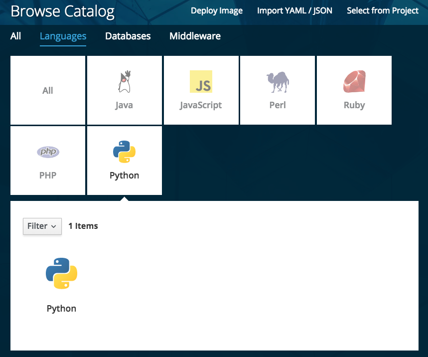
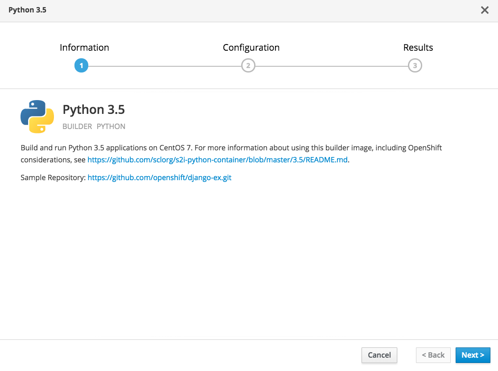
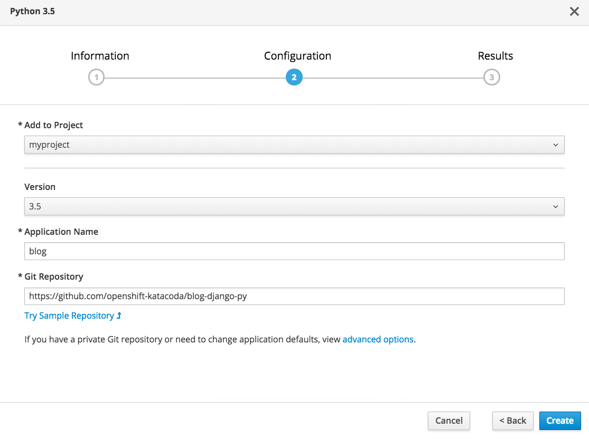
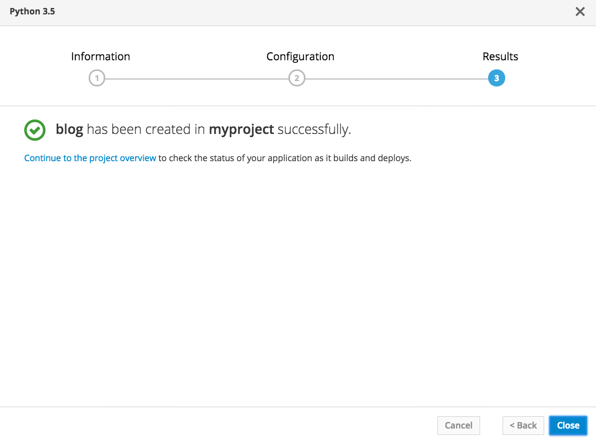

In this course you are going to first deploy a web application which is implemented using the Python programming language.

Select the _Languages_ category from the service catalog and then select _Python_.

Any options for deploying applications which are related to Python will be displayed. In the environment used for this course, the only option presented will be that for the Python Source-to-Image (S2I) builder. Click on _Python_ in the lower pane to start setting up the deployment for the application.

The first splash screen displayed will provide information on the S2I builder being used.

Click on _Next_ in order to enter in configuration for the deployment.

For the _Application Name_ enter:

`blog`{{copy}}

For the _Git Repository_ enter:

`https://github.com/openshift-katacoda/blog-django-py`{{copy}}

When you are ready, at the bottom of the page click on _Create_. This will take you to a final splash page confirming the application has been created.

Click on _Continue to the project overview_. This will take you to the _Overview_ page for the project, where you can view the details of the application created and monitor progress as it is built and deployed.

