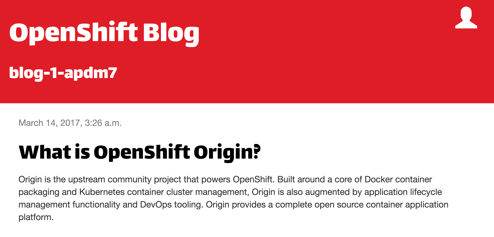

Once the build of the application image has completed, it will be deployed.

When you deploy an application from application source code using the web console, a _Route_ will be automatically created for the application and it will be exposed outside of the cluster. The URL which can be used to access the application from a web browser will be displayed on the _Overview_ page.

Click on the URL and you can view the web application.

At this point, the sample Python web application has been deployed using a local SQLite database, with data pre-loaded into the database on startup to allow for testing.

The SQLite database used is however stored in the container file system which means that it will be discarded each time the web application is re-deployed. This will result in any content entered through the web application being lost and the web application will revert to displaying what is being pre-loaded as test data.

For a production site, a separate database using a persistent volume should be used and the web application configured to use it.
