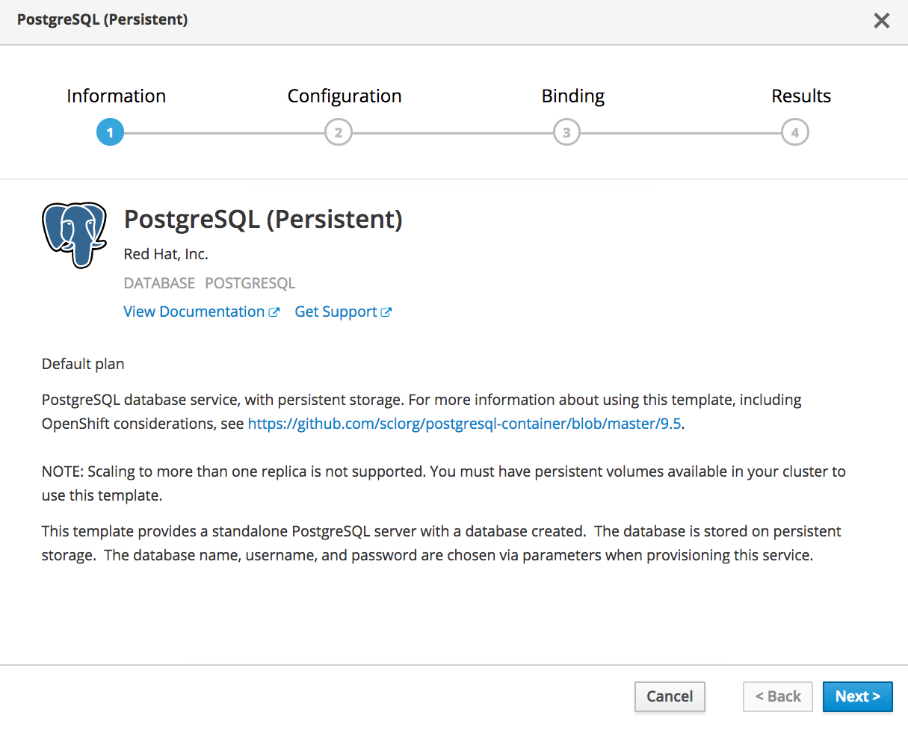
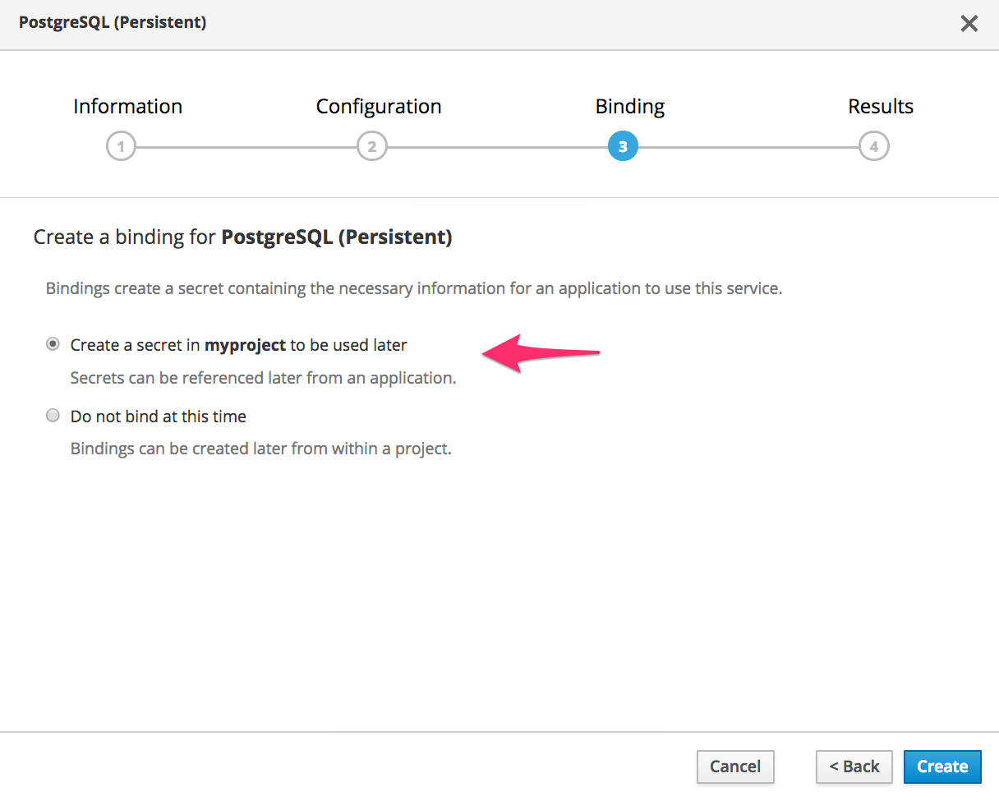

To deploy a PostgreSQL database which the web application can use, click on _Add to Project_ from the top menu bar, select _Browse Catalog_, and then select the _Databases_ category.

In the environment used for this course, the only option presented should be that for a PostgreSQL database. Click on _PostgreSQL (Persistent)_ in the lower pane to start setting up the deployment for the database.

The first splash screen displayed will provide information on the PostgreSQL database which can be deployed.

Click on _Next_ in order to enter in configuration for the deployment.

For this tutorial, you can leave all the default values as they are. Click on _Next_ to setup a service binding.

Ensure that the option for _Creating a secret_ is selected. This secret will hold the database credentials for the web application to use.

Click on _Create_ to start the deployment of the database.

Click on _Continue to the project overview_ to watch as the database is deployed.
