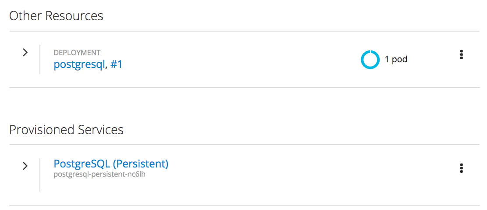
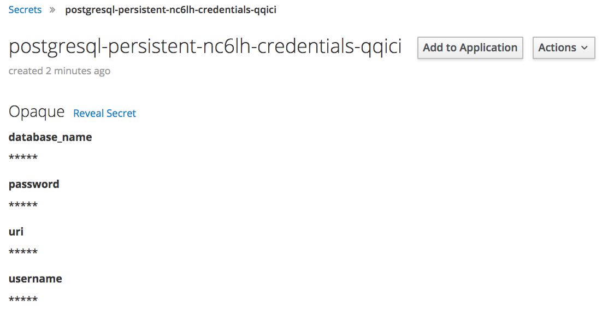

Once the database has been provisioned, you should see on the _Overview_ page for the project two entries related to the database. The first is the actual deployment and the second is the service binding listed under _Provisioned Services_.

Click on the right facing arrow to the left of the entry under _Provisioned Services_ to display the details of the service.

Under _Bindings_ you can see the service binding which was created, along with the _Secret_ containing the database credentials.

Click on _View Secret_.

The secret created contains the name of the database, user details, and the connection details for the database.

To have the web application use these details, click on _Add to Application_.

Select ``blog`` from the _Add this secret to Application_ drop down menu.

Two options are then presented as to how the database credentials can be injected into the application.

The first is as environment variables, the second is by mounting the secrets as a volume within the container.

The web application used in this tutorial is setup to accept the secrets via a mounted volume. Select _Volume_ and enter in:

``/opt/app-root/secrets/database``{{copy}}

as the _mount path_.

Click on _Save_.
