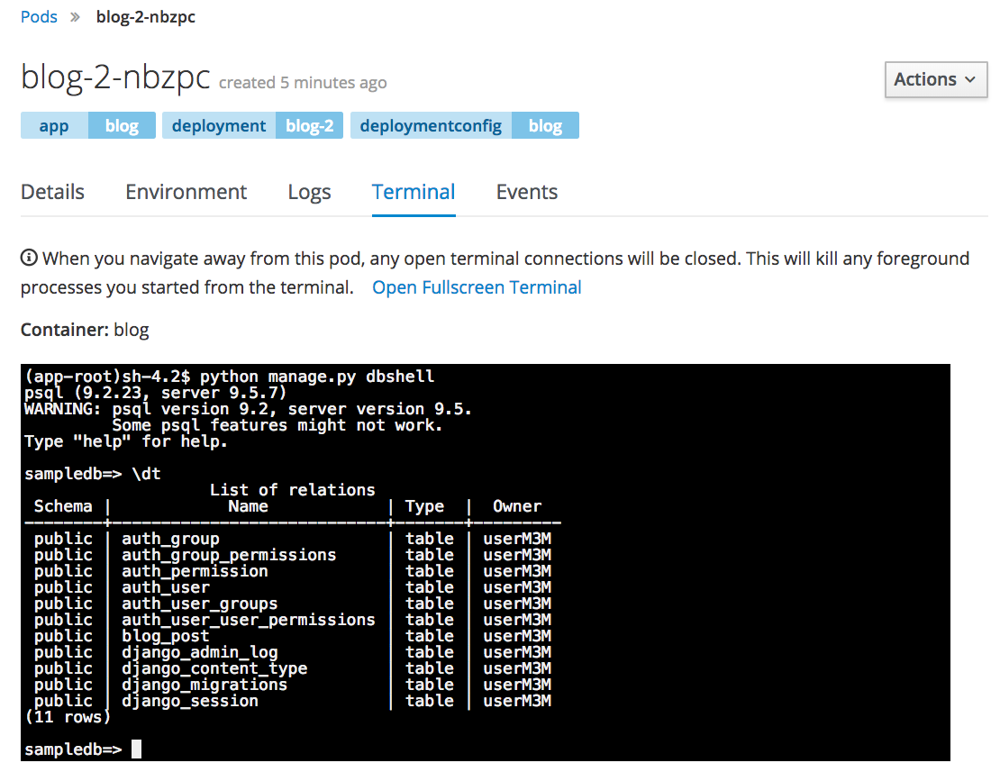

Upon adding the _Secret_ to the application, because it is a configuration change, the application will be re-deployed automatically. You should see that the deployment number has increased.

Click on the middle of the blue circle show the status of the _Pod_. This should bring you to the _Details_ for the _Pod_. Scroll down and you should see that the _Secret_ is mounted as a volume within the container.

To verify that PostgreSQL is now being used by the web application, click on the _Terminal_ tab for the _Pod_.

In the _Terminal_, run:

``python manage.py dbshell``{{copy}}

You will see that this has resulted in the PostgreSQL database client being run. Enter:

``\dt``{{copy}}

at the prompt to list the tables which have been created in the database.
