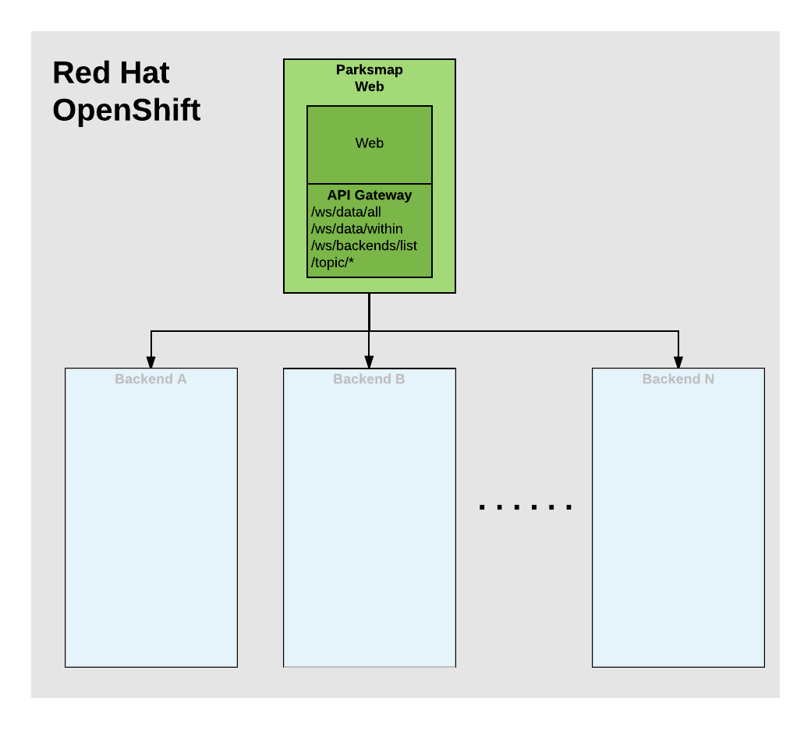
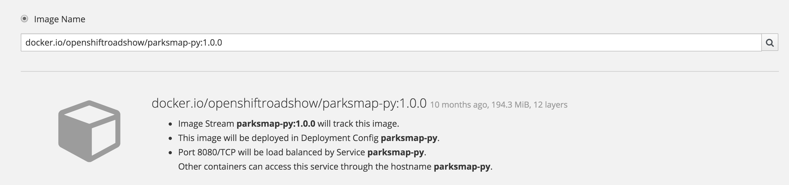

In these exercises you are going to deploy the front end web component of the ParksMap application. The front end uses a dynamic service discovery mechanism to discover what backend services have been deployed and shows their data on the map.



### Exercise: Deploying an Application Image

Let's start by doing the simplest thing possible - take a pre-existing container image and run it on OpenShift. This is incredibly simple to do using the web console.

Return to the web console:

https://[[HOST_SUBDOMAIN]]-8443-[[KATACODA_HOST]].environments.katacoda.com

Return to the project overview page for the `myproject` project. Next, click the _Add to Project_ drop down menu in the top navigation bar. Select the _Deploy Image_ option.

You will learn more about image streams and image stream tags later. For now,
select the _Image Name_ option, and copy/paste the following into the text entry field for _image name or pull spec_:

``docker.io/openshiftroadshow/parksmap-py:1.0.0``{{copy}}

Press *enter* or click on the magnifying glass icon. OpenShift will query the ``docker.io`` image registry and pull down details about the image and display it.

Your screen should look like:



With the query complete and the details available, you should also now be
presented with options to set the name of the application and add additional configuration such as environment variables and labels.


Hit the _Create_ button at the bottom of the screen and on the next page click
_Continue to overview_.

WINNING! These few steps are the only ones you need to run to get a "vanilla"
container image deployed on OpenShift. This should work with any
container image that follows best practices, such as defining an EXPOSE
port, not needing to run specifically as the *root user* or other user name, and
a single non-exiting CMD to execute on start.

### Background: Containers and Pods

In OpenShift, the smallest deployable unit is a *Pod*. A *Pod* is a group of one or
more containers deployed together and guaranteed to be on the same host.

Each pod has its own IP address, therefore owning its entire port space, and
containers within pods can share storage. Pods can be "tagged" with one or
more labels, which are then used to select and manage groups of pods in a
single operation.

*Pods* can contain multiple containers. The general idea is for a Pod to
contain a "server" and any auxiliary services you want to run along with that
server. Examples of containers you might put in a *Pod* are, an Apache HTTPD
server, a log analyzer, and a file service to help manage uploaded files.

### Exercise: Examining the Pod

In the web console's overview page you will see that there is a single *Pod* that
was created by your actions. This *Pod* contains a single container, which
is the `parksmap-py` application.

You can also examine *Pods* from the command line:

``oc get pods``{{execute}}

You should see output that looks similar to:

```
NAME                  READY     STATUS    RESTARTS   AGE
parksmap-py-1-713cw   1/1       Running   0          1m
```

The above output lists all of the *Pods* in the current *Project*, including the
*Pod* name, state, restarts, and uptime. To see more information about *Pods*, you can set the output type to *YAML* using the
`-o yaml` option.

``oc get pods -o yaml``{{execute}}

This will output a list with the details of all *Pods*. If you want to restrict the output to a single *Pod* pass the name of the *Pod* as argument to the ``oc get pod`` command.

When running ``oc get pods -o yaml`` you should see output which starts with details similar to that below:

```
kind: List
metadata: {}
resourceVersion: ""
selfLink: ""
apiVersion: v1
items:
- apiVersion: v1
  kind: Pod
  metadata:
    annotations:
      openshift.io/deployment-config.latest-version: "1"
      openshift.io/deployment-config.name: parksmap-py
      openshift.io/deployment.name: parksmap-py-1
      openshift.io/generated-by: OpenShiftWebConsole
      openshift.io/scc: restricted
    creationTimestamp: 2017-12-12T10:45:48Z
    generateName: parksmap-py-1-
    labels:
      app: parksmap-py
      deployment: parksmap-py-1
      deploymentconfig: parksmap-py
    name: parksmap-py-1-713cw
    namespace: myproject
    ...
```

The web interface also shows a lot of the same information on the *Pod* details
page. Click on the blue *Pod* circle on the project overview page. As there is only one *Pod* you will
be taken direct to the details page for the *Pod*. You can also get there by clicking _Applications_ in the left hand side navigation bar, then
_Pods_. This will give you a list of the *Pods* for the application. Click on the *Pod* name. If there was more than one *Pod* and you clicked in the *Pod* circle you would instead end up at the *Pod* list from which you can select which *Pod* to view.

#### Background: Services

*Services* provide a convenient abstraction layer inside OpenShift to find a
group of like *Pods*. They also act as an internal proxy/load balancer between
those *Pods* and anything else that needs to access them from inside the
OpenShift environment. For example, if you needed to start up multiple instances of the `parksmap-py` application to
handle the volume of requests to it, you could spin up more *Pods*. OpenShift automatically maps
them as endpoints to the *Service*, and the incoming requests would not notice
anything different except that the *Service* was now doing a better job handling
the requests.

When you asked OpenShift to run the image, it automatically created a *Service*
for you. Remember that services are an internal construct. They are not
available to the "outside world", or anything that is outside the OpenShift
environment. That's OK, as you will learn later.

The way that a *Service* maps to a set of *Pods* is via a system of *Labels* and
  *Selectors*. *Services* are assigned a fixed IP address and many ports and
protocols can be mapped.

Now that you understand the basics of what a *Service* is, let's take a look at
the *Service* that was created for the image that you just deployed.  In order to
view the *Services* defined in your *Project*, enter in the following command:

``oc get services``{{execute}}

You should see output similar to the following:

```
NAME          CLUSTER-IP     EXTERNAL-IP   PORT(S)    AGE
parksmap-py   172.30.17.45   <none>        8080/TCP   2m
```

In the above output, you can see that you have a *Service* named `parksmap-py` with an
IP/Port combination of 172.30.17.45/8080TCP. Your IP address may be different, as
each *Service* receives a unique IP address upon creation. *Service* IPs are
fixed and never change for the life of the *Service*.

In the web console, service information is available by clicking _Applications_ in the left hand side navigation bar
and then clicking _Services_.

You can also get more detailed information about a *Service* by using the
following command to display the data as YAML:

``oc get service parksmap-py -o yaml``{{execute}}

You should see output similar to the following:

```
apiVersion: v1
kind: Service
metadata:
  annotations:
    openshift.io/generated-by: OpenShiftWebConsole
  creationTimestamp: 2017-12-12T10:45:46Z
  labels:
    app: parksmap-py
  name: parksmap-py
  namespace: myproject
  resourceVersion: "1704"
  selfLink: /api/v1/namespaces/myproject/services/parksmap-py
  uid: 9c04735e-df29-11e7-b74a-0242ac110068
spec:
  clusterIP: 172.30.17.45
  ports:
  - name: 8080-tcp
    port: 8080
    protocol: TCP
    targetPort: 8080
  selector:
    deploymentconfig: parksmap-py
  sessionAffinity: None
  type: ClusterIP
status:
  loadBalancer: {}
```

Take note of the `selector` stanza.

```
selector:
  deploymentconfig: parksmap-py
```

Run again the command:

``oc get pods -o yaml``{{execute}}

Under the `metadata` section you should see the following:

```
labels:
  app: parksmap-py
  deployment: parksmap-py-1
  deploymentconfig: parksmap-py
```

The *Service* has a `selector` stanza that refers to `deploymentconfig=parksmap-py`.

The *Pod* has multiple *Labels*:

* `app=parksmap-py`

* `deployment=parksmap-py-1`

* `deploymentconfig=parksmap-py`

*Labels* are just key/value pairs. Any *Pod* in this *Project* that has a *Label* that
matches the *Selector* will be associated with the *Service*. To see this in
action, issue the following command:

``oc describe service parksmap-py``{{execute}}

You should see something like the following output:

```
Name:                   parksmap-py
Namespace:              myproject
Labels:                 app=parksmap-py
Annotations:            openshift.io/generated-by=OpenShiftWebConsole
Selector:               deploymentconfig=parksmap-py
Type:                   ClusterIP
IP:                     172.30.17.45
Port:                   8080-tcp        8080/TCP
Endpoints:              172.20.0.5:8080
Session Affinity:       None
Events:                 <none>
```

You may be wondering why only one end point is listed. That is because there is
only one *Pod* currently running.  In the next set of exercises, you will learn how to scale
an application, at which point you will be able to see multiple endpoints
associated with the *Service*.

### Catch-up: When Things Go Wrong

The "catch-up" commands for these exercises are as follows.

``oc new-app --name parksmap-py openshiftroadshow/parksmap-py:1.0.0``{{execute}}

``oc rollout status dc/parksmap-py``{{execute}}

ONLY run the "catch-up" commands if you had not already done a set of exercises.
