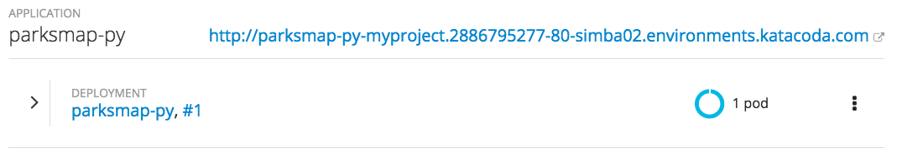

In these exercises you are going to make your application visible to end users so they can access it.


### Background: Routes

While *Services* provide internal abstraction and load balancing within an
OpenShift environment, sometimes clients (users, systems, devices, etc.)
**outside** of OpenShift need to access an application. The way that external
clients are able to access applications running in OpenShift is through the
OpenShift routing layer. And the data object behind that is a *Route*.

The default OpenShift router (HAProxy) uses the HTTP header of the incoming
request to determine where to proxy the connection. You can optionally define
security, such as TLS, for the *Route*. If you want your *Services*, and, by
extension, your *Pods*,  to be accessible to the outside world, you need to
create a *Route*.

#### Exercise: Creating a Route

Fortunately, creating a *Route* is a pretty straight-forward process.  You simply
`expose` the *Service* via the command line. Or, via the web console, just click
the _Create Route_ button associated with the service.

First we want to verify that we don't already have any existing routes. To list what _Routes_ already exist, run:

``oc get routes``{{execute}}

The result should be:

```
No resources found.
```

Next you need to get the *Service* name to expose. To list what _Services_ already exist, run:

``oc get services``{{execute}}

You should see output similar to:

```
NAME         CLUSTER-IP     EXTERNAL-IP   PORT(S)    AGE
parksmap-py  172.30.17.45   <none>        8080/TCP   7m
```

Once you know the *Service* name, creating a *Route* is done using the ``oc expose`` command.

``oc expose service/parksmap-py``{{execute}}

Verify the *Route* was created by running ``oc get routes`` again.

``oc get routes``{{execute}}

You should see output similar to:
```
NAME         HOST/PORT                                          PATH  SERVICES     PORT       TERMINATION
parksmap-py  parksmap-py-myproject...environments.katacoda.com        parksmap-py  8080-tcp
```

The ``HOST/PORT`` field will display the hostname which has been assigned by OpenShift to your application. For your application which you just exposed, the URL would then be:

http://parksmap-py-myproject.[[HOST_SUBDOMAIN]]-80-[[KATACODA_HOST]].environments.katacoda.com

You can also verify the *Route* by looking at the project in the OpenShift web console:



Pretty nifty, huh?  This application is now available at the URL shown in the
web console. Visit the URL in your browser and you will see:


### Catch-up: When Things Go Wrong

The "catch-up" commands for these exercises are as follows.

``oc expose service/parksmap-py``{{execute}}

ONLY run the "catch-up" commands if you had not already done a set of exercises.
