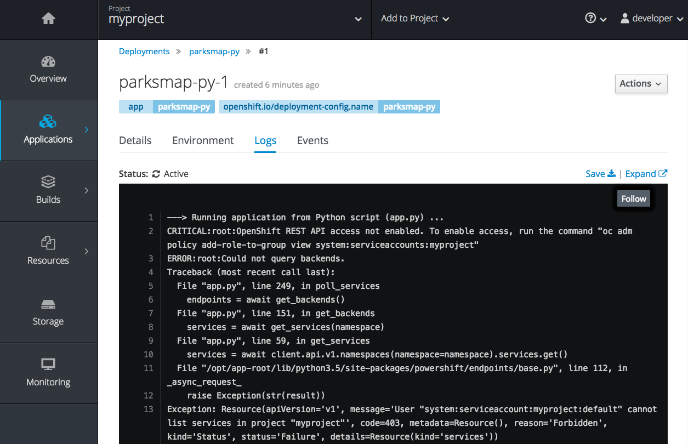

In these exercises you are going to learn about, and explore the logs generated by the application using both the web console and the command line.

### Background: Container Logs

OpenShift is constructed in such a way that it expects containers to log all
information to `STDOUT`. In this way, both regular and error information is
captured via standardized Docker mechanisms. When exploring the *Pod*'s logs
directly, you are essentially going through the Docker daemon to access the
container's logs, through OpenShift's API. Neat!

In some cases, applications may not have been designed to send all of their
information to `STDOUT` and `STDERR`. In many cases, multiple local log files
are used. While OpenShift cannot parse any information from these files, nothing
prevents them from being created, either. In other cases, log information is
sent by applications direct to some other external system. Here, too, OpenShift does not prohibit these
behaviors. If you have an application that does not log to `STDOUT`, either because it
already sends log information to some "external" system or because it writes
various log information to various files, fear not.

#### Exercise: Examining Logs

Since you have already deployed the application, you can take some time to examine its
logs. In the web console _Overview_ page, click on the kebab menu (three squares) at the
far right of the deployment and then click on the _View Logs_ item.


You should see a nice view of the *Pod*'s logs:



It appears there are some errors in the log, and that's OK. You will remedy those
in a little bit.

In addition to using the web console to view logs you can use the command line. In the case of the web console, the _View Logs_ menu item jumped automatically to the logs for one of the _Pods_. On the command line you need to select which _Pod_ you want to view the logs for.

To get a list of the _Pods_ run:

``oc get pods``{{execute}}

You should see output similar to:

```
NAME                  READY     STATUS    RESTARTS   AGE
parksmap-py-1-m7q7l   1/1       Running   0          12m
```

To see the logs for a specific _Pod_, run ``oc logs``, passing the name of the _Pod_ as argument. As the names of the _Pods_ change, for this exercise, to provide a command you can click on we use ``oc get pods -o name | head -1`` to get the name of the _Pod_.

``oc logs `oc get pods -o name | head -1` --timestamps``{{execute}}

The ``--timestamps`` option has also been added to the ``oc logs`` command so that the date and time of when a message was output is displayed. This is useful if the application logging itself doesn't include a date and time in the log message.

When you run the ``oc logs`` command you should see all of the available application logs scroll past. This should include the same error message you saw from the web console.

```
2017-12-17T21:43:30.656740303Z ---> Running application from Python script (app.py) ...
2017-12-17T21:43:31.211536443Z CRITICAL:root:OpenShift REST API access not enabled. To enable access, run thecommand "oc adm policy add-role-to-group view system:serviceaccounts:myproject"
2017-12-17T21:43:31.258423164Z ERROR:root:Could not query backends.
2017-12-17T21:43:31.258459417Z Traceback (most recent call last):2017-12-17T21:43:31.258475062Z   File "app.py", line 249, in poll_services
2017-12-17T21:43:31.258480975Z     endpoints = await get_backends()2017-12-17T21:43:31.258485848Z   File "app.py", line 151, in get_backends
2017-12-17T21:43:31.258490649Z     services = await get_services(namespace)
2017-12-17T21:43:31.258495325Z   File "app.py", line 59, in get_services2017-12-17T21:43:31.258500012Z     services = await client.api.v1.namespaces(namespace=namespace).services.get()
2017-12-17T21:43:31.258507552Z   File "/opt/app-root/lib/python3.5/site-packages/powershift/endpoints/base.py", line 112, in _async_request_
2017-12-17T21:43:31.258516364Z     raise Exception(str(result))
2017-12-17T21:43:31.258523896Z Exception: Resource(apiVersion='v1', message='User "system:serviceaccount:myproject:default" cannot list services in project "myproject"', code=403, metadata=Resource(), reason='Forbidden', kind='Status', status='Failure', details=Resource(kind='services'))
```

It is time now to address the problem described by the error message shown.
