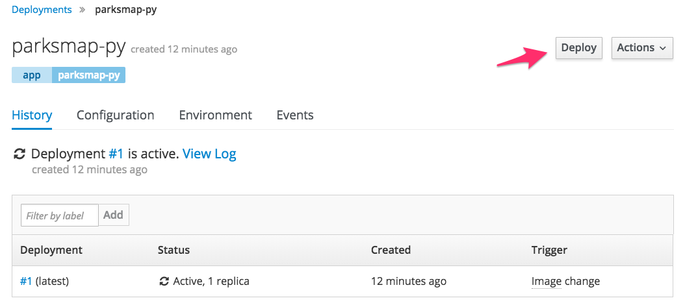

In these exercises you will learn about how anything done with OpenShift is controlled using a role based access control mechanism. You will also grant the ParksMap application front end to access the REST API of OpenShift.

### Exercise: Role Base Access Control

Almost every interaction with an OpenShift environment that you can think of
requires going through the master's API. All API interactions are both
authenticated (AuthN - who are you?) and authorized (AuthZ - are you allowed to
do what you are asking?).

Just like a user has
permissions (AuthZ), sometimes we may wish for non-users to be able to perform
actions against the API. These "non-users" are referred to as service accounts.

OpenShift automatically creates a few special service accounts in every project.
The ``default`` service account has its credentials automatically injected into
every pod that is launched. By changing the permissions for that service
account, we can do interesting things.

To view the current role bindings for your project run:

``oc get rolebindings``{{execute}}

This should display:

```
NAME                    ROLE                    USERS       GROUPS                             SERVICE ACCOUNTS   SUBJECTS
admin                   /admin                  developer
system:deployers        /system:deployer                                                       deployer
system:image-builders   /system:image-builder                                                  builder
system:image-pullers    /system:image-puller                system:serviceaccounts:myproject
```

You can see how you, logged in as the ``developer`` user, has ``admin`` role within the project. The other entries are the special service accounts created for each project.

### Exercise: Grant Service Account View Permissions

The ParksMap application front end wants to talk to the OpenShift API to learn about _Services_ and _Routes_ in the current project. You'll learn why soon!

To grant the ParksMap application access to the REST API, run:

``oc policy add-role-to-user view -z default``{{execute}}

The `oc policy` command above is giving a defined _role_ (`view`) to a user. But
we are using a special flag, `-z`. What does this flag do? From the `--help` output:

```
-z, --serviceaccount=[]: service account in the current namespace to use as a user
```

The `-z` syntax is a special one that saves us from having to type out the
entire string, which, in this case, is
`system:serviceaccount:myproject:default`. It's a nifty shortcut for when you want to apply the command to just the current project.

You can verify that the role has been added correctly by running:

``oc get rolebindings``{{execute}}

This should now output:

```
NAME                    ROLE                    USERS       GROUPS                             SERVICE ACCOUNTS   SUBJECTS
admin                   /admin                  developer
system:deployers        /system:deployer                                                       deployer
system:image-builders   /system:image-builder                                                  builder
system:image-pullers    /system:image-puller                system:serviceaccounts:myproject
view                    /view                                                                  default
```

Now that the ``default`` Service Account has ``view`` access, it can query the REST API
to see what resources are within the project. This also has the added benefit
of suppressing the error message! Although, in reality, we fixed the application.

### Exercise: Redeploying an Application

The ParksMap front end application you have deployed periodically polls the REST API. As soon as access to the REST API is granted, the ParksMap front end application should stop raising the error in the logs.

Just in case the ParksMap application has decided to stop polling due to the repeated errors, you can re-deploy the application.

This time we'll use the web console. From the _Overview_ page for your project, click _Applications_ in the left hand side navigation bar and then _Deployments_. You'll see the `parksmap-py` application listed. Click it.

The deployment screen tells you a lot about how the application will be
deployed. At the top right, there is a button labeled _Deploy_. This button will
cause a new deployment (which you know creates a new *ReplicationController*,
right?).

Click it.



You'll see that a new deployment is immediately started. Return to the _Overview_
page and watch it happen. You might not be fast enough! If you look at the logs
for the application now, you should see no errors.  That's great.

### Catch-up: When Things Go Wrong

The "catch-up" commands for these exercises are as follows.

``oc policy add-role-to-user view -z default``{{execute}}

ONLY run the "catch-up" commands if you had not already done a set of exercises.
