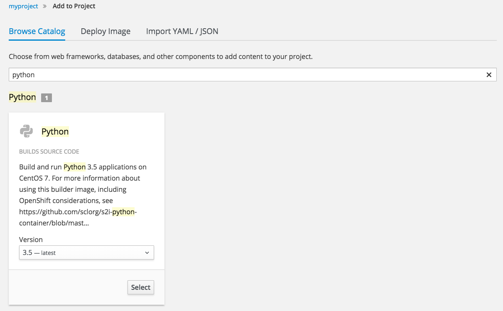
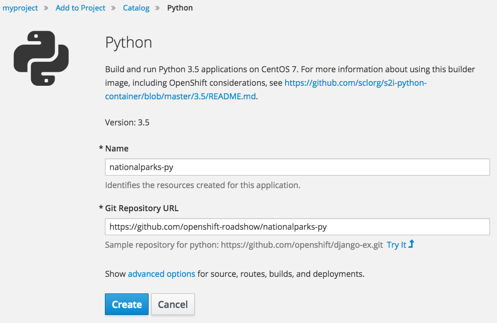

In these exercises, you are going to deploy a backend service, developed in the Python
programming language, that will expose 2 main REST endpoints to the ParksMap front end application.
The application will query for national parks information (including it's
coordinates) that is stored in a Mongo database.
This application will also provide an external access point, so that the API
provided can be directly used by the end user.


### Background: Source-to-Image (S2I)

In previous exercises you learned how to deploy a pre-existing container
image. Instead of using a pre-existing container image, you can deploy directly from a Git repository containing the application source code using a S2I builder.

[Source-to-Image (S2I)](https://github.com/openshift/source-to-image) is another
open source project sponsored by Red Hat. Its goal:

_Source-to-image (S2I) is a tool for building reproducible Docker images. S2I
produces ready-to-run images by injecting source code into a Docker image and
assembling a new Docker image which incorporates the builder image and built
source. The result is then ready to use with docker run. S2I supports
incremental builds which re-use previously downloaded dependencies, previously
built artifacts, etc._

OpenShift is S2I-enabled and can use S2I as one of its build mechanisms (in
addition to building Docker images from Dockerfiles, and "custom" builds).

OpenShift runs the S2I process inside a special *Pod*, called a build
_Pod_, and thus builds are subject to quotas, limits, resource scheduling, and
other aspects of OpenShift.

### Exercise: Creating a Python application

The backend service that you will be deploying as part of this exercise is
called `nationalparks-py`.  This is a Python application that performs 2D
geo-spatial queries against a Mongo database to locate and return map
coordinates of all National Parks in the world. That was just a fancy way of
saying that we are going to deploy a web service that returns a JSON list of
places.

OpenShift can work with any accessible Git repository. This could be GitHub,
GitLab, Bitbucket, or any other service that speaks Git. You can even register webhooks in
your Git server to initiate OpenShift builds triggered by any update to the
application code!

The repository that we are going to use is available on GitHub at:

https://github.com/openshift-roadshow/nationalparks-py

While the `oc new-app` command makes it very easy to get OpenShift to build code
from a Git repository into a container image, you can also use the web
console to do the same thing. Similar to how you used _Add to Project_ before
with a pre-existing container image, you can do the same for specifying a source code
repository.

From the web console, select _Browse Catalog_ from the _Add to Project_ drop down menu in the top navigation bar.
You will see a number of technologies and runtimes that you
can choose from.
Enter `python` into the _Filter by name or description_ text entry box.



Click on _Select_ for the Python builder to begin the process of creating the application. On the next page, for the _Name_, enter:

``nationalparks-py``{{copy}}

For the _Git Repository URL_, enter:

``https://github.com/openshift-roadshow/nationalparks-py``{{copy}}

The page should look like:



Hit the _Create_ button. Then click _Continue to
overview_. You will be able to see the build logs in the _Overview_ page once the build starts.


From the command line, you can also see the *Builds*:

``oc get builds``{{execute}}

You'll see output like:

```
NAME                 TYPE      FROM          STATUS    STARTED         DURATION
nationalparks-py-1   Source    Git@9368a76   Running   30 seconds ago
```

You can also view the build logs with the following command:

``oc logs -f builds/nationalparks-py-1 --follow``{{execute}}

The ``--follow`` option will result in the build log being tailed until the build has completed.

After the build has completed successfully:

* The S2I process will push the resulting container image to the internal OpenShift registry
* The _DeploymentConfig_ (DC) will detect that the image has changed, and this
  will cause a new deployment to happen.
* A _ReplicationController_ (RC) will be spawned for this new deployment.
* The RC will detect no *Pods* are running and will cause one to be deployed, as the default replica count is just 1.

If you run:

``oc get pods``{{execute}}

you will see that the build Pod
has finished (exited) and that an application *Pod* is in a ready and running state:

```
NAME                       READY     STATUS      RESTARTS   AGE
nationalparks-py-1-85rp9   1/1       Running     0          1m
nationalparks-py-1-build   0/1       Completed   0          2m
```

If you look again at the web console, you will notice that, when you create the
application this way, OpenShift also creates a *Route* for you. You can see the
URL in the web console. On the command line you can view the hostname assigned to the application by running:

``oc get routes``{{execute}}

The output should be similar to:

```
NAME               HOST/PORT                                                                    PATH      SERVICES           PORT       TERMINATION   WILDCARD
nationalparks-py   nationalparks-py-myproject.2886795273-80-simba02.environments.katacoda.com             nationalparks-py   8080-tcp                 None
```

For your environment the URL will be:

http://nationalparks-py-myproject.[[HOST_SUBDOMAIN]]-80-[[KATACODA_HOST]].environments.katacoda.com

Since this is a back-end application, it doesn't actually have a web interface.
However, it can give us some data. All back ends that work with the ParksMap
front end are required to implement a `/ws/info/` endpoint. Click on the following link to test:

http://nationalparks-py-myproject.[[HOST_SUBDOMAIN]]-80-[[KATACODA_HOST]].environments.katacoda.com/ws/info/

You will see a simple JSON string:

```
{"type": "cluster", "zoom": 4, "center": {"longitude": "14.505178", "latitude": "47.039304"}, "id": "nationalparks-py", "displayName": "National Parks (PY)"}
```

Earlier we said:

_This is a Python application that performs 2D geo-spatial queries
against a Mongo database_

But we don't have a database. Yet.

### Catch-up: When Things Go Wrong

The "catch-up" commands for these exercises are as follows.

``oc new-app --name nationalparks-py python:3.5~https://github.com/openshift-roadshow/nationalparks-py``{{execute}}

``oc logs bc/nationalparks-py --follow``{{execute}}

``oc rollout status dc/nationalparks-py``{{execute}}

``oc expose service/nationalparks-py``{{execute}}

ONLY run the "catch-up" commands if you had not already done a set of exercises.
