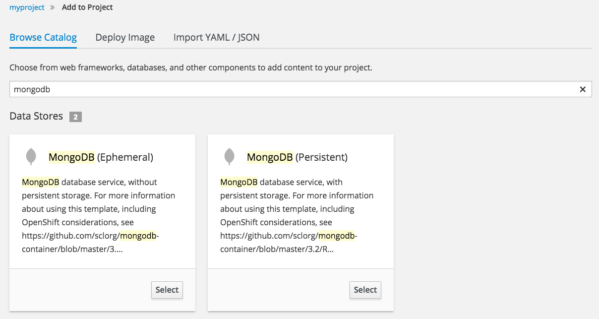
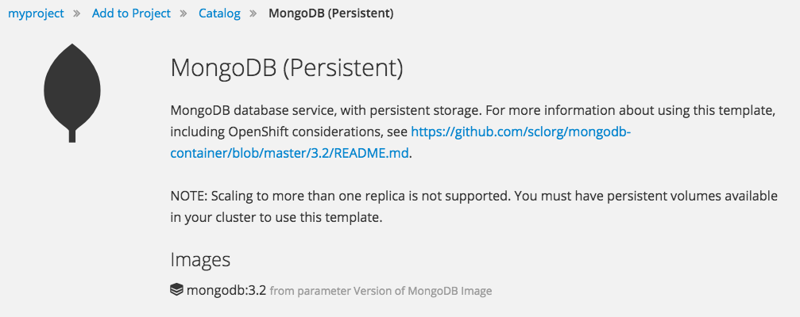
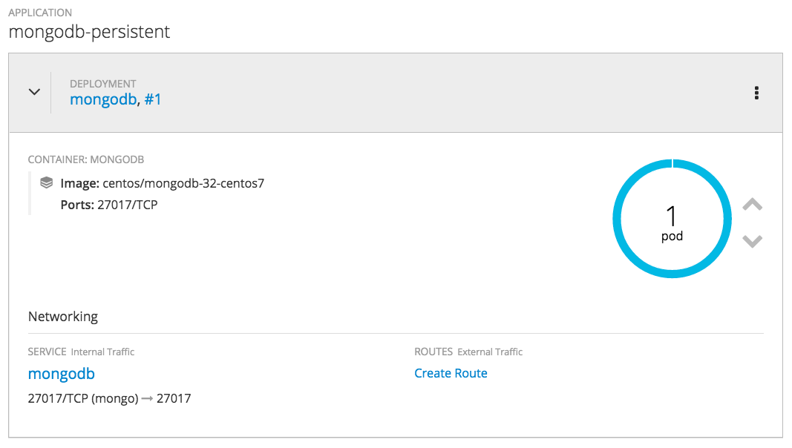

In these exercises, you are going to deploy a Mongo database that will be used to store the data for the `nationalparks-py` application. You will also connect the `nationalparks-py` application with the newly deployed Mongo database, so that the `nationalparks-py` application can load and query the database for the corresponding information.


### Exercise: Deploying the Database

As you've seen so far, the web console makes it very easy to deploy things onto
OpenShift. When we deploy the Mongo database image provided with OpenShift, we pass in some environment variables.
These environment variables are used to set the username, password, and name of
the database.  You can change the
values of these environment variables to anything you would like.  The variables
we are going to be setting are as follows:

- MONGODB_USER
- MONGODB_PASSWORD
- MONGODB_DATABASE
- MONGODB_ADMIN_PASSWORD

The database image is built in a way that it will automatically configure itself
using the supplied information (assuming there is no data already present in the
persistent storage!). The image will ensure that:

- A database exists with the specified name
- A user exists with the specified name
- The user can access the specified database with the specified password

To deploy a Mongo database, in the web console click on the _Add to
Project_ drop down menu on the top navigation bar and select _Browse Catalog_. Enter ``mongodb`` into the _Filter by name or description_ text entry box.

You will notice that there are two MongoDB options available. an ephemeral database which isn't backed by persistent storage, where all data would be lost if it were restarted, and a persistent database which comes pre-configured to use a persistent volume for storing data.



When you created the ``national-parks-py`` application, you selected the
builder image to use and OpenShift presented standard options for a S2I builder.

For MongoDB you are going to use a template, which creates a pre-configured set of resources, with parameters being able to be supplied to customize the deployment. The parameters you will need to set are those which will define the environment variables discussed before (username, password, database, and
admin password).

Select the _MongoDB (Persistent)_ template.



You will be presented with the template parameters you can set. Set the following parameters, with the value of ``mongodb`` for all.

* _Database Service Name_ : ``mongodb``{{copy}}
* _MongoDB Connection Username_ : ``mongodb``{{copy}}
* _MongoDB Connection Password_ : ``mongodb``{{copy}}
* _MongoDB Database Name_: ``mongodb``{{copy}}
* _MongoDB Admin Password_ : ``mongodb``{{copy}}

Do not leave the username and password fields empty, and ensure that the default value for the name of the database is changed from ``sampledb`` to ``mongodb``. Later steps rely on all values being ``mongodb``.

The fields for the template parameters should look like the following:


Leave the rest of the values as their defaults. Click
_Create_, then click _Continue to overview_ on the next page. The MongoDB instance should be deployed.



#### Exercise: Wiring up the Application and the Database

When you initially created the `nationalparks-py` application, you did not provide any configuration, it therefore doesn't know how to connect to the Mongo database you just created.

You need to configure the `nationalparks-py` *Pod*(s) to have the right values in
the right environment variables so that the application knows how and where to
find the Mongo database.

If you think way back to prior exercises, you will recall that a
_DeploymentConfig_ tells OpenShift how to deploy something. This includes
things like what environment variables to configure. So, to set up the right
environment variables, you need to modify the _DeploymentConfig_
(DC). This can easily be done from either the web interface or via the command
line.

The command line takes a little less time, so let's use that option. To confirm the name of _DeploymentConfig_ run:

``oc get dc``{{execute}}

You should have ``nationalparks-py`` listed.

Then, use the `oc set env` command to set environment variables directly on the DC:

``oc set env dc/nationalparks-py -e DB_USERNAME=mongodb -e DB_PASSWORD=mongodb -e DB_NAME=mongodb -e DB_HOST=mongodb``{{execute}}

The environment variables are named differently to those used in the database, but the values must match the corresponding variables for the database credentials, database and host details. If you entered the values correctly in the template parameters when deploying the Mongo database they should all be ``mongodb``.

After you have modified the *DeploymentConfig* object, you can verify the
environment variables have been added by running:

``oc set env dc/nationalparks-py --list``{{execute}}

You should see the following output:

```
# deploymentconfigs nationalparks-py, container nationalparks-py
DB_USERNAME=mongodb
DB_PASSWORD=mongodb
DB_NAME=mongodb
DB_HOST=mongodb
```

#### Exercise: Configuration Change Triggers

As soon as you set the environment variables on the _DeploymentConfig_, some
magic happened. OpenShift decided that this was a significant enough change to
warrant re-deploying the application. This was due to a configuration change trigger being enabled on the _DeploymentConfig_.

You can verify this is what happened by running:

``oc get dc``{{execute}}

This will output results similar to:

```
NAME               REVISION   DESIRED   CURRENT   TRIGGERED BY
nationalparks-py   2          1         0         config,image(nationalparks-py:latest)
```

The revision number of the *DeploymentConfig* for ``nationalparks-py`` now shows 2. Also run:

``oc get rc``{{execute}}

This will show that there are now two versions of the _ReplicationController_.

```
NAME                 DESIRED   CURRENT   READY     AGE
nationalparks-py-1   0         0         0         5m
nationalparks-py-2   1         1         1         1m
```

The desired and current number of instances for the "-1" deployment
is 0. The desired and current number of instances for the "-2" deployment is 1.
This means that OpenShift has gracefully torn down the "old" application and
stood up a "new" instance based on the updated configuration.

#### Exercise: Loading Data Into the Database

Now that you have the database deployed, you can visit the `nationalparks-py` web
service in your browser to query for data:

http://nationalparks-py-myproject.[[HOST_SUBDOMAIN]]-80-[[KATACODA_HOST]].environments.katacoda.com/ws/data/all

And the result?

```
[]
```

Where's the data? Think about the process you went through. You deployed the
application and then deployed the database. Nothing actually loaded anything
*INTO* the database, though.

The application provides an endpoint to do just that:

http://nationalparks-py-myproject.[[HOST_SUBDOMAIN]]-80-[[KATACODA_HOST]].environments.katacoda.com/ws/data/load

Visit this URL in your browser. And the result?

```
Items inserted in database: 2740
```

Visit:

http://nationalparks-py-myproject.[[HOST_SUBDOMAIN]]-80-[[KATACODA_HOST]].environments.katacoda.com/ws/data/all

from your browser again and you will see tons of JSON data now.
That's great. Our ParksMap should finally work!

If you get an error in your browser, you may be using an older version of FireFox (54) which has a JSON parsing bug. Try using ``curl`` against the URL instead.

Bring up the ParksMap front end application again:

http://parksmap-py-myproject.[[HOST_SUBDOMAIN]]-80-[[KATACODA_HOST]].environments.katacoda.com/

Hmm... There's just one thing. The main map **STILL** isn't displaying the parks.
That's because the ParksMap front end application only tries to talk to backend services that it knows about.

### Catch-up: When Things Go Wrong

The "catch-up" commands for these exercises are as follows.

``oc new-app --template mongodb-persistent --param DATABASE_SERVICE_NAME=mongodb --param MONGODB_USER=mongodb --param MONGODB_PASSWORD=mongodb --param MONGODB_DATABASE=mongodb --param MONGODB_ADMIN_PASSWORD=mongodb``{{execute}}

``oc rollout status dc/mongodb``{{execute}}

``oc set env dc/nationalparks-py -e DB_USERNAME=mongodb -e DB_PASSWORD=mongodb -e DB_NAME=mongodb -e DB_HOST=mongodb``{{execute}}

``oc rollout status dc/nationalparks-py``{{execute}}

Using your browser visit the URL:

http://nationalparks-py-myproject.[[HOST_SUBDOMAIN]]-80-[[KATACODA_HOST]].environments.katacoda.com/ws/data/load

to load the ``nationalparks-py`` data into the database.

ONLY run the "catch-up" commands if you had not already done a set of exercises.
