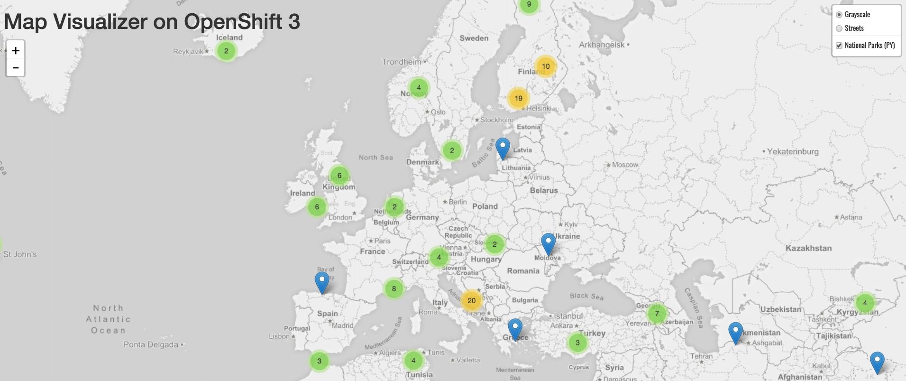

The ParksMap front end will only display data from backends which have been registered as valid data sources.

In these exercises you will label the `nationalparks-py` application as a backend for the ParksMap front end application, so that it can be dynamically discovered using the OpenShift discovery mechanism and the map populated.

#### Exercise: Working With Labels

You briefly explored labels and how they are just a ``key=value`` pair associated with a resource object, when looking at how _Pods_ are associated with a _Service_. That was a specific case where OpenShift itself relies on labels, but you can use labels for any purpose of your own as well.

In the case of the ParksMap application, it determines what backend services to pull map data from by looking for labels which have been added to the _Route_ or _Service_ objects. It does this by using the OpenShift REST API to query what _Route_ or _Service_ objects exist and then filtering out those which do not have the required `type=parksmap-backend` label.

The ParksMaps application uses the REST API to get information about labels, but you can get the same information using the command line by running ``oc describe`` on a resource.

To see the current set of labels defined for ``nationalparks-py`` run:

``oc describe route/nationalparks-py``{{execute}}

This should produce output similar to:

```
Name:                   nationalparks-py
Namespace:              myproject
Created:                5 minutes ago
Labels:                 app=nationalparks-py
Annotations:            openshift.io/generated-by=OpenShiftWebConsole
                        openshift.io/host.generated=true
Requested Host:         nationalparks-py-myproject.2886795309-80-simba02.environments.katacoda.com
                          exposed on router router 26 seconds ago
Path:                   <none>
TLS Termination:        <none>
Insecure Policy:        <none>
Endpoint Port:          8080-tcp

Service:        nationalparks-py
Weight:         100 (100%)
Endpoints:      <none>
```

You can see that at present it only has one label: `app=nationalparks`.

To add the required label of `type=parksmap-backend`, run ``oc label``:

``oc label route/nationalparks-py type=parksmap-backend``{{execute}}

Run:

``oc describe route/nationalparks-py``{{execute}}

again to verify the label has been applied.

Visit from your browser the URL for the ParksMap front end application once more.

http://parksmap-py-myproject.[[HOST_SUBDOMAIN]]-80-[[KATACODA_HOST]].environments.katacoda.com/

You'll notice that the national parks data will suddenly show up.



That's really cool!

### Catch-up: When Things Go Wrong

The "catch-up" commands for these exercises are as follows.

``oc label route/nationalparks-py type=parksmap-backend``{{execute}}

ONLY run the "catch-up" commands if you had not already done a set of exercises.
