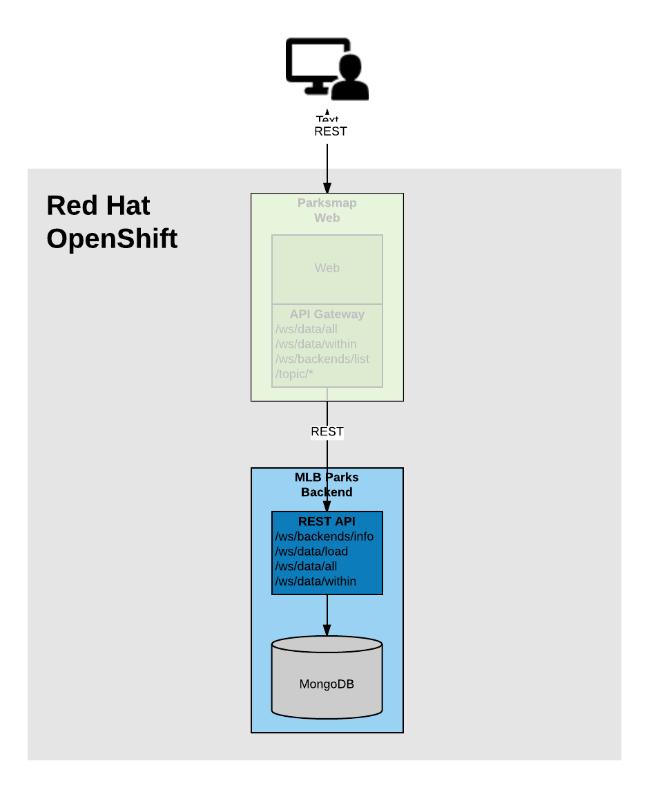

In these exercises, we're going to deploy a complete backend application, consisting of
a REST API backend and a Mongo database. The complete application will already
be wired together and described as a backend for the ParksMap front end application, so
that once the application is built and deployed, you will be able to see the new
map data straight away.



### Background: Templates

Running all the individual commands to deploy an application can be tedious and error prone if you need to do it multiple times.

Fortunately for you, all of this configuration can be captured into a single
*Template* which can then be processed to create a full set of resources. As you
saw with the Mongo database, a *Template* may define parameters for certain values, such as
database username or password, with them optionally being able to be automatically generated by OpenShift when the _Template_ is processed.

Administrators can load *Templates* into OpenShift and make them available to
all users, even via the web console. Users can create *Templates* and load them
into their own *Projects* for other users (with access) to share and use.

The great thing about *Templates* is that they can speed up the deployment
workflow for application development by providing a "recipe" of sorts that can
be deployed with a single command.  Not only that, they can be loaded into
OpenShift from an external URL, which will allow you to keep your templates in a
version control system.

Let's combine all of the exercises you have performed in the last several exercises by
using a *Template* that you can instantiate with a single command.  While you
could have used templates to deploy everything in the workshop, it was done as separate steps so you could understand how to create, deploy, and wire
resources together yourself.

### Exercise: Making Some Extra Room

You have already deployed the ParksMap front end application, the ``nationalparks-py`` backend service and a Mongo database instance. The OpenShift environment you are using for this interactive workshop only provides a limited amount of resources (1GB memory). If we deploy much more, OpenShift will not be able to schedule deployment of the applications due to lack of memory. Before we can continue, we therefore need to delete the existing ``nationalpark-py`` application and the Mongo database it used.

To delete these, run:

``oc delete all --selector app=nationalparks-py``{{execute}}

``oc delete all,pvc,secret --selector app=mongodb-persistent``{{execute}}

This will leave the ParksMap front end application still running.

To verify that this is all that is running, run:

``oc get all -o name``{{execute}}

### Exercise: Instantiate a Template

The front end application we've been working with this whole time will display
as many back end services' data as are created. Adding more stuff with the right
*Label* will make more stuff show up on the map.

Now you will deploy a service to provide data for Major League Baseball stadiums in the US by using a
template. It is pre-configured to build the back end application, and
deploy the Mongo database. It also uses a *Hook* to call the `/ws/data/load`
endpoint to cause the data to be loaded into the database from a JSON file in
the source code repository.

To load the _Template_ execute the following command:

``oc create -f https://raw.githubusercontent.com/openshift-roadshow/mlbparks-py/1.0.0/ose3/application-template.json``{{execute}}

What just happened? What did you just create? The item that we passed to the `oc create`
command is a *Template*. The `oc create` simply makes the template available in
your *Project*.

You can see what _Templates_ you have available in your project by running:

``oc get templates``{{execute}}

You will see output like the following:

```
NAME          DESCRIPTION                                                                      PARAMETERS     OBJECTS
mlbparks-py   Application template MLB Parks backend running on Python/Flask and using mongodb 14 (4 blank)   8
```

Are you ready for the magic command? Now run:

``oc new-app mlbparks-py -p APPLICATION_NAME=mlbparks-py -p GIT_URI=https://github.com/openshift-roadshow/mlbparks-py -p GIT_REF=1.0.0``{{execute}}

You will see output similar to:

```
--> Deploying template "myproject/mlbparks-py" to project myproject

     mlbparks-py
     ---------
     Application template MLB Parks backend running on Python/Flask and using mongodb

     * With parameters:
        * Application Name=mlbparks-py
        * Application route=
        * Mongodb App=mongodb-mlbparks-py
        * Git source repository=https://github.com/openshift-roadshow/mlbparks-py
        * Git branch/tag reference=1.0.0
        * Database name=mongodb
        * MONGODB_NOPREALLOC=
        * MONGODB_SMALLFILES=
        * MONGODB_QUIET=
        * Database user name=userc3F # generated
        * Database user password=LrUaTl3f # generated
        * Database admin password=JvEE1K4x # generated
        * GitHub Trigger=FF8hMKbJ # generated
        * Generic Trigger=Gm0VQFUB # generated

--> Creating resources ...
    configmap "mlbparks-py" created
    service "mongodb-mlbparks-py" created
    deploymentconfig "mongodb-mlbparks-py" created
    imagestream "mlbparks-py" created
    buildconfig "mlbparks-py" created
    deploymentconfig "mlbparks-py" created
    service "mlbparks-py" created
    route "mlbparks-py" created
--> Success
    Build scheduled, use 'oc logs -f bc/mlbparks-py' to track its progress.
    Run 'oc status' to view your app.
````

OpenShift will now:

* Configure and start a build
  * From the supplied source code repository
* Configure and deploy the Mongo database
  * Using auto-generated user, password, and database name
* Configure environment variables for the app to connect to the database
* Create the correct services
* Label the app service with `type=parksmap-backend`

All with one command!

To monitor the proress of the deployment from the command line run:

``oc rollout status dc/mlbparks-py``{{execute}}

While you wait, you can dig around in the web console to see what was created.

When the build is complete and the deployment finished, visit the URL for the ParksMap front end application.

http://parksmap-py-myproject.[[HOST_SUBDOMAIN]]-80-[[KATACODA_HOST]].environments.katacoda.com/

Does it work?

Think about how
this could be used in your environment.  For example, a template could define a
large set of resources that make up a "reference application", complete with
several app servers, databases, and more.  You could deploy the entire set of
resources with one command, and then hack on them to develop new features,
microservices, fix bugs, and more.

As a final exercise, look at the template that was used to create the
resources for our ``mlbparks-py`` application.

First get the description of the template.

``oc describe template/mlbparks-py``{{execute}}

This will display what parameters the template accepts.

You can then look at the raw definition of the template by running:

``oc get template mlbparks-py -o yaml``{{execute}}
