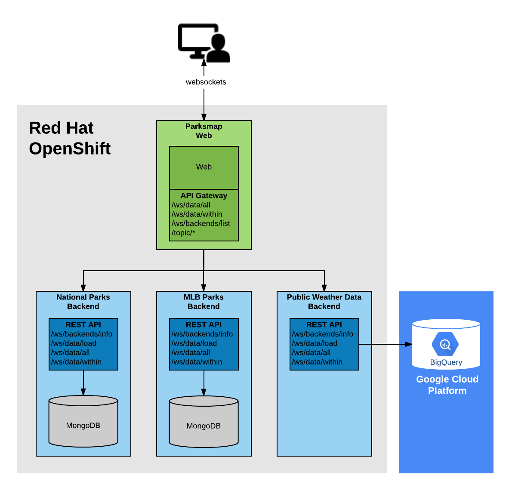

This is an extended tutorial for learning how to deploy applications to OpenShift. In the tutorial you will deploy an application called ParksMap.

ParksMap is a polyglot geo-spatial data visualization application built using the microservices architecture and is composed of a set of services which are developed using different programming language frameworks.

The main service is a web application which has a server-side component in charge of aggregating the geo-spatial APIs provided by multiple independent backend services and a client-side component in Javascript that is responsible for visualizing the geo-spatial data on the map. The client-side component which runs in your browser communicates with the server-side via WebSockets protocol in order to update the map in real-time.

There will be a set of independent backend services deployed that will provide different mapping and geo-spatial information. The set of available backend services that provide geo-spatial information are:

* WorldWide National Parks
* Major League Baseball Stadiums in the US
* International Airports
* Earthquakes in New Zealand
* Aussie Dunnies

The original source code for the applications are located [here](https://github.com/openshift-roadshow/).

The server-side component of the ParksMap web application acts as a communication gateway to all the available backends. These backends will be dynamically discovered by using service discovery mechanisms provided by OpenShift which will be discussed in more details in the tutorial.
