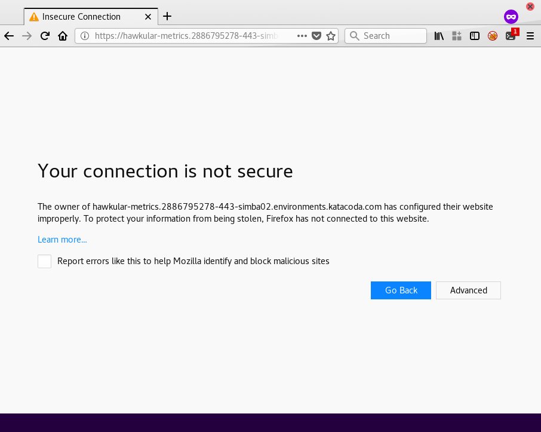
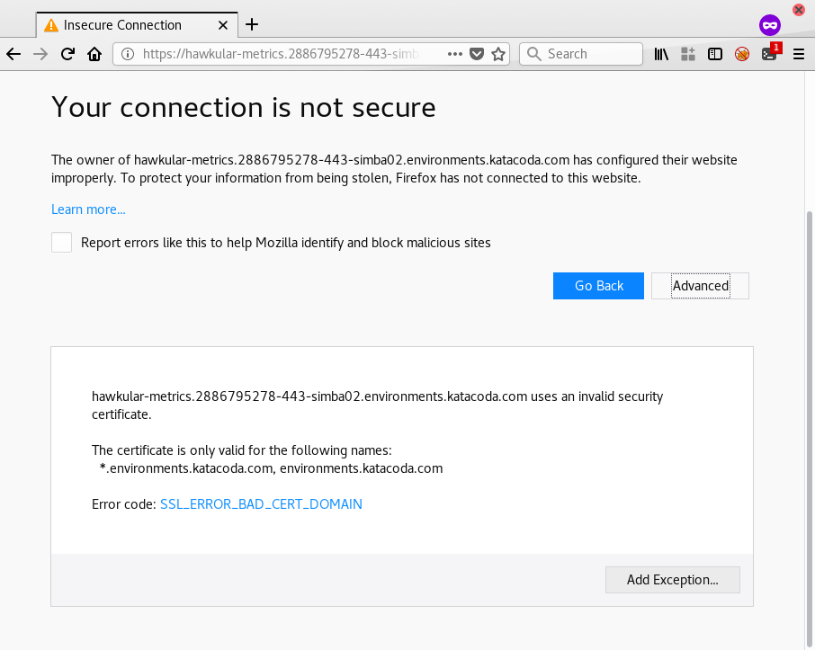
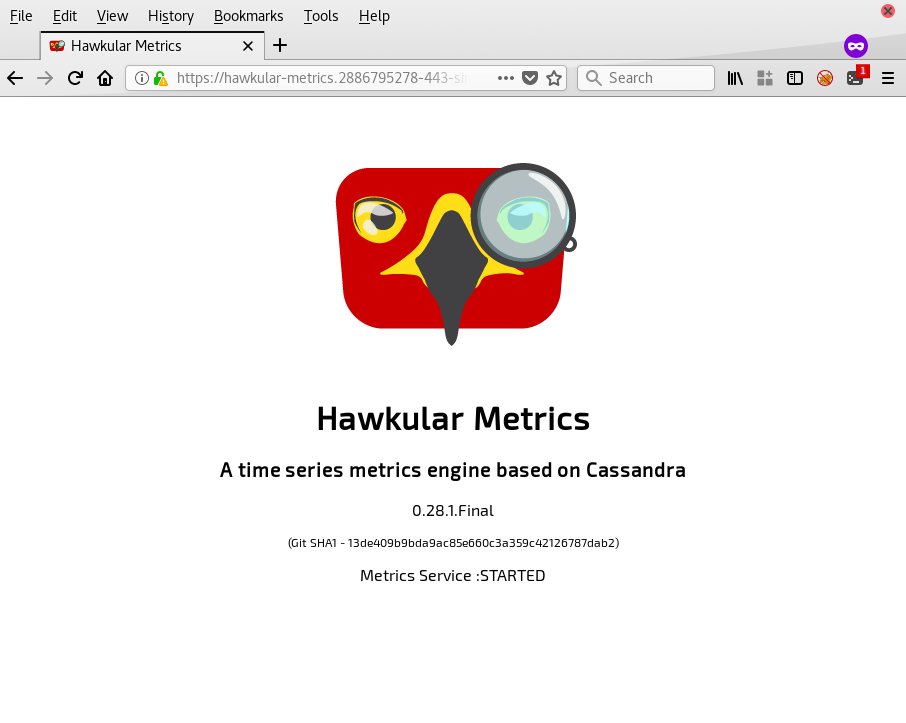
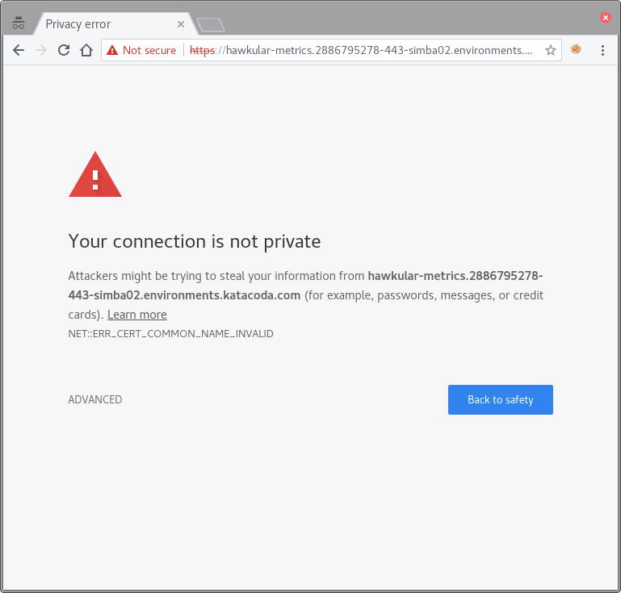
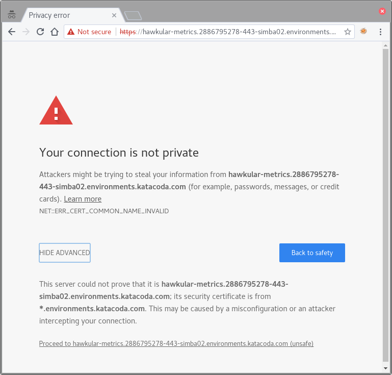
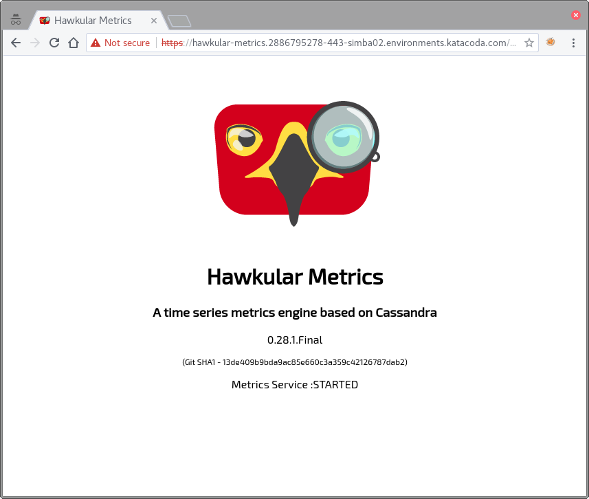
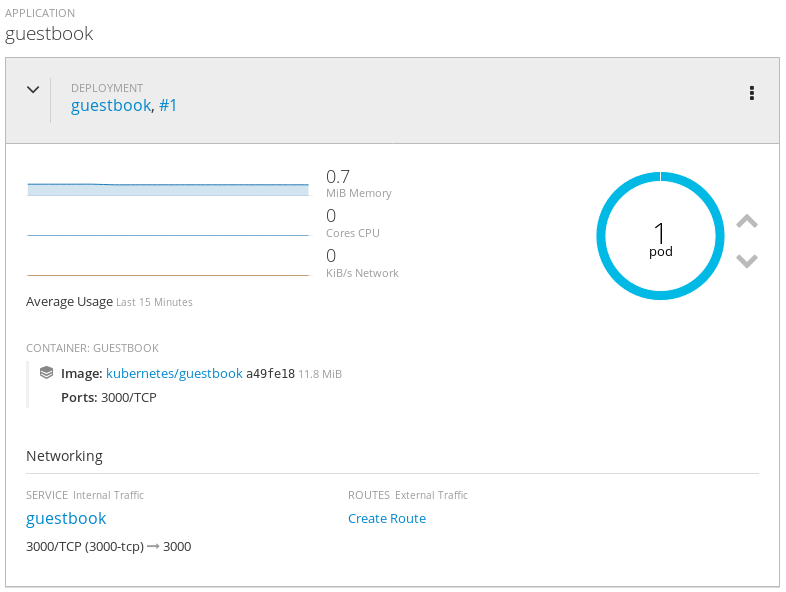
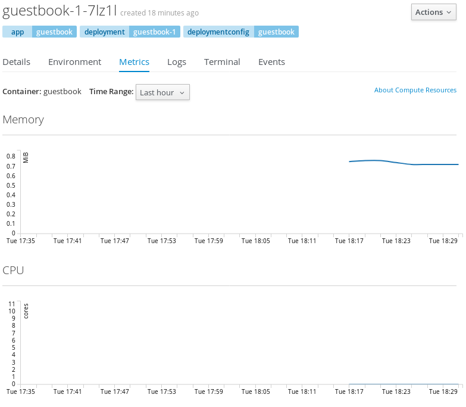

We will create an initial project where we deploy a sample application
that we will use to observe the metrics.

To login to the OpenShift cluster used for this course from the _Terminal_,
run:

``oc login -u developer -p developer``{{execute}}

This will log you in using the credentials:

* **Username:** ``developer``
* **Password:** ``developer``

You should see the output:

```
Login successful.

You don't have any projects. You can try to create a new project, by running

    oc new-project <projectname>
```

To create a new project called ``myproject`` run the command:

``oc new-project myproject``{{execute}}

You should see output similar to:

```
Now using project "myproject" on server "https://172.17.0.41:8443".

You can add applications to this project with the 'new-app' command. For example, try:

    oc new-app centos/ruby-22-centos7~https://github.com/openshift/ruby-ex.git

to build a new example application in Ruby.
```

We will deploy a sample application:

``oc new-app kubernetes/guestbook``{{execute}}

After the pod has been created, check the metrics using ``oc``. In order to see
the metrics, using the ``oc`` command line, it is required to be cluster-admin
first:

``oc login -u system:admin``{{execute}}

Then perform the ``adm top pod`` command:

``oc adm top pod --heapster-namespace='openshift-infra'  --heapster-scheme="https" -n myproject``{{execute}}

**NOTE:** Recent versions of ``oc`` [don't require](https://bugzilla.redhat.com/show_bug.cgi?id=1470003) the ``--heapster-namespace`` nor the ``--heapster-scheme`` flags.

You should see output similar to:

```
NAME                CPU(cores)   MEMORY(bytes)   
guestbook-1-7lz1l   0m           0Mi
```

As an exercise to the reader, explore the different ``oc adm top`` options,
including observing nodes utilization.

Login again as developer once you've finished observing the stats:

``oc login -u developer -p developer``{{execute}}

To access the web console, click on the _Dashboard_ button above the terminal
window. You can switch back to the terminal by clicking on the _Terminal_
button.

The actual URL of the web console for your environment is:

https://[[HOST_SUBDOMAIN]]-8443-[[KATACODA_HOST]].environments.katacoda.com

If you click on this you will also be taken to the _Dashboard_ tab. If you want to view the web console in a separate browser tab or window, right click on the URL and select the menu option to open it.

The hawkular-metrics certificate should be trusted temporary in your browser,
otherwise, metrics won't show up in the web interface. In order to make do it,
open the following URL:

https://hawkular-metrics.[[HOST_SUBDOMAIN]]-443-[[KATACODA_HOST]].environments.katacoda.com/hawkular/metrics

Accept the security warning and temporary accept the certificate. The hawkular
metrics mighty hawk should show once finished.

In Firefox:






In Chrome:





**NOTE:** This step should be ideally performed before login in the web console,
even if it can be done later but you need to log out from the web console and
log in again after the certificate has been trusted.

Once the certificate has been trusted, the next step is to login in the
web console.


Enter in the following credentials:

**Username:** ``developer``{{copy}}
**Password:** ``developer``{{copy}}

and click on _Log In_.

Click on the `myproject` project. You will be taken to the project overview page
which will list all of the routes, services, deployments, and pods that you have
running as part of your project.

If the metrics are properly deployed, there will be a new fancy graph showing
the current resource usage detailed by CPU, Memory and Network I/O per pod
in the overview section.



**NOTE:** If metrics don't appear, verify if the hawkular certificate has been
trusted.

Accessing every pod details in "Applications" -> "Pods" -> "<pod name>" will
show a new tab named "Metrics" with a metrics historical graph that can be
used to browse usage from within a week.



Note the graph will show you detailed information if moving the mouse cursor
over the exact time the metric has been gathered.
