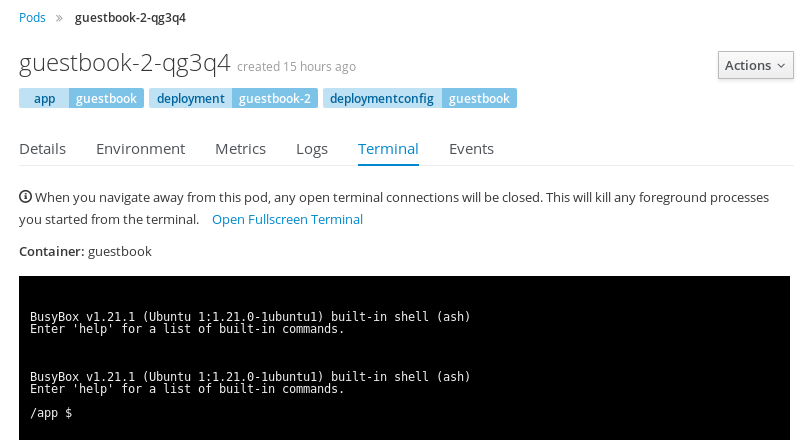

Once everything is set, it is time to check the ``hpa`` in action. To be able
to see it, we will create some CPU stress in the guestbook pod and will
observe the events.

We will perform a CPU hog operation using the pod's terminal on the OpenShift
web interface and we will observe the events using the terminal.

First thing is first, so lets see the events on the _Terminal_ window by
using the ``oc`` tool:

``oc get events -w``{{execute}}

Using the ``-w`` flag, the terminal will be watching for new events to show.

Let's access the pod's shell in the web interface by
accessing the ``myproject`` project -> Applications -> Pods then select the
pod name. Once the pod details are showed, select the "Terminal" tab:



The pod's terminal depends on the image used in the container, in this example
the shell used is a built in shell using busybox so don't expect to have a full
featured terminal because it is not needed for this container.

Type the following command to start creating CPU load on the container:

```
$ seq 3 | xargs -0 -n1 timeout -t 60 md5sum /dev/zero
```

This will create 3 ``md5sum`` processes for 1 minute that will be enough to
stress the CPU.

Go back to the _Terminal_ and after a while, you will see some events regarding
the ``hpa``:

```
LASTSEEN                        FIRSTSEEN                       COUNT     NAME      KIND                      SUBOBJECT   TYPE      REASON                    SOURCE                         MESSAGE
2017-12-28 05:55:00 -0400 EDT   2017-12-28 05:53:52 -0400 EDT   8         guestbook   HorizontalPodAutoscaler             Normal    DesiredReplicasComputed   {horizontal-pod-autoscaler }   Computed the desired num of replicas: 0, on a base of 1 report(s) (avgCPUutil: 0, current replicas: 1)
2017-12-28 05:55:25 -0400 EDT   2017-12-28 05:55:25 -0400 EDT   1         guestbook   HorizontalPodAutoscaler             Normal    DesiredReplicasComputed   {horizontal-pod-autoscaler }   Computed the desired num of replicas: 2, on a base of 1 report(s) (avgCPUutil: 38, current replicas: 1)
2017-12-28 05:55:55 -0400 EDT   2017-12-28 05:55:55 -0400 EDT   1         guestbook   DeploymentConfig             Normal    ReplicationControllerScaled   {deploymentconfig-controller }   Scaled replication controller "guestbook-2" from 1 to 2
2017-12-28 05:55:55 -0400 EDT   2017-12-28 05:55:55 -0400 EDT   1         guestbook   HorizontalPodAutoscaler             Normal    SuccessfulRescale   {horizontal-pod-autoscaler }   New size: 2; reason: CPU utilization above target
2017-12-28 05:55:55 -0400 EDT   2017-12-28 05:55:55 -0400 EDT   1         guestbook-2-gy8kr   Pod                 Normal    Scheduled   {default-scheduler }   Successfully assigned guestbook-2-gy8kr to localhost
2017-12-28 05:55:55 -0400 EDT   2017-12-28 05:55:55 -0400 EDT   1         guestbook-2   ReplicationController             Normal    SuccessfulCreate   {replication-controller }   Created pod: guestbook-2-gy8kr
2017-12-28 05:55:55 -0400 EDT   2017-12-28 05:55:55 -0400 EDT   2         guestbook   HorizontalPodAutoscaler             Normal    DesiredReplicasComputed   {horizontal-pod-autoscaler }   Computed the desired num of replicas: 2, on a base of 1 report(s) (avgCPUutil: 55, current replicas: 1)
... [OUTPUT ABBREVIATED] ...
2017-12-28 05:55:58 -0400 EDT   2017-12-28 05:55:58 -0400 EDT   1         guestbook-2-gy8kr   Pod       spec.containers{guestbook}   Normal    Pulling   {kubelet localhost}   pulling image "kuberentes/guestbook@sha256:6639cfbc4bd5d558eb782817eca84594e333a5fee9b032d5dea68fb959963022"
2017-12-28 05:55:59 -0400 EDT   2017-12-28 05:55:59 -0400 EDT   1         guestbook-2-gy8kr   Pod       spec.containers{guestbook}   Normal    Pulled    {kubelet localhost}   Successfully pulled image "kuberentes/guestbook@sha256:6639cfbc4bd5d558eb782817eca84594e333a5fee9b032d5dea68fb959963022"
2017-12-28 05:56:00 -0400 EDT   2017-12-28 05:56:00 -0400 EDT   1         guestbook-2-gy8kr   Pod       spec.containers{guestbook}   Normal    Created   {kubelet localhost}   Created container with docker id 522fb0c705b5; Security:[seccomp=unconfined]
2017-12-28 05:56:00 -0400 EDT   2017-12-28 05:56:00 -0400 EDT   1         guestbook-2-gy8kr   Pod       spec.containers{guestbook}   Normal    Started   {kubelet localhost}   Started container with docker id 522fb0c705b5
```

Cancel the ``oc get events -w`` command by pressing _Ctrl+c_ and observe the
new pod:

``oc get pods``{{execute}}

Go back to the events:

``oc get events -w``{{execute}}

Once the CPU hog command finishes, the pods will be scaled down to the original
status:

```
LASTSEEN                        FIRSTSEEN                       COUNT     NAME      KIND                      SUBOBJECT   TYPE      REASON                    SOURCE                         MESSAGE
2017-12-28 06:16:00 -0400 EDT   2017-12-28 06:16:00 -0400 EDT   1         guestbook   HorizontalPodAutoscaler             Normal    SuccessfulRescale   {horizontal-pod-autoscaler }   New size: 1; reason: All metrics below target
2017-12-28 06:16:00 -0400 EDT   2017-12-28 06:16:00 -0400 EDT   1         guestbook   DeploymentConfig             Normal    ReplicationControllerScaled   {deploymentconfig-controller }   Scaled replication controller "guestbook-2" from 2 to 1
2017-12-28 06:16:00 -0400 EDT   2017-12-28 06:16:00 -0400 EDT   1         guestbook-2   ReplicationController             Normal    SuccessfulDelete   {replication-controller }   Deleted pod: guestbook-2-gy8kr
```

Note the scale down process can take up to 5 minutes. Starting with OpenShift
3.7, this parameter can be modified in the OpenShift cluster using the `horizontal-pod-autoscaler-downscale-delay` flag in the controller arguments on
master nodes.

Go back to the web interface and observe what happened with the metrics graphs
during this situation.
