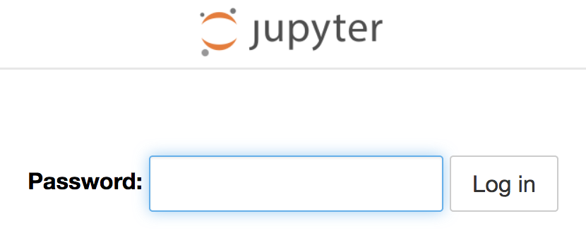

From the options for deploying applications to your project, select _From Catalog_. This will bring up the _Developer Catalog_.

Ensure that _All Items_ is selected on the left hand side, and in the _Filter by keyword_ text entry field enter ``jupyter``{{copy}}. This will limit the displayed items to just the OpenShift templates you loaded.

Click on the tile for _Jupyter Notebook_.

This will bring up the description of the template. Click on _Instantiate Template_, which will bring up a form with the parameters for the template which you can customize.

The purpose of the template parameters are:

* ``APPLICATION_NAME`` - The name of the deployment.
* ``NOTEBOOK_IMAGE`` - The name of the image stream for the Jupyter notebook image, and the version tag, which you wish to use.
* ``NOTEBOOK_PASSWORD`` - The password used to protect access to the Jupyter notebook. This cannot be left empty.
* ``NOTEBOOK_INTERFACE`` - The Jupyter notebook web interface to use. Setting this to ``lab`` will enable the JupyterLab web interface.
* ``NOTEBOOK_MEMORY`` - The maximum amount of memory the Jupyter noteboook deployment is allowed to use.

In the ``NOTEBOOK_PASSWORD`` field enter a password of ``secret``{{copy}}, and then click on _Create_. The _Template Instance Overview_ view for the deployment will be displayed.

To monitor the deployment, click on the _Topology_ view in the left hand side menu.

The ring shown in the visualization of the deployment will change from white, indicating the deployment is pending, to light blue, indicating the application is starting, and finally blue, indicating the application is running.

The icon top right of the ring is a short cut to access the URL for the deployment. Once the ring has turned blue indicating the application is running, click on this icon, which will open a new browser tab or window for the Jupyter notebook.

Because a secure HTTP connection is used, but an environment may in some cases use a self signed SSL certificate, you will need to accept the certificate to proceed.

At the login prompt, enter the password ``secret``{{copy}} which you entered into the ``NOTEBOOK_PASSWORD`` field. You will then be granted access to the Jupyter notebook file browser.

At this point you can create new notebooks or upload existing notebooks. If you need to install additional Python packages, when using this type of deployment you would need to start a terminal from the Jupyter notebook web interface and install the packages manually.

In this configuration nothing is persistent. If the notebook instance were restarted, you would loose any work. For a persistent workspace, the ``notebook-workspace`` template can be used. Details of how to use this template are described in a separate workshop.
