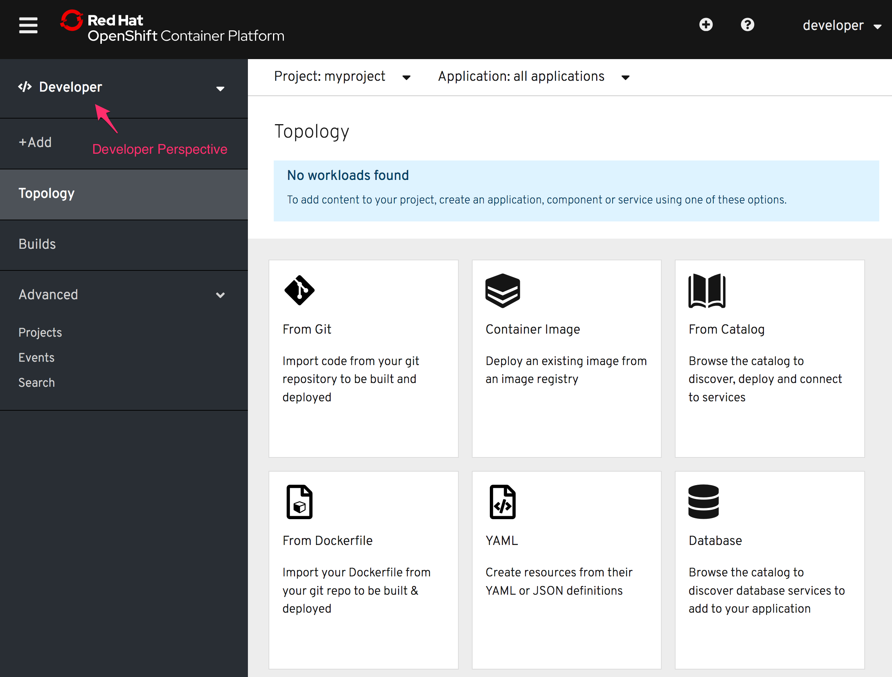

You can work with the templates using either the command line or the OpenShift web console. We will use the web console in this example.

Click on the _Console_ tab in the workshop dashboard. You will be presented with the OpenShift login screen.

For the credentials, enter:

* **Username:** ``developer``{{copy}}
* **Password:** ``developer``{{copy}}

Once you have logged in, you should be shown the list of projects you have access to. A project called ``myproject`` has already been created for you to use in this workshop.

Click on ``myproject`` and you should then be at the _Overview_ page for
the project. Select the _Developer_ perspective for the project instead of the _Adminstrator_ perspective in the left hand side menu. If necessary click on the hamburger menu icon top left of the web console to expose the left hand side menu.

As the project is currently empty, no workloads should be found and you will be presented with various options for how you can deploy an application.

Once you have deployed a workload, you can return to this view to deploy additional applications by selecting the _+Add_ option in the left hand side menu.
