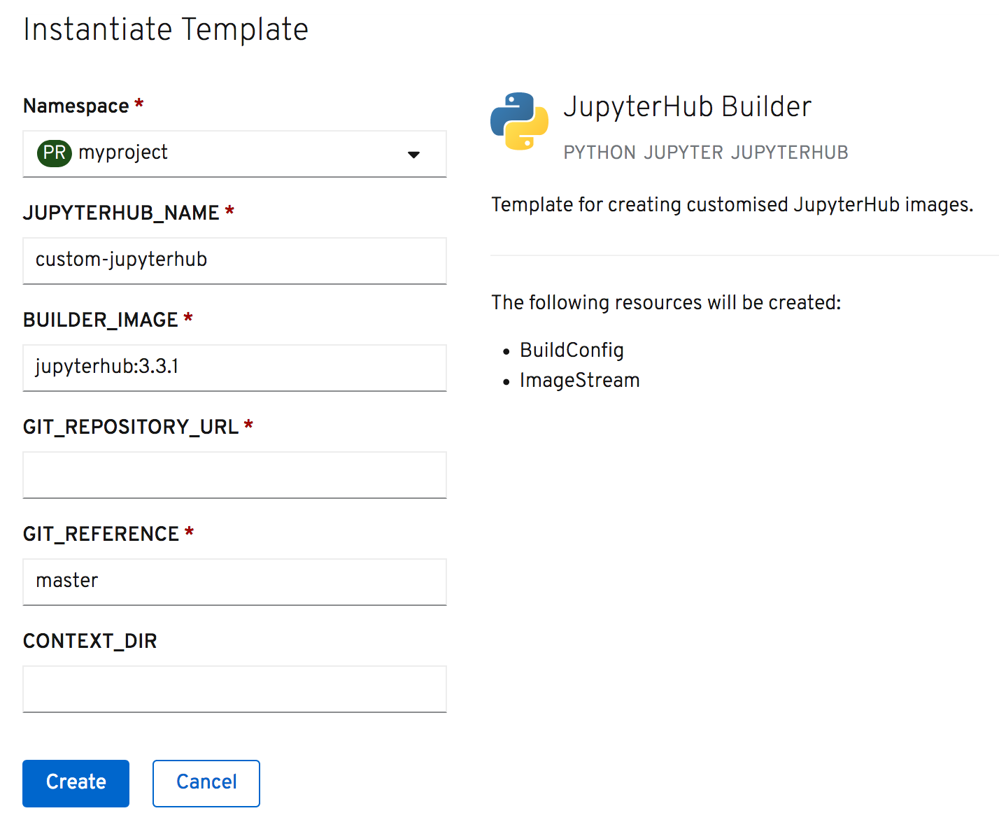

If the required configuration is too complex to provide via the template parameters, you need to include additional files, or install extra Python packages to support a particular authentication provider, you can use the JupyterHub image as a Source-to-Image (S2I) builder to create a custom JupyterHub image.

From the web console click on _+Add_ in the left hand side menu and select _From Catalog_. In the _Developer Catalog_, enter ``jupyter``{{copy}} into the _Filter by keyword_ text entry box.

This time select _JupyterHub Builder_ from the catalog entries shown.

This will bring up the description of the template. Click on _Instantiate Template_, which will bring up a form with the parameters for the template which you can customize.

The purpose of the template parameters are:

* ``JUPYTERHUB_NAME`` - The name to be given to the custom JupyterHub image.
* ``BUILDER_IMAGE`` - The name and version of the JupyterHub image to be used as the base for building the custom notebook image.
* ``GIT_REPOSITORY_URL`` - The URL to a hosted Git repository containing the JupyterHub configuration, and a Python ``requirements.txt`` file listing any Python packages if required.
* ``GIT_REFERENCE`` - The branch of the Git repository to use.
* ``CONTEXT_DIR`` - Where files to be used to build the custom JupyterHub image are located in a sub directory of the Git repository, the name of that sub directory.

In the ``GIT_REPOSITORY_URL`` field enter the URL:

``https://github.com/jupyter-on-openshift/poc-hub-openshift-auth``{{copy}}

In the ``CONTEXT_DIR`` field enter:

``jupyterhub``{{copy}}

Click on _Create_ to instantiate the template. This will leave you on the _Template Instance Overview_ with details of what was created.

Usually a template is used to create a deployment for an application. In this case it has created a build configuration and triggered a build of a custom JupyterHub image, using the files held in the Git repository you provided to the template.

To monitor the building of the custom JupyterHub image, run:

``oc logs -f bc/custom-jupyterhub``{{execute}}

The build process will then use the builder image as a base for your custom JupyterHub image, injecting into the image the source code files from the Git repository, and installing any Python packages listed in the Python ``requirements.txt`` file.

One of the items created by the template is an image stream, with it defining the destination for the image which is built.

Once the build has completed, list the image streams in the project by running:

``oc get imagestreams -o name``{{execute}}

You will see there are now multiple JupyterHub image streams. The original ``jupyterhub`` image, and the ``custom-jupyterhub`` image.

Return again to the web console, and click on _+Add_ in the left hand side menu and select _From Catalog_. In the _Developer Catalog_, enter ``jupyter``{{copy}} into the _Filter by keyword_ text entry box.

Select _JupyterHub_ from the catalog entries shown and then _Instantiate Template_.

In the list of template parameters, change the value of ``JUPYTERHUB_IMAGE`` to ``custom-jupyterhub:latest``{{copy}}. This is the name and version of the custom  JupyterHub image you just created.

Click on _Create_ and return to the _Topology_ view to wait for the deployment to complete. When done, click on the URL short cut icon to open the application. You will once again be asked to login using OpenShift credentials.

When you have verified access, delete the JupyterHub service again:

``oc delete all,configmap,pvc,serviceaccount,rolebinding --selector app=jupyterhub``{{execute}}

For details on how to structure the directory in the Git repository used as input to a custom JupyterHub image build, see the `jupyterhub` directory of:

* https://github.com/jupyter-on-openshift/poc-hub-openshift-auth

As well as serving as input to an S2I build, this Git repository can also be built using a ``Dockerfile`` build, and includes an example of using custom templates to provide alternate options for deployment.

A further example which uses templates to deploy additional services, in this case a KeyCloak service to act as the authentication provider, is:

* https://github.com/jupyter-on-openshift/poc-hub-keycloak-auth
