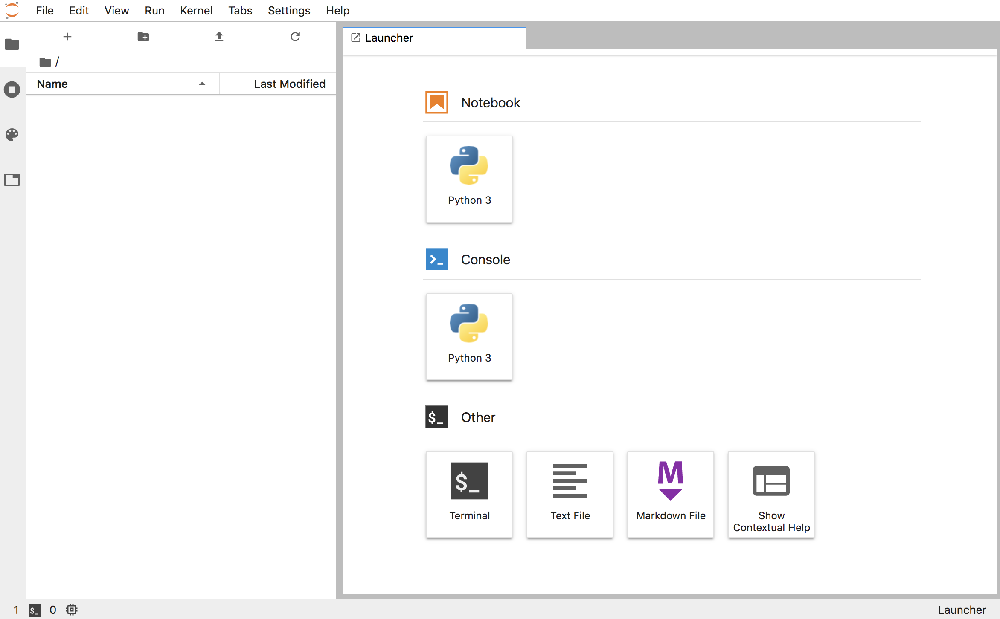

To see details about the `jupyterhub-workspace` template we will use in this workshop, and what parameters can be provided when using the template, run the command:

``oc describe template jupyterhub-workspace``{{execute}}

The purpose of the template parameters are:

* ``SPAWNER_NAMESPACE`` - The name of the project into which the JupyterHub instance is being deployed.
* ``CLUSTER_SUBDOMAIN`` - The subdomain used for generated host names when exposing services via a route.
* ``APPLICATION_NAME`` - The name of the deployment.
* ``JUPYTERHUB_IMAGE`` - The name of the image stream for the JupyterHub image, and the version tag, which you wish to use.
* ``NOTEBOOK_IMAGE`` - The name of the image stream for the Jupyter notebook image, and the version tag, which you wish to use.
* ``JUPYTERHUB_CONFIG`` - Contents for a custom `jupyterhub_config.py` file to override any JupyterHub defaults.
* ``JUPYTERHUB_ENVVARS`` - Contents for a shell script to be executed to set any special environment variables to customise the JupyterHub deployment.
* ``ADMIN_USERS`` - The optional list of users who should have admin access to the JupyterHub instance.
* ``REGISTERED_USERS`` - An optional whitelist of users permitted access to the JupyterHub instance if you want to control access.
* ``DATABASE_PASSWORD`` - Password for accessing the database used by JupyterHub.
* ``COOKIE_SECRET`` - Secret used with cookies to encode information about the JupyterHub session.
* ``JUPYTERHUB_MEMORY`` - The maximum amount of memory the JupyterHub deployment is allowed to use.
* ``DATABASE_MEMORY`` - The maximum amount of memory the JupyterHub database application is allowed to use.
* ``NOTEBOOK_MEMORY`` - The maximum amount of memory each Jupyter noteboook deployment is allowed to use.
* ``NOTEBOOK_INTERFACE`` - The style of web interface to be displayed for the Jupyter notebooks.
* ``OPENSHIFT_PROJECT`` - A name template for an optional OpenShift project which should be automatically created and/or made the default project for a user. For example ``{username}-workspace``.
* ``VOLUME_SIZE`` - The size of an optional persistent volume into which a users workspace is stored.
* ``IDLE_TIMEOUT`` - Optional time in seconds after which idle Jupyter notebook sessions should be shutdown.
* ``OAUTH_CLIENT_SECRET`` - Secret used in communicating with the OpenShift OAuth client endpoint.

The ``SPAWNER_NAMESPACE`` and ``CLUSTER_SUBDOMAIN`` template parameters are required as they can't be calculated by the template when instantiated.

All the other fields can be left as their defaults, but we will enable a few extra features.

To create the JupyterHub instance run:

``oc process jupyterhub-workspace --param SPAWNER_NAMESPACE=`oc project --short` --param CLUSTER_SUBDOMAIN="[[HOST_SUBDOMAIN]]-80-[[KATACODA_HOST]].environments.katacoda.com" --param NOTEBOOK_INTERFACE=lab --param OPENSHIFT_PROJECT='{username}-workspace' --param VOLUME_SIZE=1Gi --param IDLE_TIMEOUT=3600 | oc apply -f -``{{execute}}

Note that to deploy JupyterHub using the ``jupyterhub-workspace`` template, you must be a cluster admin. In this workshop you are already logged in on the command line as a cluster admin.

This is necessary as a resource of type ``oauthclient`` needs to be created, and only a cluster admin would usually have the require role to create it.

To monitor the deployment, run:

``oc rollout status dc/jupyterhub``{{execute}}

When the deployment has completed, click on the URL:

https://jupyterhub-myproject.[[HOST_SUBDOMAIN]]-80-[[KATACODA_HOST]].environments.katacoda.com

Because a secure HTTP connection is used, but an environment may in some cases use a self signed SSL certificate, you will need to accept the certificate to proceed.

In this deployment of JupyterHub, user authentication is handled by the OpenShift cluster. When you are presented with the OpenShift login page, enter a username of ``user1``{{copy}}, and a password of ``user1``{{copy}}.

What you will see is a progress screen as a separate Jupyter notebook instance is started up for the user ``user1``. Once the instance has started, you will have access to the JupyterLab web interface.

At this point you can create new notebooks or upload existing notebooks. If you need to install additional Python packages, when using this type of deployment you would need to start a terminal from the Jupyter notebook web interface and install the packages manually.

In this configuration, because we specified ``VOLUME_SIZE`` any changes you make are persistent. If the notebook instance were restarted, you would not loose any work.

Because JupyterHub is used to handle spawning of JupyterHub notebook instances on demand, a separate user visiting the same URL, will be given access to their own notebook session, with their own persistent storage.
