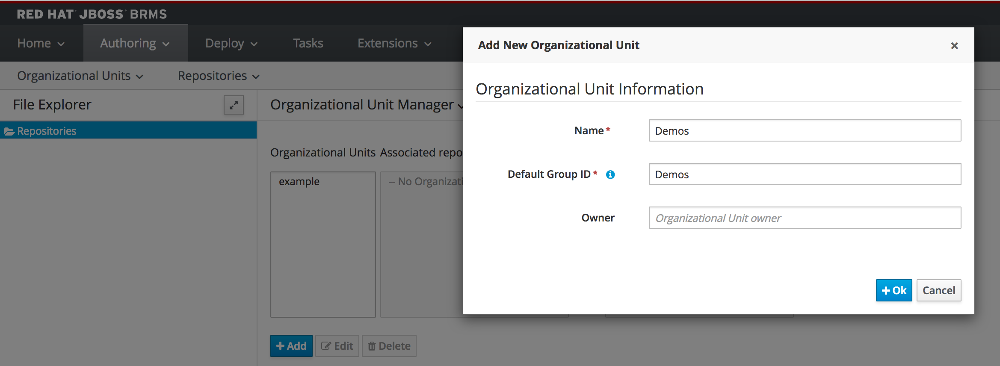
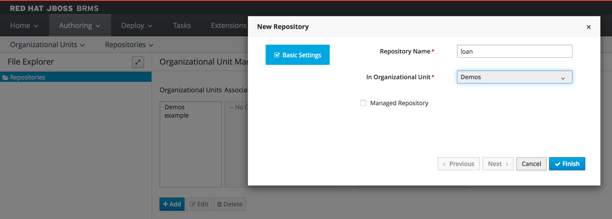

Business Central provides a number of different BRMS functionalities:

1. Asset/Rules Repository: A *Git*-based, version controlled, repository in which the BRMS projects and their assets (rules, decision tables, data-models, etc) are stored.
2. Workbench: A set of editors, wizards and tools to allow the user to create and manage business rules.
3. Artifact Repository:  A *Maven*-based repository which stores the (compiled) business-rules projects that can be deployed onto the execution environment.

Before we can create our rules project, we first need to configure the repository in which we can store our project assets.

To do this, we first need to create a so-called Organizational Unit (OU) in the “Business Central” interface. An OU is a concept within Business Central workbench that defines an entity within your organization. Within Business Central, a repository is always owned by an OU.

1. In the workbench, click on *Authoring -> Administration*
2. Click on *Organizational Units -> Manage Organizational Units*
3. Click on *Add* and create a new Organizational Unit with *Name* and *Default Group ID* `Demos`{{copy}} (you can leave the other fields in the screen empty).
4. Click on the *OK* button

Now we’re going to create a new repository in which we can store our project:

1. Click on *Repositories -> New repository*
2. Give it the *Repository Name* `loan`{{copy}} and assign it to the `Demos` OU we created earlier (leave the *Managed Repository* checkbox unchecked).
3. Click on the *Finish* button.

We now have a repository in which we can store our project and our assets. The next step is to create the project.
