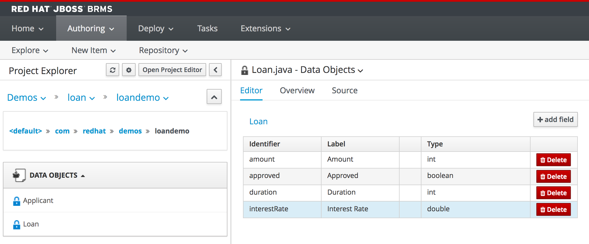

The first asset we need to create is our data-model. The data-model defines the rule *facts* on which we will execute our rules.

A data-model in JBoss BRMS can have many forms. As BRMS is a Java-based rules engine, it operates on Java POJOs (Plain Old Java Objects). As such we can both re-use existing (corporate) data-models defined in external JARs (Java Archives), as well as define these POJOs in our rules project as assets. JBoss BRMS provides a simple data modeling tool that allows business users to create their data-models without having to know the Java programming language.

We will create a simple data model consisting of 2 classes: *Applicant* and *Loan*.

1. Click on *New Item -> Data Object*
2. Give the object the name `Applicant`{{copy}}
3. Set the package to `com.redhat.demos.loandemo`{{copy}}
4. Click on *OK*

Give the object two fields:
1. Click on *+ add field*
2. Add the field with *Id* `creditScore`{{copy}} and *Label* `Credit Score`{{copy}} of type `int`
3. Click on *Create and Continue*
4. Add the field with *Id* `name`{{copy}} and *Label* `Name`{{copy}} of type `String`
5. Click on *Create*
6. Click on the *Save* button to save the model

Next, create a data object with name `Loan`{{copy}} in package `com.redhat.demos.loandemo`{{copy}} with the following fields:

1. amount: int (Label: Amount)
2. approved: boolean (Label: Approved)
3. duration: int (Label: Duration)
4. interestRate: double (Label: InterestRate)

Make sure to also save this model using the *Save* button in the editor. We can now create our rules.

