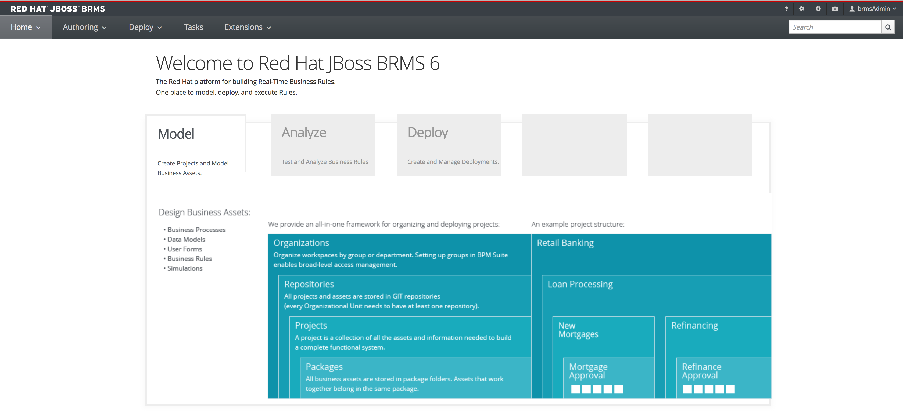

The JBoss BRMS Business Central workbench is provided in this Katacoda image and is automatically loaded and started when this scenario is started. Please observe the output of the terminal to verify that the Workbench is available.

When the workbench is ready, it can be accessed at: https://[[HOST_SUBDOMAIN]]-8080-[[KATACODA_HOST]].environments.katacoda.com/business-central

Use the following credentials to log in:

- username: brmsAdmin
- password: jbossbrms1!

If all is well, you will be presented with the following screen:

