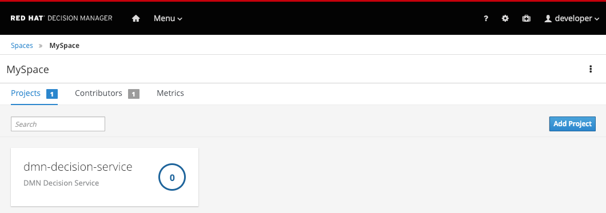
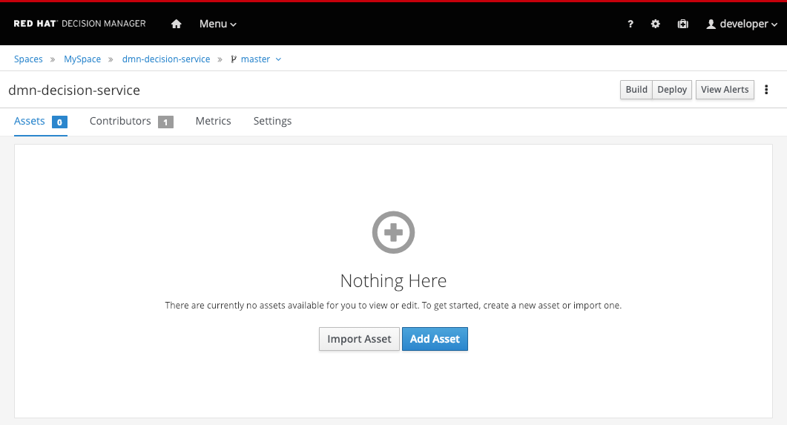
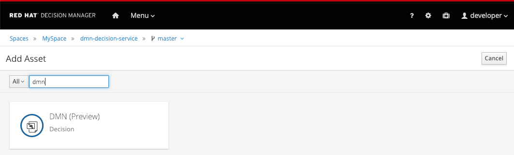

The asset we will create is a DMN model. With the DMN Designer enabled, navigate back to the project we've created earlier. You can do this by clicking on "Menu -> Design -> Projects". This should bring you back to your `Space` (which is called 'MySpace').

Click on the 'dmn-decision-service' tile to open the project.

The project is empty. We will now add our DMN model. Click on the `Add Asset` button in the center of the screen. In the filter on the upper left of the screen type `dmn` to filter the DMN assets":

Click on the `DMN (Preview)` tile to create a new DMN model:
  - Name: `insurance-premium`{{copy}}
  - Package: `com.myspace.dmn_decision_service` (this should be the default)

This will create a new DMN model and open the DMN editor.

A DMN DRD, or Decision Requirements Diagram, supports various modeling constructs. In the palette on the left side of the modeler, you can see 5 constructs

| Element          | Description         | Notation             |
|:----------------:|---------------------|:--------------------:|
| Text Annotation  | Explanatory note associated with an input data node, decision node, business knowledge model, or knowledge source.|  |
| Input Data       | Information used in a decision node or a business knowledge model. Input data usually includes business-level concepts or objects relevant to the business, such as loan applicant data used in a lending strategy. |  |
| Knowledge Source | External authorities, documents, committees, or policies that regulate a decision or business knowledge model. Knowledge sources are references to real-world factors rather than executable business rules. |  |
| Business Knowledge Model | Reusable function with one or more decision elements. Decisions that have the same logic but depend on different sub-input data or sub-decisions use business knowledge models to determine which procedure to follow. |  |
| Decision | Node where one or more input elements determine an output based on defined decision logic. |  |

In this introduction we will use the DMN `Input Data` and `Decision` nodes.
