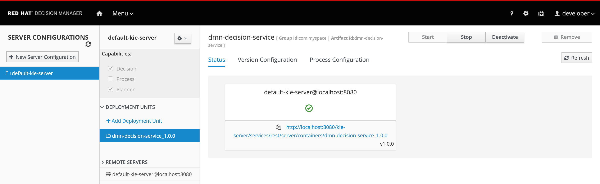

We will now Build and Deploy our DMN Demo project on to the Decision Manager Execution Server. This will make our DMN model available as a Decision Service, which can be integrated with any other application via its RESTful interface. This makes our Decision Model ready for consumption in, for example, a microservices architecture.

Click on the `dmn-decision-service` breadcrumb at the top of the Decision Central workbench to navigate back to the project's asset library. In this view click on the _Deploy_ button in the upper right corner of the screen. This will compile the project and package it into a Deployment Unit (called a KJAR or Knowledge JAR). This command will also deploy the Deployment Unit onto the Decision Server.

Open the Execution Servers view via *Menu -> Deploy -> Execution Server*. This will show the following screen:

This view shows that we have one Execution Server template named `default-kie-server`. On this server template we've deployed one KIE Container, `dmn_decision_service_1.0.0`, which is the deployment of our Insurance Premium DMN model. There is one Decision Server connected to our Decision Central environment, `default-kie-server@172.20.0.7:8080`, which is the Decision Server POD running in our OpenShift instance (the ip-address will obviously differ per environment).

The user can perform more actions on this screen, for example starting and stopping existing KIE-Containers, deploying new KIE-Containers to existing templates (and thus deploying them to Decision Servers that are connected to the template) and upgrading existing KJARs deployed in KIE-Containers to newer versions.

Now that our Deployment Unit is deployed onto our Decision Server runtime, we can test our DMN model.
