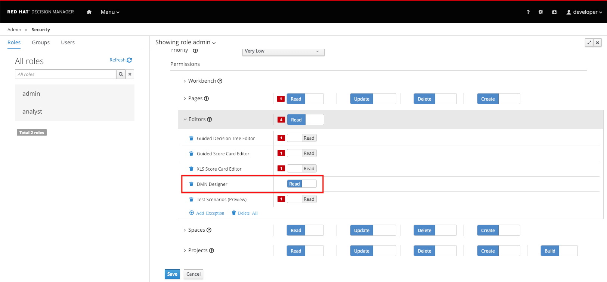

The asset we will create is a DMN model. Red Hat Decision Manager 7.2 provides a new DMN modeler as, so called, `Tech Preview` functionality. One thing this implies is that the new DMN modeler is not by default enabled.

To enable the modeler:

1. Navigate to the Decision Central Settings screen by click on the gear icon  in the upper right corner of the screen.

2. In the Settings screen, click on the "Roles" tile to open the Security Management configuration screen.

3. Click on 'admin', this will open the settings for the 'admin' role.

4. Expand the `Editors` entry and enable the `DMN Designer`.

5. Click on the `Save` button at the bottom of the screen to save the settings.

With the DMN Designer enabled, we can now create our first DMN model.
