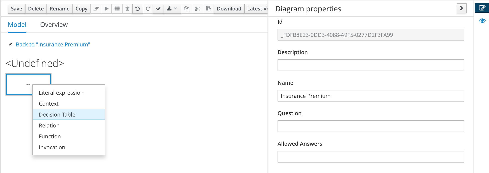
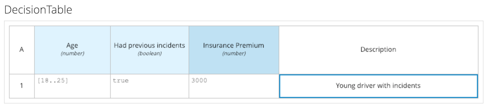
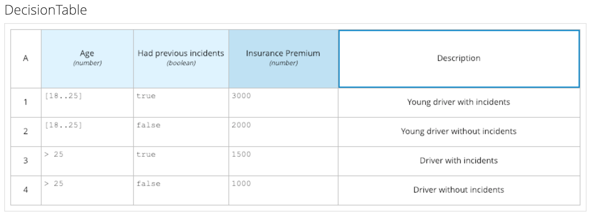
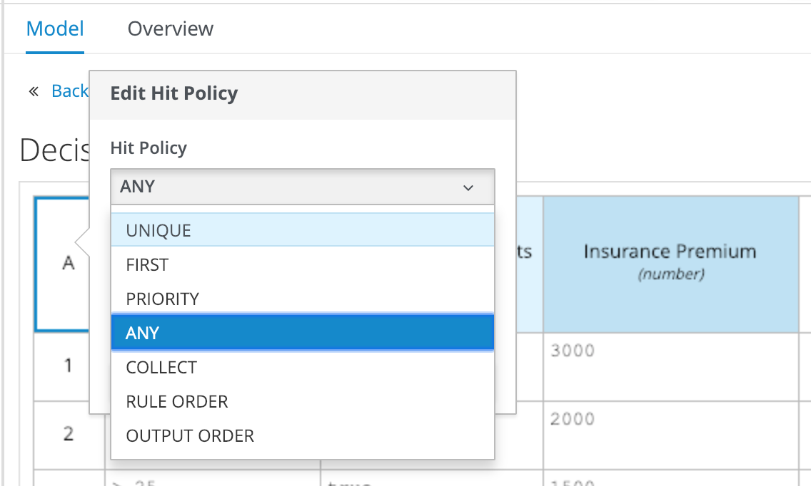
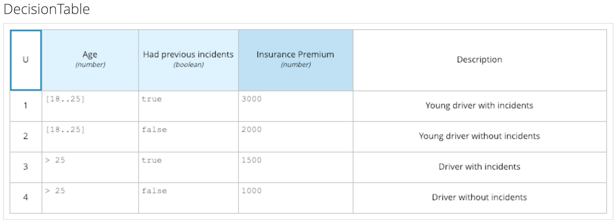

DMN supports various contructs to implement the logic of a Decision Node, e.g.:
- Literal Expression
- Decision Table
- Function
- etc.

In this scenario we will use the Decision Table to implement our logic.

In the DMN DRD (your diagram), click on the `Insurance Premium` Decision Node. On the left side of the node, click on the _Edit_ icon:

In the next screen, double click in the box under the text _<Undefined>_ to open a selection menu in which you can select how you want to implement the logic of your Decision Node:

Select the `Decision Table` to open the DMN Decision Table editor.

The first decision/rule that we want to define is that a driver with an age between 18 and 25, and who has had incidents in the past, has to pay a premium of 3000.

The first requirement, an age between 18 and 25, can be expressed with a FEEL expression. FEEL stands for Friendly Enough Expression Language, and is an expression language focussed at business users. The idea behind FEEL is that any user who can write expressions in a spreadsheet should be able to write expressions in FEEL. We can write the requirement as an inclusive range in FEEL using the following syntax `[18..25]`{{copy}}.

The second requirement is simply the boolean expression `true`{{copy}}. Hence the decision can be defined as such:

Apart from inclusive ranges, FEEL also supports exclusive ranges (e.g. `[18..25)`, which excludes the value 25 from the range), comparisons (less than, greater than, equal to), negations, disjunctions, etc.

The table below provides an overview of all the rules/decisions we want to define in this example.

| Age      | Had previous incidents | Insurance Premium | Description |
|:--------:|:----------------------:|:-----------------:|-------------|
| [18..25] | true                   | 3000              | Young driver with previous incidents |
| [18..25] | false                  | 2000              | Young driver without previous incidents |
| > 25     | true                   | 1500              | Driver with previous incidents |
| > 25     | false                  | 1000              | Driver without previous incidents |

The final table will look like this:

There is a final change we want to make to the Decision Table. In DMN, decision tables implement a feature called "hit policy". The "hit policy" of a table defines how many rules in a decision table can fire and how the output (decisions) of those rules need to be comined or aggregated. For example, you can define a hit policy `Collect` that uses a `SUM` aggregator to sum the results of all fired rules/decisions. Or you can have a `Unique` hit policy, which defines that only a single decision/rule in a table can fire for any given input.

In the case of our decision table, we can clearly see that only one rule should be able to fire for any given input. Hence, we should configure our table with the `Unique` hit policy. To do this, we double-click on the hit-policy cell of our decision table in the upper left corner of our table (This is the cell that currently is set to the letter `A`, which stands for the `Any` hit policy). In the pop-up, select `Unique` as the hit-policy:

Close the pop-up and save the DMN model. The final table should look like this:

