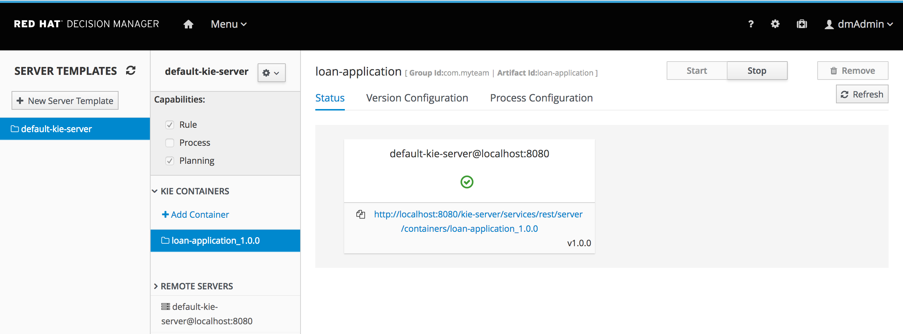

We will now Build and Deploy our Loan Application Demo rules onto a Decision Server

In the project's asset library view, click on the *Build & Deploy* button. This will compile the project and package it into a KJAR or Knowledge JAR. This command will also deploy the KJAR onto the Decision Server.

Open the Execution Servers via via *Menu -> Deploy -> Execution Server*. This will show the following screen:

This view shows that we have one Execution Server template named `default-kie-server`. On this server template we've deployed one KIE Container, `loan-application_1.0.0`, which is the deployment of our Loan Application Demo KJAR. There is one Decision Server connected to our Decision Central environment, `default-kie-server@172.20.0.7:8080`, which is the Decision Server POD running in our OpenShift instance (the ip-address will obviously differ per environment).

The user can perform more actions on this screen, for example starting and stopping existing KIE-Containers, deploying new KIE-Containers to existing templates (and thus deploying them to Decision Servers that are connected to the template) and upgrading existing KJARs deployed in KIE-Containers to newer versions.

Now that are KJAR is deployed onto our Decision Server runtime, we can test our rules.
