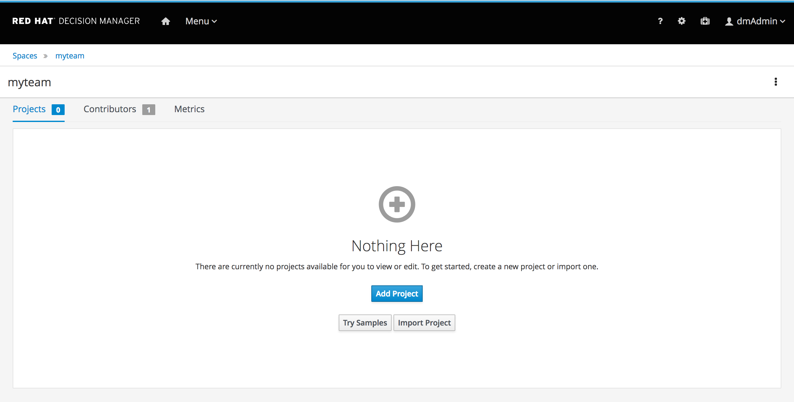

Decision Central provides a number of different Decision Manager functionalities:

1. Asset/Rules Repository: A *Git*-based, version controlled, repository in which the Decision Manager projects and their assets (rules, decision tables, data-models, etc) are stored.
2. Workbench: A set of editors, wizards and tools to allow the user to create and manage business rules and decision services.
3. Artifact Repository:  A *Maven*-based repository which stores the (compiled) business-rules projects that can be deployed onto the execution environment.

Click on the *Design* button in the homescreen of Decision Manager to open the design perspective.

We can now create our first rules project. A Red Hat Decision Manager project can contain various types of rule assets:

1. DRL: Rule definitions written in the *Drools Rule Language*
2. Guided Rules: rules written in a more business friendly language, including a business friendly editor
3. Guided Decision Tables: rules written in the form of a decision table.
4. etc.

To create the project, perform the following steps:
1. Click on the "Add Project" button in the design perspective.

    

2. Provide the following details:
    - Name: `loan-application`{{copy}}
    - Description: `Loan Application Demo`{{copy}}
3. Click on the *Finish* button

We've now created our first Red Hat Decision Manager 7 project and can now start creating rules assets. We will begin with creating our domain-model.
