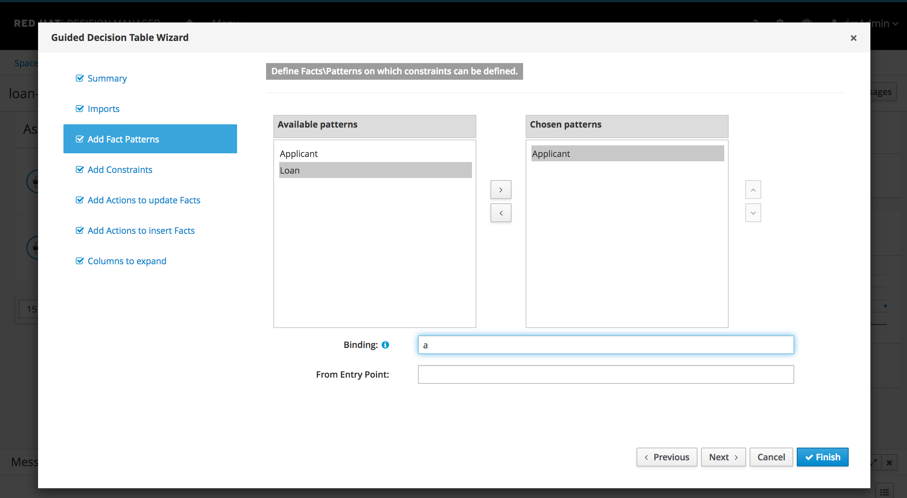
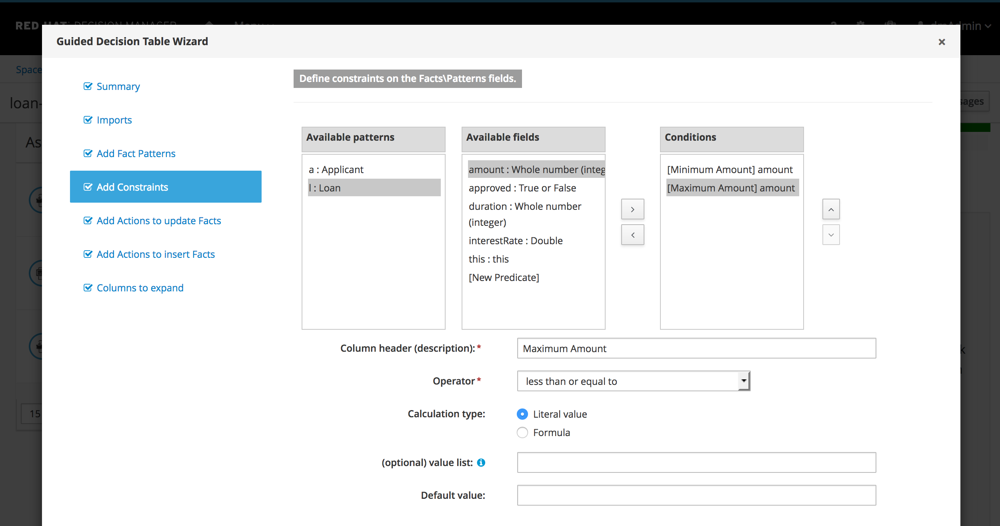
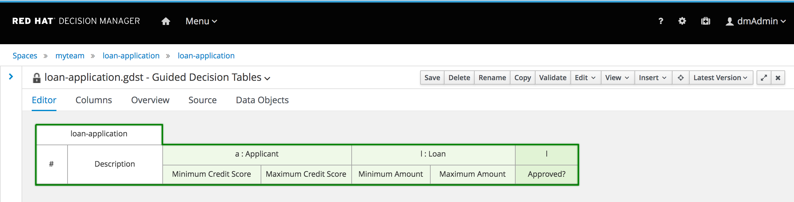

The Guided Decision Table Wizard will guide us through the setup or configuration process of our decision table.

1. In the *Summary* section, click *Next*.
2. We don't need to import any model types, so in the *Imports* section, we can click on *Next* as well.

We will now configure the Condition Columns. Condition columns in our decision table will define the so called *Left-Hand-Side* (LHS) of our rules, also know as the *when* part of a rule. When these constraints are met, the rule will fire and will execute the action defined in the *Right-Hand-Side* or *then* part of the rule.

Our decision table will consist of 4 *Condition* columns and one *Action* column. In this chapter we will define the constraint columns.

1. In the *Add Facts Pattern* section, click on `Applicant` and click on the `>` icon to choose it.
2. Click on `Applicant` in the *Chosen patterns* table and set `a` as the *Binding*.

    

3. In the *Add Facts Pattern* section, click on `Loan` and click on the `>` icon to choose it.
4. Click on `Loan` in the *Chosen patterns* table and set `l` as the *Binding*.
5. Click *Next* to go to the *Add Constraints* section.
6. Click on `Applicant`, select the `creditScore` field and click in the `>` icon to add it to the *Conditions* table.
7. Click `creditScore` in the *Conditions* table. Define the following settings:
    - Column header: `Minimal Credit Score`{{copy}}
    - Operator: `greater than or equal to`
    - Calculation type: `Literal value`
8. Set 3 additional constraints in the same way:
    - Pattern: `Applicant`
    - Field: `creditScore`
    - Column Header: `Maximum Credit Score`
    - Operator: `less than or equal to`
    - Calculation Type: `Literal Value`

    - Pattern: `Loan`
    - Field: `amount`
    - Column Header: `Minimum Amount`
    - Operator: `greater than or equal to`
    - Calculation Type: `Literal Value`

    - Pattern: `Loan`
    - Field: `amount`
    - Column Header: `Maximum Amount`
    - Operator: `less than or equal to`
    - Calculation Type: `Literal Value`

    

Now that the *Condition* columns have been defined, we can work on the *Action* column.

Our rule will contain a single *Action* column. This column basically sets the `approved` boolean field of the `Loan` fact to `true` or `false`. I.e. the action of the rule is to define whether the loan application has been approved.

1. Click on *Next* to go to the *Add Action to update Facts* section.
2. Select `Loan`, select the `approved` field and click on the `>` icon.
3. Select `approved` in the *Chosen fields* column. Define the following settings:
    - Column header: `Approved?`{{copy}}
    - Default value: `false`
4. Click on *Next*.
5. In the *Add Actions to insert Facts* section, click on *Next*.
6. Finally click on *Finish*.

The table will now be created and will look like this:

We can now implement the rows of our decision table which in fact defines our rules, where each row defines a single rule.
