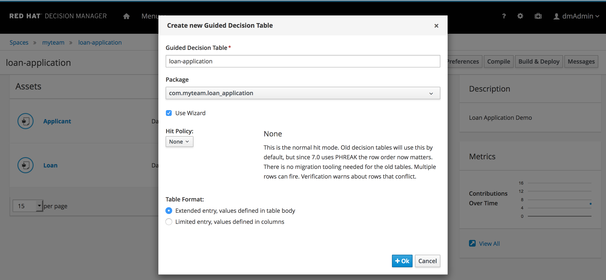

Now that we have a data-model for our rules project, we can start writing the rules that will reason over this data-model.

In this example project we will write our rules in a decision table. The decision table concept allows a person, skilled in writing rules,
to define the layout of the decision table, the conditional columns, the actions to be performed when a rule matches and fires, etc.
We basically create a template for the rules. The actual rules are then defined by the individual rows of the decision table, where each row will
translate into a single rule. This allows less technical people to easily define and write sophisticated business rules that are executable at runtime.

To create the decision table we:

1. Click on *Create New Asset -> Guided Decision Table*
2. Give it the name `loan-application`{{copy}}
3. Enable the *Use Wizard* checkbox.
4. *Hit Policy* should be set to *None*.
4. Make sure to select *Extended entry, values defined in table body*
5. Click on *OK*

We can now navigate through the wizard to create the layout of our decision table.
