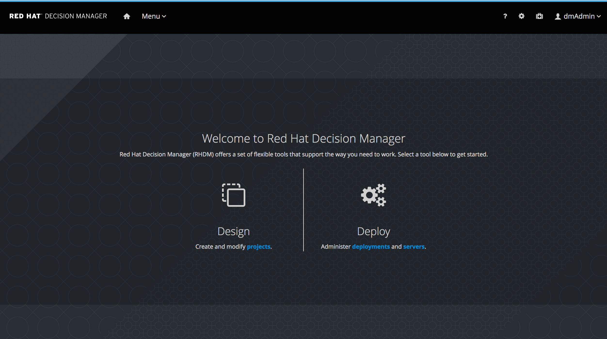

The Red Hat Decision Manager Decision Central workbench is provided in this Katacoda image and is automatically loaded and started when this scenario is started. Please observe the output of the terminal to verify that the Workbench is available.

It may take a while for the platform to be ready as we are spinning up the entire decision framework.
When it is ready you will see the following message in the terminal:

```
Waiting for the Red Hat Decision Manager workbench to become available

Enviroment ready!
$
```

When the workbench is ready, it can be accessed at: http://loan-demo-rhdmcentr-loan-demo.[[HOST_SUBDOMAIN]]-80-[[KATACODA_HOST]].http-proxy.katacoda.com/

Use the following credentials to log in:

- username: developer
- password: developer

If all is well, you will be presented with the following screen:


