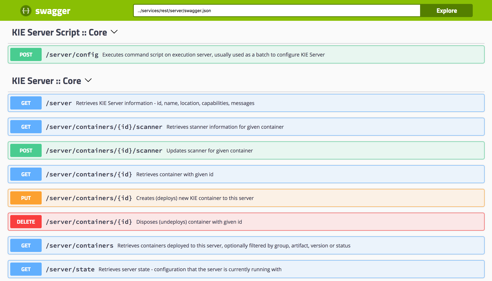

With our Decision Server deployed, we can now test our rules. As our Decision Server provides a Swagger interface to interact with its RESTful API, we can simply test our rules via the web-interface provided by the Decision Server.

The Decision Server's Swagger UI can be accessed at http://loan-demo-kieserver-loan-demo.[[HOST_SUBDOMAIN]]-80-[[KATACODA_HOST]].http-proxy.katacoda.com/docs/



In the Swagger UI:

1. Navigate to "KIE Server :: Core"
2. Expand the "GET" operation for resource "/server/containers"
3. Click on "Try it out"
4. Leave the parameters blank and click on "Execute"
5. When asked for credentials use: Username: `developer`{{copy}}, Password: `developer`{{copy}}`
6. Observe the response, which lists the KIE Containers deployed on the server and their status (STARTED, STOPPED).


We can use the Swagger UI to test our Loan Approval Decision Service. In the Swagger UI:
1. Navigate to "Rules evalutation :: BRM"
2. Expand the "POST" operation for resource "/server/containers/instances/{id}"
3. Click on "Try it out"
4. Set the "id" parameter to the name of the KIE Container that hosts our rules, in this case loan-application_1.0.0.
5. Set "Parameter content type" to application/json.
6. Set "Response content type" to application/json
7. Use the following request as the "body" parameter. Note that the `Loan` object has its `approved` attribute set to false:

    ```
{
    "lookup":"loan-stateless-ksession",
    "commands":[
        {
            "insert":{
                "object":{
                    "com.myteam.loan_application.Applicant":{
                        "creditScore":230,
                        "name":"Jim Whitehurst"
                    }
                },
                "out-identifier":"applicant"
            }
        },
        {
            "insert":{
                "object":{
                    "com.myteam.loan_application.Loan":{
                        "amount":2500,
                        "approved":false,
                        "duration":24,
                        "interestRate":1.5
                    }
                },
                "out-identifier":"loan"
            }
        },
        {
            "fire-all-rules":{
            }
        }
    ]
}
    ```
    This JSON request is the representation of a Decision Manager “BatchExecutionCommand” in which we insert 2 objects (facts) into the rules engine, `Applicant` and `Loan`, after which we give the command to fire the rules. The response will look like this:

8. Observe the result. The Loan Application rules have fired and determined that, based on the credit score of the application, and the amount of the loan, the loan can be approved. The `approved` attribute of the `Loan` has been set to true.

```
{
  "type": "SUCCESS",
  "msg": "Container loan-application_1.0.0 successfully called.",
  "result": {
    "execution-results": {
      "results": [
        {
          "value": {
            "com.myteam.loan_application.Loan": {
              "amount": 2500,
              "duration": 24,
              "interestRate": 1.5,
              "approved": true
            }
          },
          "key": "loan"
        },
        {
          "value": {
            "com.myteam.loan_application.Applicant": {
              "name": "Jim Whitehurst",
              "creditScore": 230
            }
          },
          "key": "applicant"
        }
      ],
      "facts": [
        {
          "value": {
            "org.drools.core.common.DefaultFactHandle": {
              "external-form": "0:2:1617049150:1617049150:2:DEFAULT:NON_TRAIT:com.myteam.loan_application.Loan"
            }
          },
          "key": "loan"
        },
        {
          "value": {
            "org.drools.core.common.DefaultFactHandle": {
              "external-form": "0:1:2101504172:2101504172:1:DEFAULT:NON_TRAIT:com.myteam.loan_application.Applicant"
            }
          },
          "key": "applicant"
        }
      ]
    }
  }
}
```
