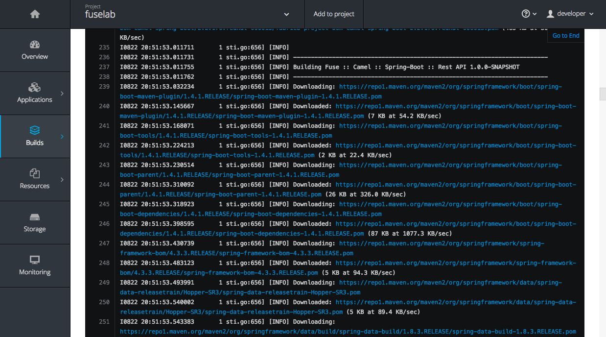
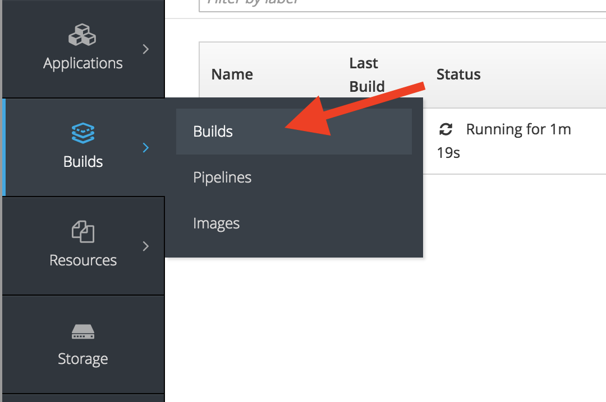
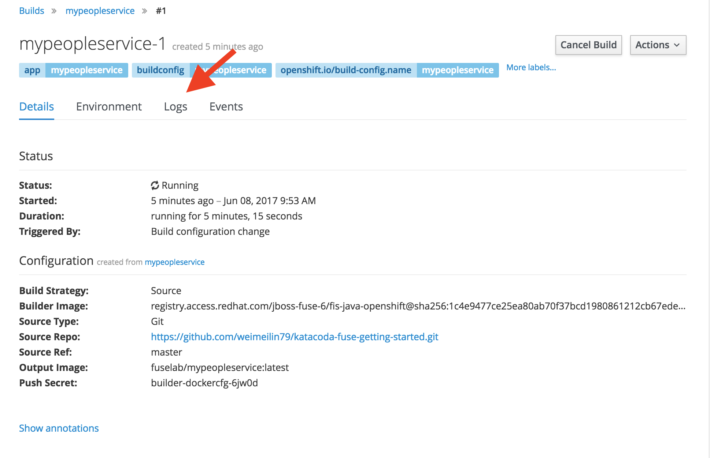

Now that we have kicked off our People Service API build and deployment lets take a look at the logs from our build. First we can take a look at the output from the command line.

Execute the following command:

`oc logs -f bc/mypeopleservice`{{execute}}

What you will see is the streaming output of our build which, for the most part, will look like a typical Maven build running through its lifecycle. 

As part of the ``oc logs -f bc/mypeopleservice`` command we also are passing in the ``-f`` flag. This is the **_follow_** log flag which streams the output till complete or till you hit **_ctrl-c_**. This output can also be seen in the OpenShift Web Console.

Now open the OpenShift Web console by selecting the **_Dashboard_** tab at the top of your screen and then click the **_Overview_** menu on the left. Here you can view the details of the application created and monitor progress as it is built and deployed. This page will refresh periodically as events in the system, such as your build, begin to occur.

Once the build begins for an application, a **_Builds_** frame will appear in the Overview Screens Application summary frame as seen below. Located in this summary are important details about the build in progress including:

 1. The status of the build, **_Build #1 is running..._**
 2. When it was created, **_X minutes ago_**
 3. A link to **_View Full Log_**
 4. The build logging in progress

 

> _Note: Generally, first time builds will take an additional few minutes to complete as Maven initializes the application's local repository._

At a quick glance, the build summary is more than helpful but what if we need to take a deeper look at the build output logs? Well, you have a couple ways available to view the full logs output in progress, the first of which is clicking on **_View Full Log_** (#3 above). This will bring you to the **_Logs_** tab of the **_Pod_** for the build which is running.

If you are in a screen other than the **_Overview_** screen, the build logs are accessible by selecting the **_Builds_** menu and then selecting the running build, **_#1_** under the **_Last Build_** column.

This will bring up a list of builds which are currently running, as well as builds which have completed. Select on the build number of the last build to bring up the details for the build.

Select on the **_Logs_** tab to bring up the log output for the build.

Once the build of the application image has completed, it will be deployed. The **_Overview_** page will indicate this by the banner listing the status of the build as complete. The **_Deployment Config_** pane will also show the state of the deployment and indicate the number of running pods.

Now that we have successfully built our application, click **_Continue_** to take it for a test drive on the **_JBoss Fuse Hawtio Console_**.

