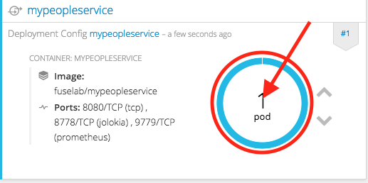
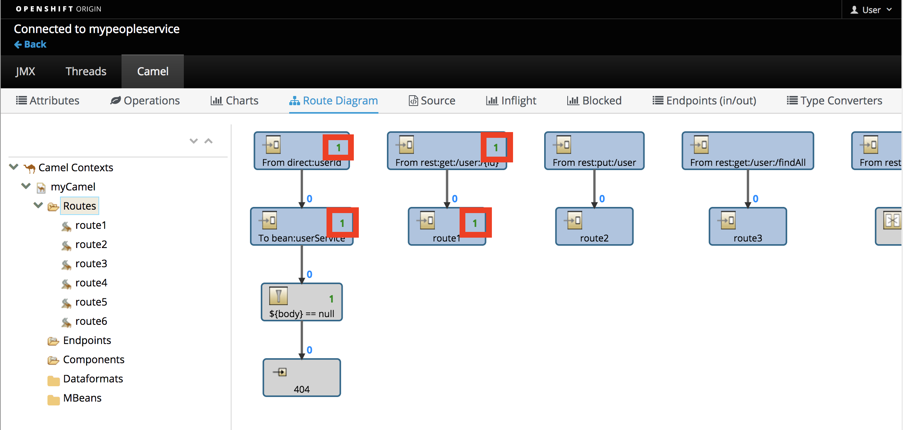
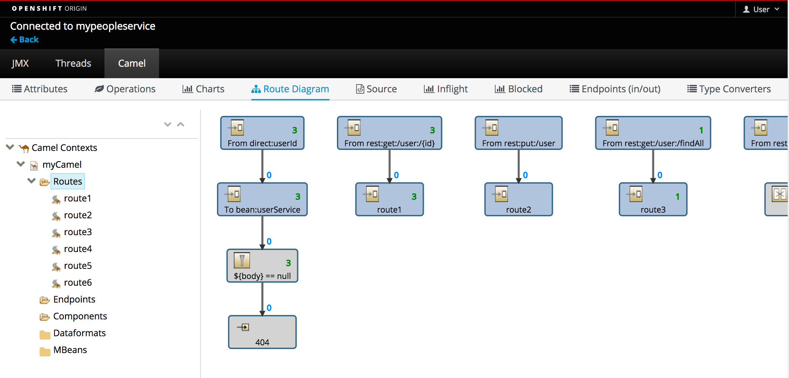

In this next section of the scenario we will use the JBoss FIS 2.0 Hawtio Console to test and review the behavior of our new route.  

### What is Hawtio? 
The JBoss Fuse Hawtio console provides in depth details into the Camel and ActiveMQ components deployed as part of a JBoss FIS 2.0 application. This includes standard JVM resources such as memory and threads as well as JMX attributes and operations. The Hawtio console also provides a full selection of tools used to drill into the JBoss FIS 2.0 Camel and ActiveMQ components.

To get there we start with selecting the Applications menu on the left and then select Pods.



You will be taken directly to the pod detail page. Below the *Template* section on the page you will find a link named "Open Java Console". Go ahead and click it.


You are now taken to the JBoss Fuse Hawtio console. Continue on to see how we can get better insight into the People Service API through this console deployed with all JBoss FIS 2.0 applications.

Lets get started by taking a look at some statistics provided by the console.  Select the "Route Diagram" to see a more detailed implementation:


The Route Diagram tab provides a graphical review of all the routes currently deployed in our API application.  After selecting this tab we should see something similar to what is pictured below; 5 routes represented as Enterprise Integration Patterns, or EIPs. Further details on EIPs can be found at the end of this scenario:


Once done, close the console by clicking the back link as shown below and then head back to our terminal:


Now lets take a look at calling the APIs and tracing that output on the Hawtio console.

To highlight these capabilities the People Service API has 3 methods provided with it. They are:

- Retrieve User
- Create User  
- Retrieve All Users

> Note: To see the Camel REST APIs defined, check it out [here](https://github.com/jbossdemocentral/katacoda-fuse-getting-started/blob/master/src/main/resources/spring/camel-context.xml)

Switch back over to the **_Terminal_** screen and let's try retrieving user information by running:

``curl http://mypeopleservice-fuselab.[[HOST_SUBDOMAIN]]-80-[[KATACODA_HOST]].environments.katacoda.com/people-service/user/123``{{execute}}

This will display output similar to:

```
{
  "id" : 123,
  "name" : "John Doe"
}
```
Go back to the **_Dashboard view_**, in the **Hawtio console**, you should be able to see the number of message pass through route "get user" has been updated to "1":

> _Note: If the numbers do not update at first, click over to the Source or Inflight tab and then back to the Route Diagram screen..._




Lets make some more calls to our User API service.  Switch back over to the **_Terminal_** screen and and run each of the following :

``curl http://mypeopleservice-fuselab.[[HOST_SUBDOMAIN]]-80-[[KATACODA_HOST]].environments.katacoda.com/people-service/user/456``{{execute}}

This will display output similar to:

```
{
  "id" : 456,
  "name" : "Donald Duck"
}
```

``curl http://mypeopleservice-fuselab.[[HOST_SUBDOMAIN]]-80-[[KATACODA_HOST]].environments.katacoda.com/people-service/user/789``{{execute}}

This will display output similar to:

```
{
  "id" : 789,
  "name" : "Slow Turtle"
}
```

To retrieve entire user list, try running :

``curl http://mypeopleservice-fuselab.[[HOST_SUBDOMAIN]]-80-[[KATACODA_HOST]].environments.katacoda.com/people-service/user/findall``{{execute}}

This will display output similar to:

```
[ {
  "id" : 123,
  "name" : "John Doe"
}, {
  "id" : 456,
  "name" : "Donald Duck"
}, {
  "id" : 789,
  "name" : "Slow Turtle"
} ]
```

The terminal is nice and all but what about seeing more details in the **Hawtio console**. Do you remember how to get there? 

Once you get back to the **Hawtio** console, click the **Camel** tab at the top and then select **_Route Diagram_** tab just below it and see if anything has changed. Notice anything different?  Check out the number of calls on the associated routes in the diagram which now reflects the number of API calls you made earlier:



And lastly, try adding another user to the list.  Switch back over to the **_Terminal_** screen and run :

``curl -H "Content-Type: application/json" -X PUT -d '{"id":888, "name" : "Christina"}' http://mypeopleservice-fuselab.[[HOST_SUBDOMAIN]]-80-[[KATACODA_HOST]].environments.katacoda.com/people-service/user``{{execute}}

This will display output similar to:

```
{
  "id" : 888,
  "name" : "Christina"
}
```
Over in the **_Dashboard_** browser our **_Route Diagram_** should have even more updates as shown below :


Lets continue on over to the last step of the scenario and take a look at the API docs which our route provides by clicking the **_Continue_** button.
