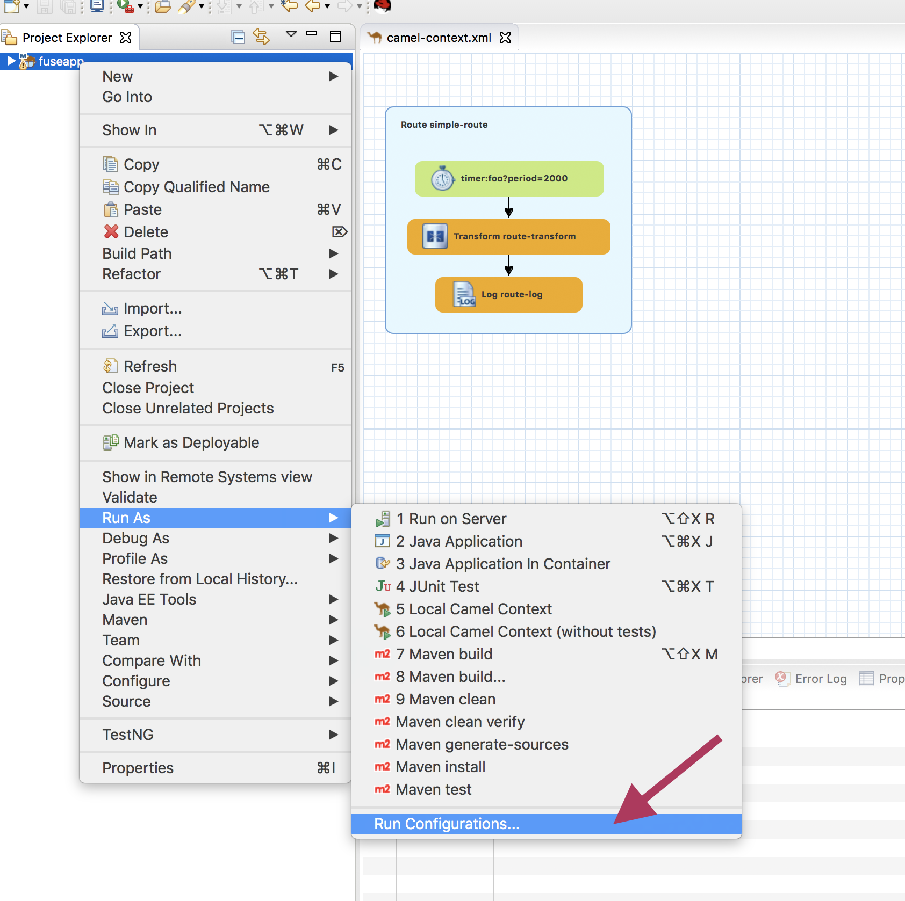
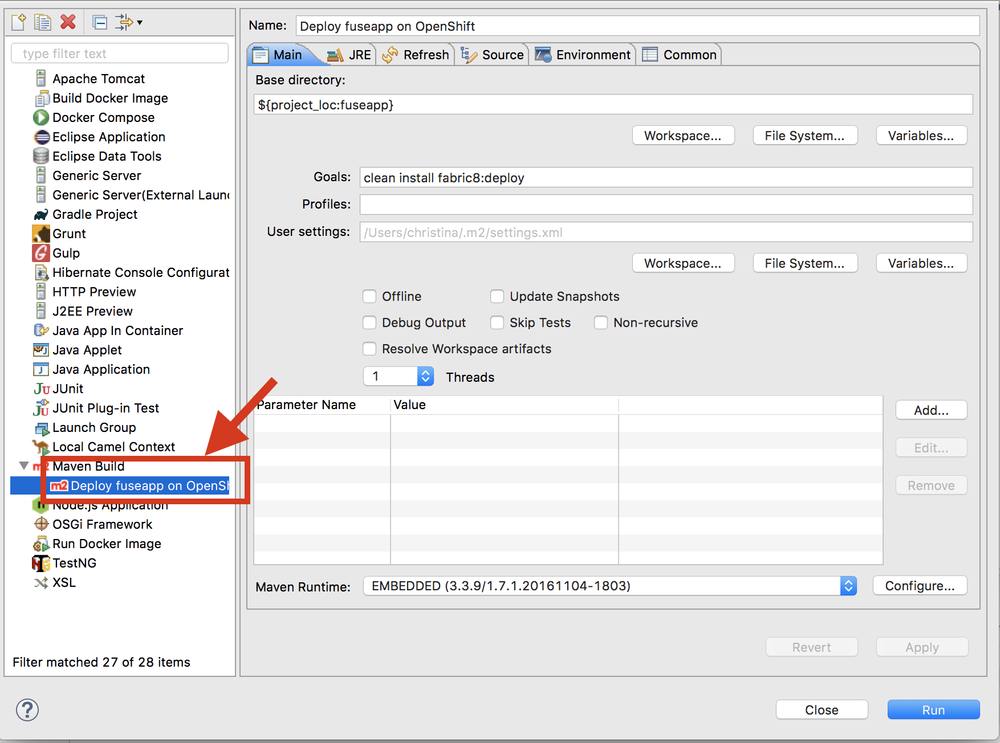
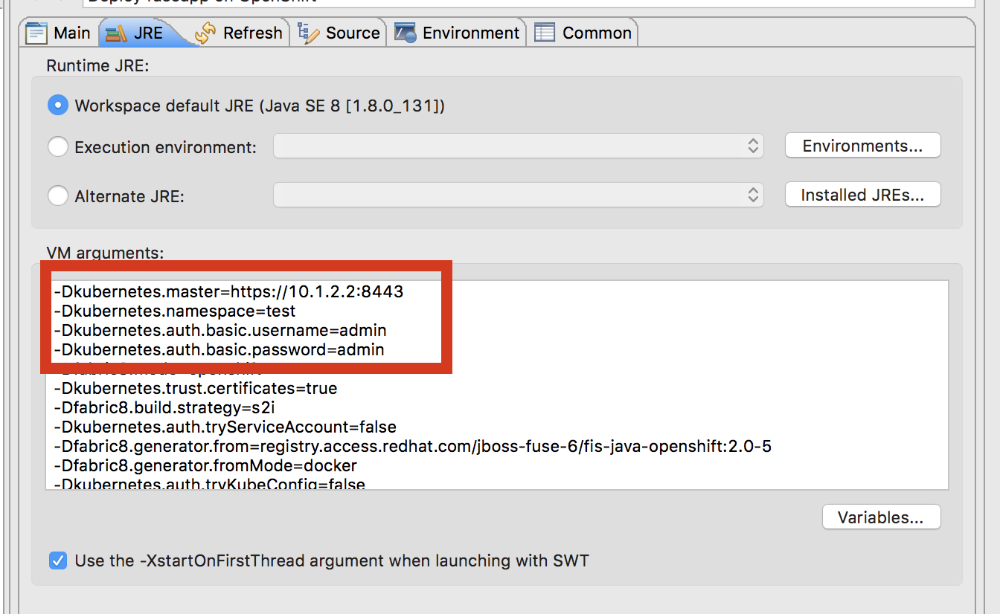
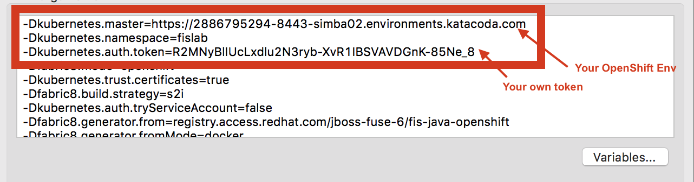
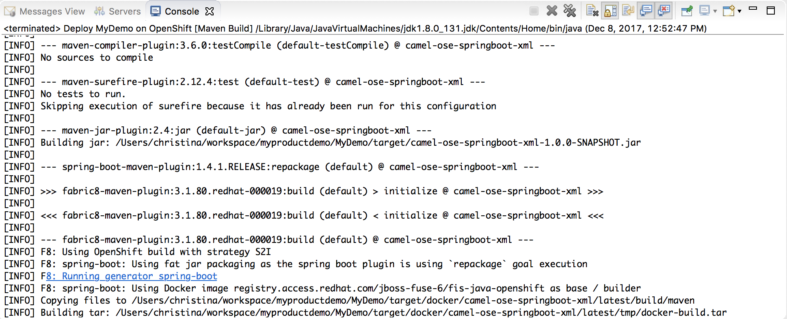
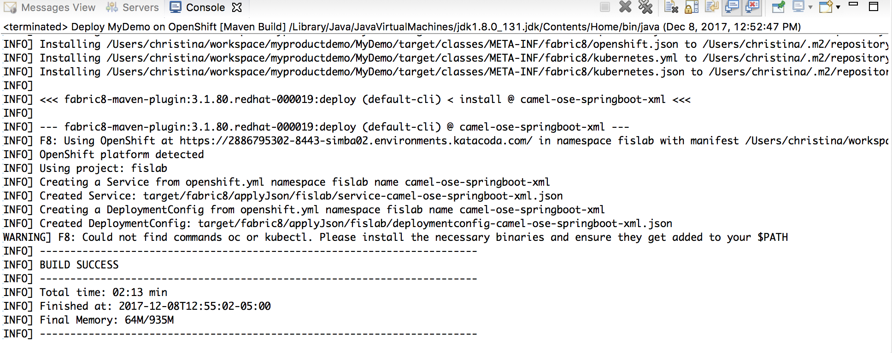

Let’s get started with building and deploying your application to the **fuselab** project.

We will be using OpenShift's Source 2 Image capability, also referred to as **_S2I_** . The OpenShift S2I tool injects application source code into a container image and the final product is a new and ready-to-run container image that incorporates the builder image and built source code. 

To enable this S2I capability, you need to collect the following information and configure it in ***Red Hat CodeReady Studio***. 

Right click on your project in the sidebar menu, select Run As > Run Configuration  

On the pop up sidebar menu under *Maven Build*, click on "Deploy *projectname* on OpenShift" to open the project's default run configuration. *projectname* will be replaced by your project name. Leave all of the default settings on the Main tab.

Select the JRE tab to access the VM arguments.

* Find the line that reads -Dkubernetes.namespace=test, and replace test with the project name you supplied when the project was created.

	``-Dkubernetes.namespace=fuselab``

* On the line that reads -Dkubernetes.master=https://xx.x.x.x:8443 change the url to your openshift instance below.

	https://[[HOST_SUBDOMAIN]]-8443-[[KATACODA_HOST]].environments.katacoda.com

* Get the authentication token by running the following command
	``oc whoami -t``{{execute}} 
* Copy the result token 
* Remove  the the userid and password entries and add a new entry for your  authentication token.
	
	``-Dkubernetes.auth.token={{YOUR_TOKEN}}``

Click **Apply** and then click **Run**.

Your application is now being built locally on your machine. The first build may take some time. You can keep track of the progress in the **Console** view.

Interested in tracking progress of your deployment to OpenShift?  Click **_Continue_** on to see how.

