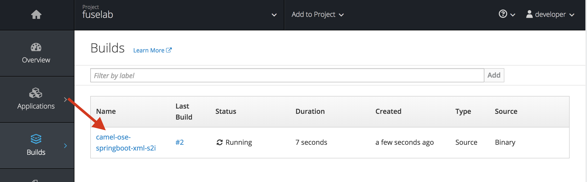
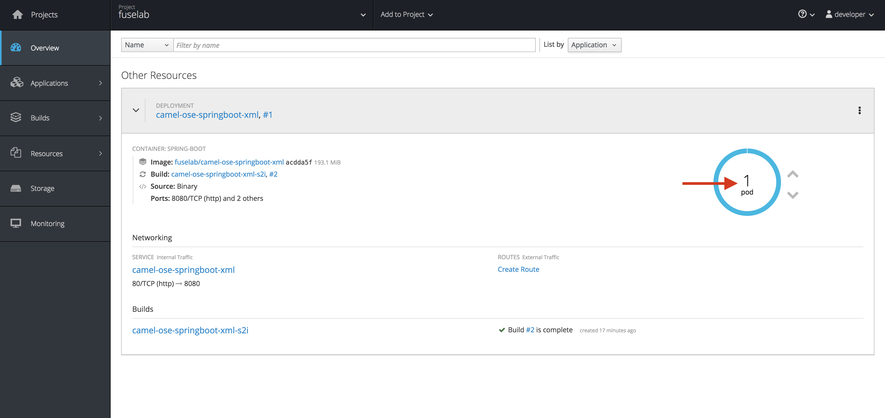
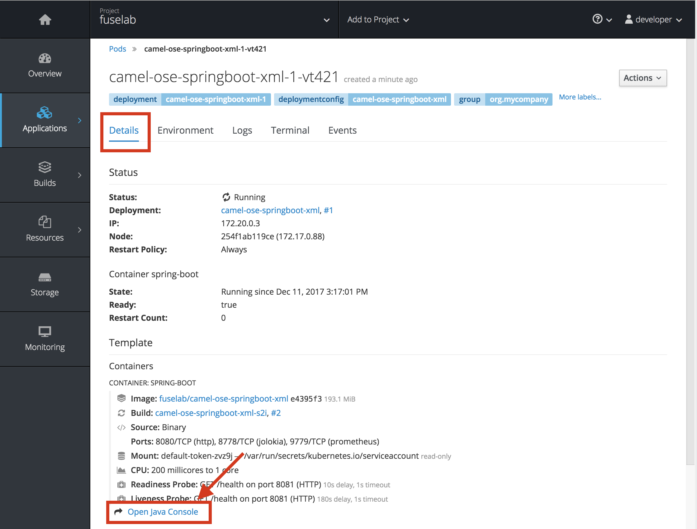
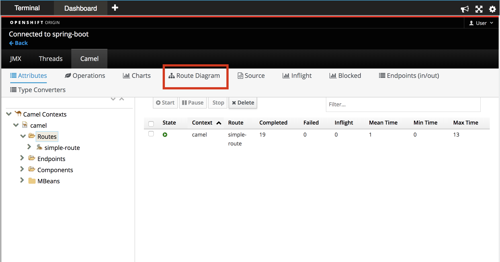
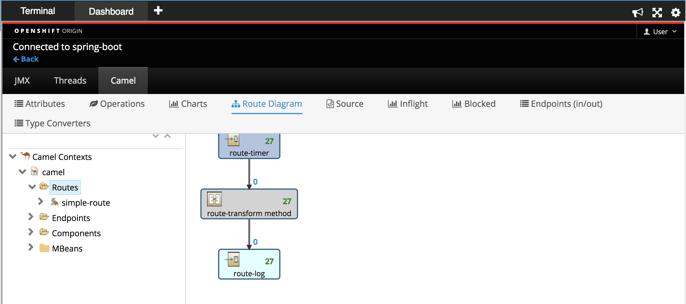
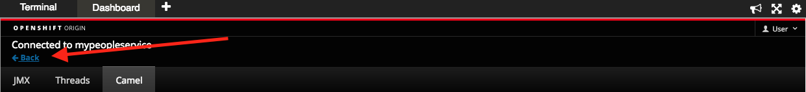
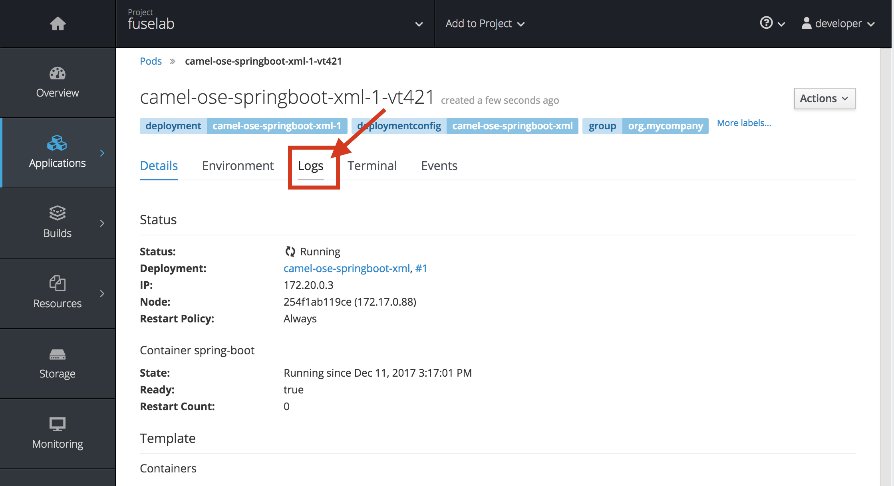
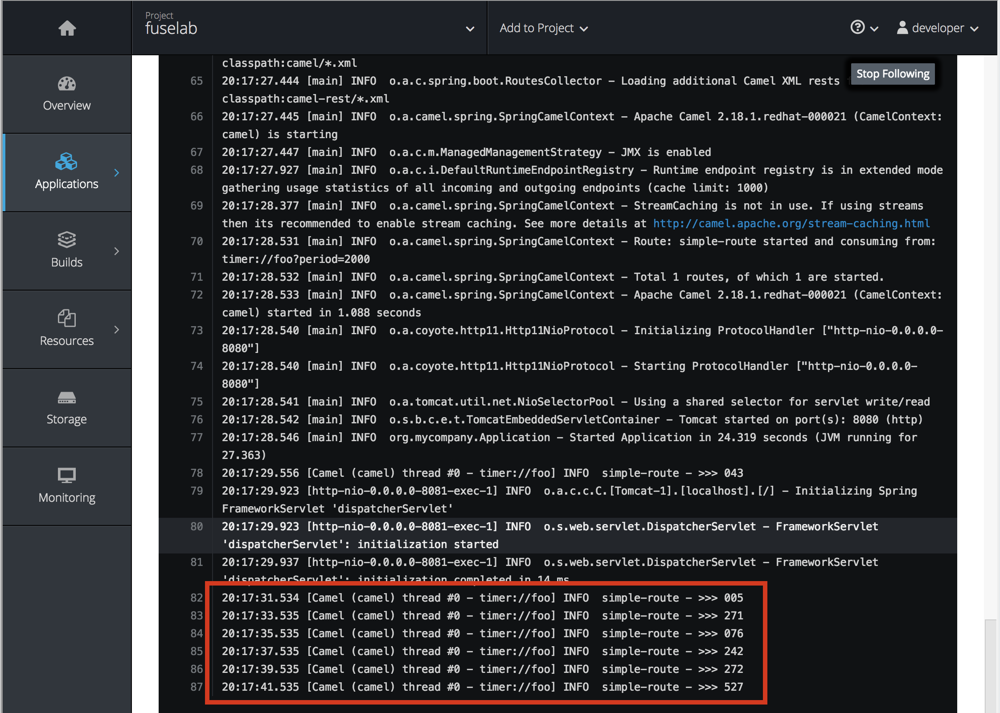

To view the status of our build, go back to the Dashboard, on the lefthand side menu, hover over *Builds* and click on *Builds*. 

From this page, you can monitor the status of your build on the platform.

Click Overview on the lefthand side menu. This page will display the list of applications that are running in your project. You can find overall details about each application on this page. For instance, the number of pods running your application, container images used in the pod, source code (if available). etc.. 

For a more detailed view of your application, let’s go to the Fuse Hawtio console. This includes standard JVM resources such as memory and threads as well as JMX attributes and operations. The console also provides a full selection of tools used to drill into the Fuse integration.

To get there, click on the running pod  on the overview page. You will be taken directly to the pod detail page. Below the Template section on the page you will find a link named "Open Java Console". Go ahead and click it.

The Fuse Hawtio console  provides deep  insight into your integration  and its current status. Select Route Diagram to see detailed view of your implementation logic :

The Route Diagram tab provides a graphical review of all the routes currently deployed in our API application. After selecting this tab, you should see something similar to what is pictured below.

Once done, close the console by clicking the back link as shown below and then head back to our terminal:

Now let’s check on the output of our application in the log console. Click on the Logs tab on the top of the page. 

You will be able to see the output of the application. 

Congratulations! You have completed your first Fuse application on OpenShift.

