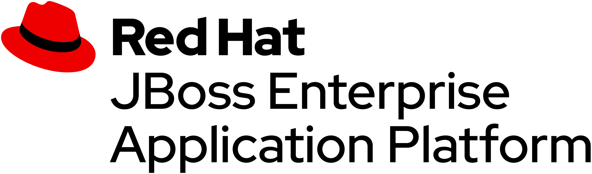

## What you will learn ##

In this scenario, you will learn how to get started with developing Java EE 8 application using JBoss Enterprise Application Platform on OpenShift. This scenario is targeted for developers that haven't used Java EE 7 or 8 before and covers the most common parts of Java EE 8. 

## What is Red Hat JBoss EAP?

JBoss Enterprise Application Platform is a leading Java EE platform that includes full Java EE 8 support. We will use JBoss EAP 7.2, which is the latest version as of Jan-2019 in this scenario. 

What differs JBoss Enterprise Application Platform compared to for example Oracle® WebLogic Application Server and IBM® WebSphere Application Server ND are that JBoss EAP since version 6 and later has been architectured to be used both in cloud environments as well as more traditional environments like Virtual or Bare metal. 

This scenario exclusively uses JBoss EAP on OpenShift, which is the leading container platform for Kubernetes and container (i.e., Docker), but as a developer, you can also apply what you learn here on other environments. 

