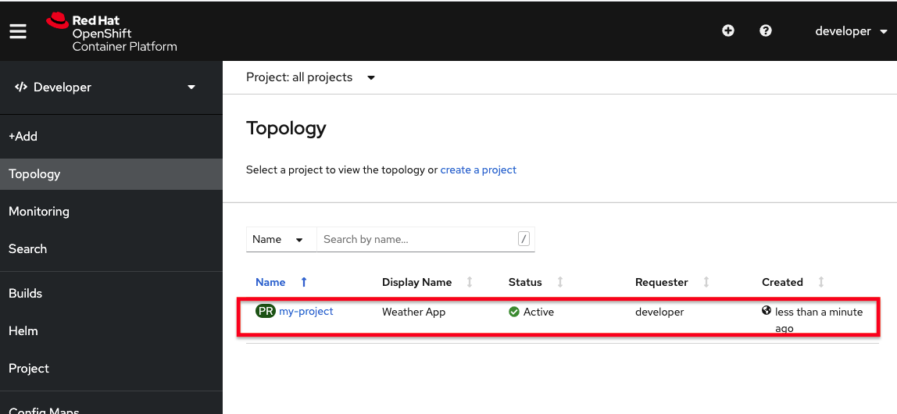
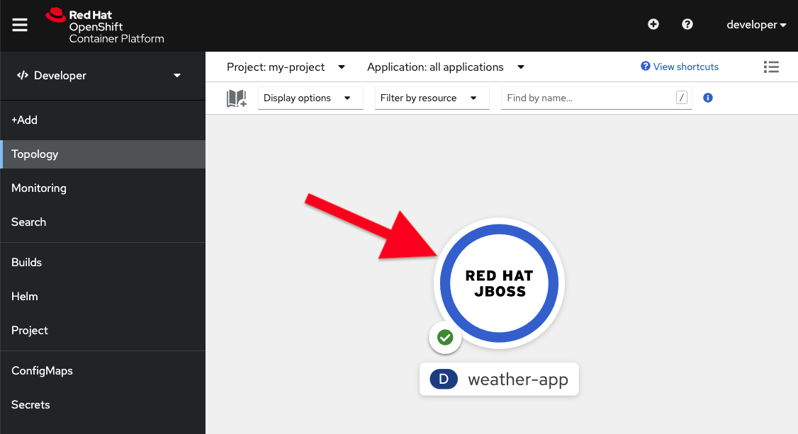
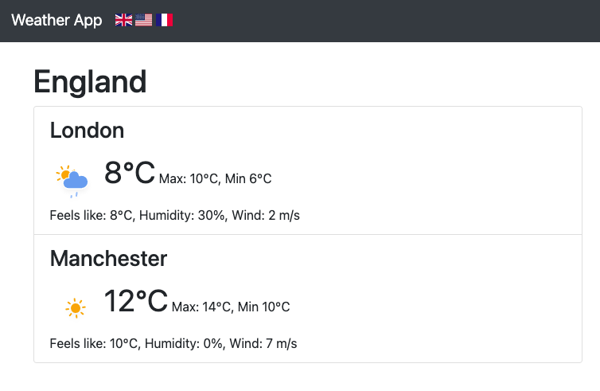

# Deploy to OpenShift

An appropriate Java runtime has been installed for you for building the app. Ensure you can use it by running this command:

> If the command fails, wait a few moments and try again (it is installed in a background process and make take a few moments depending on system load).

`$JAVA_HOME/bin/java --version`{{execute}}

The command should report the version in use, for example (the versions and dates may be slightly different than the below example):

```console
openjdk 11.0.10 2021-01-19
OpenJDK Runtime Environment AdoptOpenJDK (build 11.0.10+9)
OpenJDK 64-Bit Server VM AdoptOpenJDK (build 11.0.10+9, mixed mode)
```

**Red Hat OpenShift Container Platform** is the preferred cloud runtime for JBoss EAP
OpenShift Container Platform is based on **Kubernetes** which is the most used Orchestration for containers running in production. We assume you understand the basics of OpenShift, if not, please complete [Introduction to OpenShift]( https://learn.openshift.com/introduction/) course and come back here.

**1. Login to OpenShift Container Platform**

To authenticate to the OpenShift Container Platform, we will use the **oc** command and then specify the server that we
want to authenticate to:

```oc login -u developer -p developer```{{execute}}


Congratulations, you are now authenticated to the OpenShift server.


**2. Create project**

For this scenario, you will build a REST service that manages products that we deploy on OpenShift.

```
oc new-project my-project --display-name="Weather App"
```{{execute}}

**3. Open the OpenShift Web Console**

As you probably know, OpenShift ships with a web-based console that will allow users to perform various tasks via a browser. To get a feel for how the web console works, click on the "OpenShift Console" tab next to the "Local Web Browser" tab.


The first screen you will see is the authentication screen. Enter your username and password and
then login:


* Username: `developer`
* Password: `developer`

After you have authenticated to the web console, click **Skip Tour** to bypass the initial new user tour (feel free to visit it later on). After that, you will be on the initial screen listing the projects you're able to work with, including your newly created _my-project_.



Click on your new project name to be taken to the project topology page which will initially be empty ("No resources found") but that's about to change.

Now that you've logged into OpenShift, let's deploy a single JBoss EAP instance. The deployed JBoss EAP instance will in this step not be connected to a database, but we will see an example of that in a later scenario.

**3. Deploy JBoss EAP image**

To deploy our application we first have to create a container. JBoss EAP comes with a S2I image that packages all the binaries that are needed at runtime. S2I stands for Source-To-Image and is a convenient way for developers to provide either an artifact (E.g. WAR, JAR, etc) or the source code directly and OpenShift will then build a container image for you, so there is no need to have a local container build system and as a developer you do not have to care about patching and maintaining the base image.

We will use the following command to create a build configuration in OpenShift:

`oc new-build jboss-eap73-openjdk11-openshift:7.3 --binary=true --name=weather-app`{{execute}}

This command tells openshift to use a base image including JBoss EAP 7.3 with the name `weather-app`  and finally, we tell it to use what is called binary deployment. Binary deployment means that we will build the Java artifacts locally (using maven) and let the S2I process build a container where that artifact is deployed in JBoss EAP.

Now, we need to build the prototype application that we are going to deploy.

First move to the project directory:

`cd ~/projects/rhoar-getting-started/javaee/weather-app`{{execute}}

Now, build the application by executing the following maven command.

`mvn clean package`{{execute}}

We are now ready to upload our artifact (a WAR file) to the build "weather-app" process that we created earlier.

`oc start-build weather-app --from-file=target/ROOT.war --follow`{{execute}}

This command will upload the artifact to the build config that we created before and start building a container. Please note that this might take a while the first time you execute it since openshift will have to download the EAP image. Next time it will go much faster.

When the build is finished, we are ready to create your application.

`oc new-app weather-app -l app.openshift.io/runtime=jboss`{{execute}}

The command new-app will create a running instance based on the container that we built before, and a label `-l` that gives it a nice icon on the topology view.

Go back to the [Topology view](https://console-openshift-console-[[HOST_SUBDOMAIN]]-443-[[KATACODA_HOST]].environments.katacoda.com/topology/ns/my-project/graph) and verify that the application comes up correctly (look for the dark blue circle):




**4. Expose service route**

Now that our application is runing in a container we also have to expose the application to be accessed outside the internal OpenShift network. For that we need to create a route that will forward traffic ffrom the external OpenShift router to our service.

Let's do that next.

```oc expose svc weather-app```{{execute}}

You'll notice a new route link icon on the topology view. Click it to access the app:


You should see the app running:



You won't yet be able to select different country flags (you'll get an error popup) - this we will fix in the next step.
