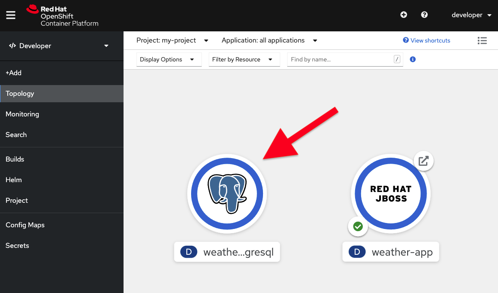
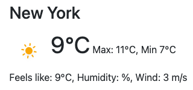
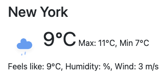

So far we have been using an in-memory database that is part of JBoss EAP. However, JBoss EAP only provides this to make it easy to develop and test application. The in-memory database H2 is not recommended for production use.

In this part, you will learn how to setup a simple PostgreSQL database in OpenShift, how to configure a datasource within the JBoss EAP image that connects to the database, and finally how to make use of that database in your application.

**1. Remove the internal in-memory database**

If you recall in step 03 we create a datasource definition as part of the deployment. Let's update it to use PostgresQL.

Open the `src/main/webapp/WEB-INF/weather-ds.xml`{{open}} file and click **Copy To Editor** to replace its content for PostgresQL:

<pre class="file" data-filename="./src/main/webapp/WEB-INF/weather-ds.xml" data-target="replace">
&lt;?xml version="1.0" encoding="UTF-8"?&gt;
&lt;datasources xmlns="http://www.jboss.org/ironjacamar/schema"
             xmlns:xsi="http://www.w3.org/2001/XMLSchema-instance"
             xsi:schemaLocation="http://www.jboss.org/ironjacamar/schema http://docs.jboss.org/ironjacamar/schema/datasources_1_0.xsd"&gt;
    &lt;!-- The datasource is bound into JNDI at this location. We reference
        this in META-INF/persistence.xml --&gt;
    &lt;datasource jndi-name="java:jboss/datasources/WeatherDS"
                pool-name="weather" enabled="true"
                use-java-context="true"&gt;
        &lt;connection-url&gt;jdbc:postgresql://weather-postgresql:5432/weather-db&lt;/connection-url&gt;
        &lt;driver&gt;postgresql.jar&lt;/driver&gt;
        &lt;security&gt;
            &lt;user-name&gt;weather-app-user&lt;/user-name&gt;
            &lt;password&gt;secret&lt;/password&gt;
        &lt;/security&gt;
    &lt;/datasource&gt;
&lt;/datasources&gt;
</pre>

This configures our app to access the database using a hostname of `weather-postgresql` and corresponding ports, usernames, and password. We'll need to deploy Postgres itself to respond to these connection requests.

**2. Start a PostgreSQL database**

To start a PostgreSQL database in OpenShift we can simply use the image provided as part of the OpenShift distribution.

`oc new-app -e POSTGRESQL_USER=weather-app-user -e POSTGRESQL_PASSWORD=secret -e POSTGRESQL_DATABASE=weather-db --name=weather-postgresql -l app.openshift.io/runtime=postgresql postgresql:10`{{execute}}

By using the `-e` flag, we can also pass a set of environment variables that will configure and setup the PostgreSQL database. These environment variables are pretty self explaining. The `-l` flag adds a nice icon to our deployment topology view for the database.

You can see the new database spinning up on the [Topology view](https://console-openshift-console-[[HOST_SUBDOMAIN]]-443-[[KATACODA_HOST]].environments.katacoda.com/topology/ns/my-project/graph):

**3. Deploying the application**

We are now ready to test our application in OpenShift using an external database.

First, build the application and verify that we do not have any compilation issues.

`mvn clean package`{{execute}}

Since EAP does not ship with a Postgres DB driver by default, we'll need to download it and include it with our application. Click the following command to download the driver to the `target/` directory:

`curl -o target/postgresql.jar https://jdbc.postgresql.org/download/postgresql-42.2.20.jar`{{execute}}

Next, build a container by starting an OpenShift S2I build and provide the files as input.

`oc start-build weather-app --from-dir=target/ --follow`{{execute}}

When the build has finished, you can test the REST endpoint directly using for example curl:

`curl -s "Accept:application/json" http://weather-app-my-project.[[HOST_SUBDOMAIN]]-80-[[KATACODA_HOST]].environments.katacoda.com/api/weather | jq`{{execute}}

> **Note:** that it might take a couple of seconds for the application to start so if the command fails at first, please try again.

You should see the same output as before.

You can also test the web application by clicking [here](http://weather-app-my-project.[[HOST_SUBDOMAIN]]-80-[[KATACODA_HOST]].environments.katacoda.com/index.html)

Note: that it might take a couple of seconds for the application to start so if you see an error page wait 30 secs and then try again.

**4. Verify the database**

Open [this](http://weather-app-my-project.[[HOST_SUBDOMAIN]]-80-[[KATACODA_HOST]].environments.katacoda.com/index.html) link and click on the US flag. Note the weather icon in New York. It should be sunny:

Let's update the database and set it to rainy instead.

`oc rsh deployment/weather-postgresql`{{execute}}

`psql -U $POSTGRESQL_USER $POSTGRESQL_DATABASE -c "update city set weathertype='rainy-5' where id='nyc'";`{{execute}}

Now, reload the weather page for US and check the weather icon in New York. It should now be rainy.

