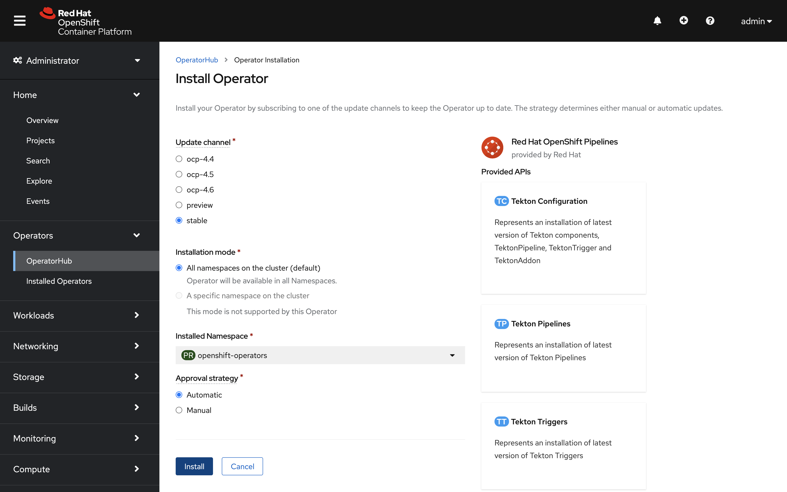

OpenShift Pipelines are an OpenShift add-on that can be installed via an operator that is available in the OpenShift OperatorHub.

Operators may be installed into a single namespace and only monitors resources in that namespace. The OpenShift Pipelines Operator can install globally on the cluster, monitoring and managing pipelines for every single user in the cluster.

You can either install the operator using the OpenShift Pipelines Operator in web console, or by using the CLI tool `oc`. Let's log in to our cluster to make changes and install the operator. You can do so by running:

`oc login -u admin -p admin`{{execute}}

This will log you in using the credentials:

* **Username:** ``admin``
* **Password:** ``admin``

## Installing the OpenShift Pipelines Operator in web console

You can install OpenShift Pipelines using the Operator listed in the OpenShift Container Platform OperatorHub. When you install the OpenShift Pipelines Operator, the Custom Resources (CRs) required for the Pipelines configuration are automatically installed along with the Operator.

1. Firstly, switch to the _Console_ and login to the OpenShift web console using the same credentials you used above.


2. In the _Administrator_ perspective of the web console, navigate to Operators → OperatorHub. You can see the list of available operators for OpenShift provided by Red Hat as well as a community of partners and open-source projects.

3. Use the _Filter by keyword_ box to search for `OpenShift Pipelines Operator` in the catalog. Click the _OpenShift Pipelines Operator_ tile.


4. Read the brief description about the Operator on the _OpenShift Pipelines Operator_ page. Click _Install_.

5. Select _All namespaces on the cluster (default)_ for installation mode & _Automatic_ for the approval strategy. Click Subscribe!



Be sure to verify that the OpenShift Pipelines Operator has installed through the Operators → Installed Operators page.

## Installing the OpenShift Pipelines Operator using the CLI

You can install OpenShift Pipelines Operator from the OperatorHub using the CLI.

1. First, you'll want to create a Subscription object YAML file to subscribe a namespace to the OpenShift Pipelines Operator, for example, `subscription.yaml` as shown below:

```
apiVersion: operators.coreos.com/v1alpha1
kind: Subscription
metadata:
  name: openshift-pipelines-operator
  namespace: openshift-operators 
spec:
  channel: openshift-operators
  name: openshift-pipelines-operator-rh
  source: redhat-operators
  sourceNamespace: openshift-marketplace
```

This YAML file defines various components, such as the `channel` specifying the channel name where we want to subscribe, `name` being the name of our Operator, and `source` being the CatalogSource that provides the operator. For your convience, we've placed this exact file in your `/operator` local folder. 

2. You can now create the Subscription object similar to any OpenShift object.

`oc apply -f operator/subscription.yaml`{{execute}}

Great! The OpenShift Pipelines Operator is now installed in the default target namespace `openshift-operators`.

Now that you've successfully instakked the OpenShift Pipelines Operator, let's start the workshop.