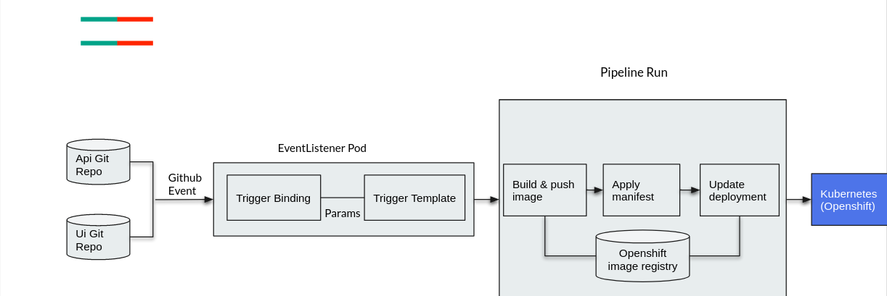

A `Pipeline` defines an ordered series of `Tasks` that you want to execute along with the corresponding inputs and outputs for each `Task`. In fact, tasks should do one single thing so you can reuse them across pipelines or even within a single pipeline.

Below is an example definition of a `Pipeline`, created using the following diagram:



Below is a YAML file that represents the above pipeline:

```
apiVersion: tekton.dev/v1beta1
kind: Pipeline
metadata:
  name: build-and-deploy
spec:
  workspaces:
  - name: shared-workspace
  params:
  - name: deployment-name
    type: string
    description: name of the deployment to be patched
  - name: git-url
    type: string
    description: url of the git repo for the code of deployment
  - name: git-revision
    type: string
    description: revision to be used from repo of the code for deployment
    default: "master"
  - name: IMAGE
    type: string
    description: image to be build from the code
  tasks:
  - name: fetch-repository
    taskRef:
      name: git-clone
      kind: ClusterTask
    workspaces:
    - name: output
      workspace: shared-workspace
    params:
    - name: url
      value: $(params.git-url)
    - name: subdirectory
      value: ""
    - name: deleteExisting
      value: "true"
    - name: revision
      value: $(params.git-revision)
  - name: build-image
    taskRef:
      name: buildah
      kind: ClusterTask
    params:
    - name: TLSVERIFY
      value: "false"
    - name: IMAGE
      value: $(params.IMAGE)
    workspaces:
    - name: source
      workspace: shared-workspace
    runAfter:
    - fetch-repository
  - name: apply-manifests
    taskRef:
      name: apply-manifests
    workspaces:
    - name: source
      workspace: shared-workspace
    runAfter:
    - build-image
  - name: update-deployment
    taskRef:
      name: update-deployment
    workspaces:
    - name: source
      workspace: shared-workspace
    params:
    - name: deployment
      value: $(params.deployment-name)
    - name: IMAGE
      value: $(params.IMAGE)
    runAfter:
    - apply-manifests
```

This pipeline helps you to build and deploy backend/frontend, by configuring the right resources to the pipeline.

Pipeline Steps:

  1. `fetch-repository` clones the source code of the application from a git repository by referring (`git-url` and `git-revision` param)
  2. `build-image` builds the container image of the application using the `buildah` clustertask
  that uses [Buildah](https://buildah.io/) to build the image
  3. The application image is pushed to an image registry by referring (`image` param)
  4. The new application image is deployed on OpenShift using the `apply-manifests` and `update-deployment` tasks

You might have noticed that there are no references to the git repository or the image registry it will be pushed to in the pipeline. That's because pipeline in Tekton is designed to be generic and re-usable across environments and stages through the application's lifecycle. Pipelines abstract away the specifics of the git
source repository and image to be produced as [`PipelineResources`](https://tekton.dev/docs/pipelines/resources) or `Params`. When triggering a pipeline, you can provide different git repositories and image registries to be used during pipeline execution.

The execution order of task is determined by dependencies that are defined between the tasks via inputs and outputs as well as explicit orders that are defined via `runAfter`.

`workspaces` field allows you to specify one or more volumes that each Task in the Pipeline requires during execution. You specify one or more Workspaces in the `workspaces` field.

Create the pipeline by running the following:

`oc create -f pipeline/pipeline.yaml`{{execute}}

In the next section, you will focus on creating a trigger to execute the tasks specified in the pipeline.